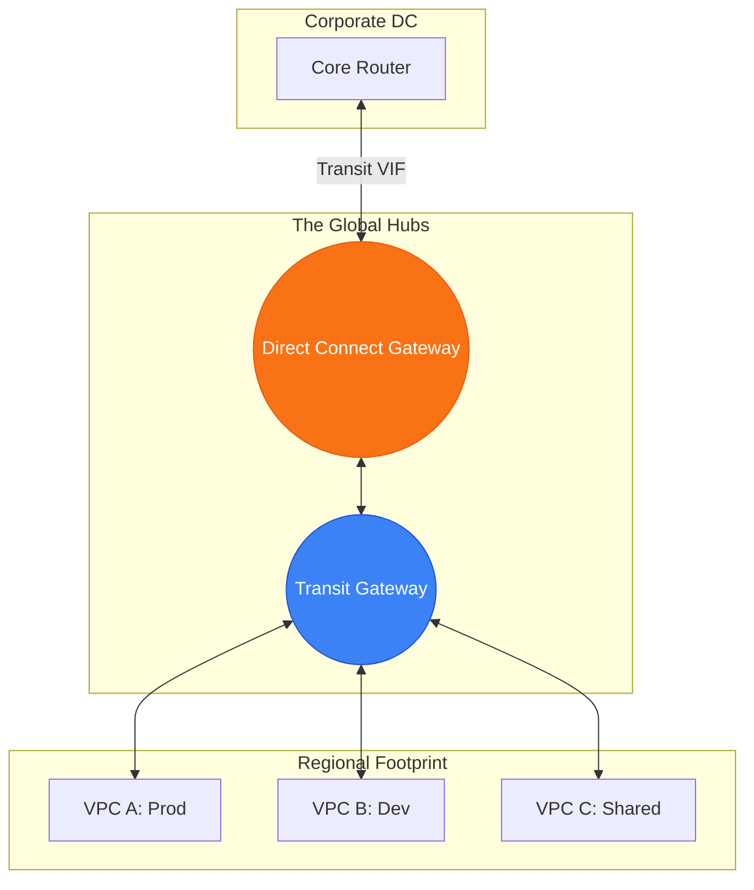

# 🎛️ Module 09.03: TGW and Hybrid Architectures

> **"In an enterprise, 'One VPC' is a myth. You will likely manage hundreds. Transit Gateway and Direct Connect Gateway are the control center that transforms a chaotic spider-web of links into a clean, centralized hub-and-spoke empire."**

## 📚 Overview

As organizations scale, managing individual VPNs or Direct Connect VIFs for every single VPC becomes an operational nightmare. To solve this, AWS provides two powerful coordination layers: **Direct Connect Gateway (DXGW)** and **Transit Gateway (TGW)**. DXGW allows you to share one fiber line across multiple Regions and Accounts. TGW acts as a "Regional Router" that can connect thousands of VPCs and physical links into a single, cohesive network. This module explains how to architect these components for maximum scale and minimum management overhead.

## 🎓 Learning Objectives

By the end of this module, you will:

- ✅ Understand the role of **Direct Connect Gateway (DXGW)** in cross-region networking.
- ✅ Master the architecture of **Transit Gateway (TGW)** as a hybrid hub.
- ✅ Identify the **10-VPC Limit** of DXGW and when to transition to TGW.
- ✅ Configure **Transit Virtual Interfaces (VIFs)** for TGW integration.
- ✅ Use **AWS RAM** to share hybrid connectivity resources across the organization.

---

## 🏗️ The Hybrid Architecture Stack

### 1. Direct Connect Gateway (DXGW)
- **Role**: A global resource (except China) that allows a single Direct Connect VIF to connect to up to **10 VPCs** (via VGWs) across different regions and accounts.
- **Benefit**: Simplifies multi-region connectivity without needing a Transit Gateway.

### 2. Transit Gateway (TGW) for Hybrid
- **Role**: The "Regional Router." It takes the incoming fiber traffic from the DXGW and fans it out to **thousands** of attached VPCs.
- **Requirement**: Requires a **Transit VIF** on your physical connection.
- **Trade-off**: Adds a data processing fee (~$0.02/GB) but provides ultimate scalability and transitive routing.

---

## 🚀 Professional Pattern: The "Global Fiber Backbone"

A global company has their primary data center in London and dozens of VPCs in Ireland, Virginia, and Tokyo.

**The Pro Standard**:
1. **The Link**: Provision a physical Direct Connect in London.
2. **The Gateway**: Create a **Direct Connect Gateway (DXGW)**.
3. **The Hubs**: Create a **Transit Gateway (TGW)** in Ireland, Virginia, and Tokyo.
4. **The Connection**: Peer the London DXGW to all three regional TGWs.
5. **The Result**: Every VPC in every region can now talk to the London Data Center privately over the high-speed AWS backbone.
6. **The Outcome**: You only manage ONE physical link but support a planetary-scale infrastructure.

---

## 🏆 Real-World DevOps Story: The "11th VPC" Wall

**The Scenario**: A successful SaaS startup was using a Direct Connect Gateway to link their 5 Dublin-based VPCs to their office. It worked perfectly and was cheap because DXGW has no data processing fee.
**The Crisis**: They launched client-specific VPCs and quickly reached their 11th VPC.
**The Discovery**: They hit the hard limit. A Direct Connect Gateway can only associate with **10 Virtual Private Gateways (VGWs)**. They couldn't add any more clients to their hybrid network.
**The Fix**: They migrated their architecture to **Transit Gateway**. They connected the DX link to a TGW and then attached all 11 (and eventually 100+) VPCs to that TGW.
**The Result**: The limit was gone. They traded a small data processing fee for the ability to scale to 5,000 VPCs.
**The Lesson**: **Build for the 11th VPC, not the first.** Understand your architectural hard limits before you hit them.

---

## ❓ Interview Preparation (Hybrid Hubs)

1. **Q: What is the main difference between connecting a VPC via DXGW vs. TGW?**
    *A: **DXGW** is a global resource that connects up to 10 VPCs directly with no data processing fee. **TGW** is a regional resource that can connect thousands of VPCs and supports transitive routing, but it charges a $0.02/GB processing fee.*

2. **Q: Is a Direct Connect Gateway Regional or Global?**
    *A: It is a **Global** resource (except for AWS China). This is why you can use it to bridge a London fiber line to a Tokyo VPC.*

3. **Q: Can a single Direct Connect Gateway be connected to both a VGW and a TGW?**
    *A: **No.** An association can be with either Virtual Private Gateways (VGWs) or a Transit Gateway (TGW), but you cannot mix them in the same DXGW configuration.*

4. **Q: How many Transit Gateways can be associated with a single Direct Connect Gateway?**
    *A: You can associate up to **3 Transit Gateways** with a single Direct Connect Gateway.*

5. **Q: How do you handle 'Account Isolation' when sharing a hybrid link?**
    *A: You use **AWS Resource Access Manager (RAM)**. You 'share' the Transit Gateway (which is connected to your Direct Connect) with other AWS Accounts in your Organization so they can create their own VPC attachments.*

---

## 📝 Knowledge Check

1. **What is the maximum number of Virtual Private Gateways (VPCs) a Direct Connect Gateway can associate with?**
    - [ ] a) 1
    - [ ] b) 5
    - [x] c) 10
    - [ ] d) 100

2. **Which Virtual Interface (VIF) type is required to connect to a Transit Gateway?**
    - [ ] a) Private VIF
    - [ ] b) Public VIF
    - [x] c) Transit VIF
    - [ ] d) Standard VIF

3. **Which resource is 'Global' and can bridge different AWS Regions?**
    - [ ] a) Transit Gateway
    - [x] b) Direct Connect Gateway
    - [ ] c) Internet Gateway
    - [ ] d) Subnet

4. **To connect 500 VPCs to a single Direct Connect link, which architecture is required?**
    - [ ] a) 500 Private VIFs
    - [ ] b) 50 Direct Connect Gateways
    - [x] c) 1 Transit Gateway + 1 Direct Connect Gateway
    - [ ] d) VPC Peering only

5. **True or False: Using a Transit Gateway for hybrid traffic adds a data processing fee per Gigabyte.**
    - [x] True 
    - [ ] False

---

## 🔗 Next Steps

You've built the global highway. Now let's explore how to make it unbreakable using advanced resiliency and security patterns.

Proceed to: **[04. Resiliency & Security in Hybrid](../04-resiliency-and-security-hybrid/readme.md)** →
Node: This link points to the next lesson.