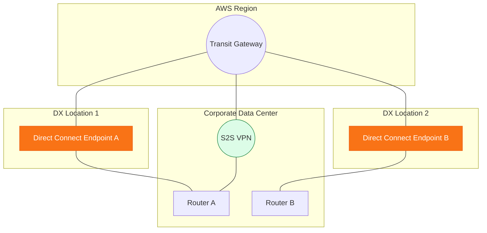

# 🛡️ Module 09.04: Resiliency & Security in Hybrid

> **"A hybrid link is more than just a cable; it is the lifeblood of your digital operation. If that link fails, your company stops. Truly professional networks don't just 'hope' for the best; they architect for the worst using redundant paths and hardware-speed encryption."**

## 📚 Overview

A hybrid network link is a single point of failure. If a construction crew cuts the fiber optic line entering your building, your cloud-based applications will lose access to their on-premises databases instantly. This module covers the **AWS Well-Architected** models for hybrid resiliency: from basic VPN backups to **Maximum Resiliency** using multiple locations and routers. We also explore the critical world of **Hybrid Security**, comparing **MACsec** (Layer 2) and **VPN over Direct Connect** (Layer 3) to protect your most sensitive traffic.

## 🎓 Learning Objectives

By the end of this module, you will:

- ✅ Deep dive into the **Standard** vs. **Maximum** resiliency models.
- ✅ Influence traffic paths using **BGP AS-Path Prepending**.
- ✅ Implement **MACsec (802.1ae)** for hardware-level line encryption.
- ✅ Architect a **VPN-over-DX** tunnel for defense-in-depth.
- ✅ Resolve **Asymmetric Routing** issues in dual-link environments.

---

## 🏗️ The Resiliency Models

### 1. High Resiliency (The standard)
Uses two Direct Connect connections to **two different AWS locations** within the same region. This protects you if an entire colocation facility loses power or connectivity.

### 2. Maximum Resiliency (Mission-Critical)
Adds internal hardware redundancy. You use two separate routers on your side, connected to two separate routers on the AWS side in two different locations. Minimum RTO and maximum protection.

### 3. VPN Backup (Cost-Effective)
One Direct Connect link handles primary traffic. A Site-to-Site VPN acts as the standby. If the DX goes down, BGP automatically shifts traffic to the VPN (which is slower but ensures continuity).

---

## 🚀 Professional Pattern: The "AS-Path" Preference

When you have two paths (e.g., a fast DX and a slow VPN), you must tell AWS to prefer the fast one for **incoming** traffic.

**The Pro Standard**:
1. **The Logic**: BGP always chooses the "Shortest Path" (the one with the fewest AS numbers in the list).
2. **The Trick**: On your backup VPN router, configure **AS-Path Prepending**. This repeats your own AS number 3 or 4 times.
3. **The Result**: AWS looks at the DX path and sees one hop. It looks at the VPN path and sees four hops.
4. **The Outcome**: AWS chooses the DX path 100% of the time. If the DX fails, the TGW automatically switches to the VPN, which is now the "only" (and thus shortest) path.

---

## 🏆 Real-World DevOps Story: The 3:00 AM "Stateful" Crash

**The Scenario**: A global bank had a Direct Connect and a Backup VPN. They noticed that as soon as a failover happened, their firewalls would start dropping packets, and all SSH sessions died.
**The Crisis**: The business couldn't recover because the technical staff couldn't log into the servers to verify the state.
**The Discovery**: They had **Asymmetric Routing**. Traffic from On-Prem to AWS was going over the newly-restored DX line, but traffic from AWS to On-Prem was still coming back over the VPN. Their "Stateful" firewalls saw a "Return" packet for a connection they never "Saw" start, so they dropped it as a security threat.
**The Fix**: They aligned their **BGP Local Preference** (for outbound) and **AS-Path Prepending** (for inbound) so that both directions always used the same link.
**The Lesson**: **Networking is a two-way street.** If the traffic doesn't come back the way it went out, your firewalls will treat it like an attack.

---

## ❓ Interview Preparation (Hybrid Resiliency)

1. **Q: What is the most resilient way to connect On-Prem to AWS?**
    *A: The **Maximum Resiliency** model. This involves two dedicated connections at two different Direct Connect locations, terminating on two separate customer routers. This provides redundancy at the location, link, and hardware levels.*

2. **Q: How does BGP AS-Path Prepending influence traffic?**
    *A: BGP prefers the path with the fewest 'hops' in the AS-Path. By 'prepending' (repeating) your own AS number on a specific link, you make that path intentionally look longer and less desirable, forcing AWS to choose the other (primary) link.*

3. **Q: When should you use MACsec over a standard VPN?**
    *A: Use **MACsec** when you need high-speed (10G/100G) hardware-level encryption without the processing overhead and MTU limits of an IPsec VPN. MACsec handles the encryption at the physical fiber layer (Layer 2).*

4. **Q: Can you encrypt traffic over Direct Connect if you don't have MACsec-compatible hardware?**
    *A: **Yes.** You can establish an IPsec **VPN over Direct Connect**. You create a Public VIF on the DX, and then point your Customer Gateway to the VPN endpoint. The traffic travels over the DX fiber but is wrapped in an IPsec tunnel.*

5. **Q: Why would AWS prefer a Direct Connect link over a VPN link if both are advertising the same route?**
    *A: AWS has a specific **Route Priority Hierarchy**. Direct Connect is higher in the priority list than Site-to-Site VPN. If the paths are equal, the DX link will always attract the traffic.*

---

## 📝 Knowledge Check

1. **What is the primary purpose of 'BGP AS-Path Prepending'?**
    - [ ] a) To encrypt traffic
    - [x] b) To influence traffic towards a preferred primary link
    - [ ] c) To compress data
    - [ ] d) To increase bandwidth

2. **Which resiliency model provides protection against both an AWS location failure AND a customer router failure?**
    - [ ] a) Standard
    - [ ] b) High Resiliency
    - [x] c) Maximum Resiliency
    - [ ] d) VPN-only

3. **At which OSI layer does MACsec provide encryption?**
    - [ ] a) Layer 1
    - [x] b) Layer 2
    - [ ] c) Layer 3
    - [ ] d) Layer 7

4. **Which Virtual Interface (VIF) is required to build an IPsec VPN tunnel OVER a Direct Connect link?**
    - [ ] a) Private VIF
    - [x] b) Public VIF
    - [ ] c) Transit VIF
    - [ ] d) Management VIF

5. **True or False: If you have two different Direct Connect locations, they should be connected to the same customer router to save costs.**
    - [ ] True 
    - [x] False (This creates a single point of failure at the router)

---

## 🔗 Next Steps

You've built a indestructible bridge. Now let's explore how to see what's actually happening on that bridge: Monitoring and Troubleshooting your VPC network.

Proceed to: **[Module 10: Monitoring & Troubleshooting](../../10-monitoring-and-troubleshooting/readme.md)** →
Node: This link points to the final module of the networking phase.