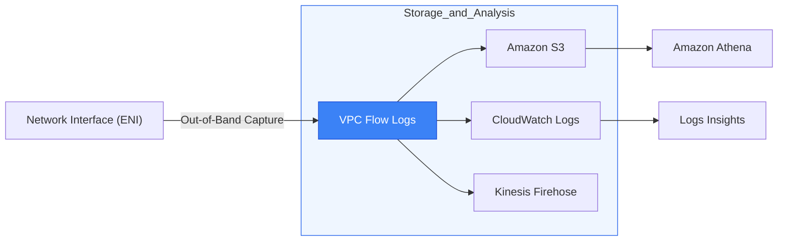

# 📊 Module 10.01: VPC Flow Logs & Analysis

> **"In a network, if you can't measure it, you can't manage it. VPC Flow Logs are the 'Security Camera' of your cloud, capturing every handshake, every rejection, and every byte that moves through your infrastructure."**

## 📚 Overview

**VPC Flow Logs** is a feature that enables you to capture information about the IP traffic going to and from network interfaces in your VPC. Imagine it as a digital ledger that records the "Who, Where, and When" of your network traffic. Crucially, it is **out-of-band**, meaning it has zero impact on your network performance or latency. This module covers how to interpret log fields, choose between S3 and CloudWatch for storage, and use metadata to hunt down security threats and connectivity hangups.

## 🎓 Learning Objectives

By the end of this module, you will:

- ✅ Configure Flow Logs at the **VPC**, **Subnet**, and **ENI** levels.
- ✅ Interpret the `ACCEPT` and `REJECT` actions in the log entries.
- ✅ Differentiate between **Standard** and **Custom** log formats.
- ✅ Analyze massive log datasets using **CloudWatch Logs Insights** and **Amazon Athena**.
- ✅ Identify the "Source IP" of attacks hidden behind NAT Gateways.

---

## 🏗️ The Anatomy of a Flow Log

A standard flow log entry looks like this:
`2 123456789010 eni-abc123de 172.31.16.139 198.51.100.1 443 49152 6 20 4249 1418530010 1418530070 ACCEPT OK`

### Key Metadata Fields:
- **srcaddr / dstaddr**: The source and destination IPs.
- **srcport / dstport**: The ports being used (e.g., 443 for HTTPS).
- **protocol**: The IANA number (6 = TCP, 17 = UDP).
- **action**:
    - `ACCEPT`: The traffic was allowed by BOTH Security Groups and NACLs.
    - `REJECT`: The traffic was blocked by EITHER a Security Group or a NACL.
- **start / end**: The time window (aggregated over 1 or 10 minutes).

---

## 🚀 Professional Pattern: The "Custom Format" Deep Dive

By default, Flow Logs only show the "Infrastructure" IPs. If traffic goes through a NAT Gateway, you lose visibility into the *original* client IP.

**The Pro Standard**:
1. **The Config**: Don't use the "Default" format. Create a **Custom Format**.
2. **The Fields**: Add `pkt-srcaddr` and `pkt-dstaddr`.
3. **The Benefit**: Even if traffic is translated by a NAT Gateway or Load Balancer, `pkt-srcaddr` tells you the **original** IP address in the IP packet.
4. **The Resolution**: Essential for security teams investigating DDoS attacks or unauthorized access attempts that would otherwise look like they were coming from your own NAT Gateway.

---

## 🏆 Real-World DevOps Story: The "Silent" NACL Block

**The Scenario**: A senior developer was setting up a new database in a private subnet. They verified the Security Group allowed the SQL port (3306) from the App server. But the App server kept timing out when trying to connect.
**The Crisis**: "The Security Group is correct! AWS is broken!" was the cry.
**The Discovery**: They turned on **VPC Flow Logs** for the database ENI. In 1 minute, the logs showed `REJECT` for incoming traffic on port 3306.
**The Fix**: Since the Security Group was known to be open, the only other culprit was the **Network ACL (NACL)**. Upon checking, they found a legacy NACL rule that blocked everything except port 80/443.
**The Result**: One rule change later, the connection was successful.
**The Lesson**: **Logs don't lie; humans do.** Flow logs are the final word on whether traffic is moving or being stopped at the gate.

---

## ❓ Interview Preparation (Flow Logs)

1. **Q: Does VPC Flow Logs capture the actual content (payload) of the data?**
    *A: **No.** Flow logs only capture the metadata (headers). They tell you which IP talked to which port, but they don't show the actual data being sent. For that, you need **Traffic Mirroring**.*

2. **Q: Why would you choose to send Flow Logs to S3 instead of CloudWatch?**
    *A: Use **S3** for long-term retention and cost-effective analysis of massive datasets using **Amazon Athena**. Use **CloudWatch Logs** for real-time monitoring, alerting (via Metric Filters), and quick searches using **Logs Insights**.*

3. **Q: What does a 'REJECT' status in a flow log tell you?**
    *A: It tells you that the packet was dropped by a security rule. It does NOT specify if it was a Security Group or a NACL that did the dropping, so you must investigate both.*

4. **Q: Can you turn on Flow Logs for a single EC2 instance without affecting the rest of the VPC?**
    *A: **Yes.** You can enable Flow Logs at three levels: the entire VPC, a specific Subnet, or a specific **Elastic Network Interface (ENI)**.*

5. **Q: What is the 'Aggregation Interval'?**
    *A: It is the window of time AWS waits before writing a log entry. You can choose **1 minute** (better for fast troubleshooting) or **10 minutes** (default, better for cost and general trends).*

---

## 📝 Knowledge Check

1. **What does the 'action' field 'REJECT' indicate?**
    - [ ] a) The server was too busy
    - [ ] b) The network was congested
    - [x] c) The traffic was blocked by a Security Group or NACL
    - [ ] d) The IP address does not exist

2. **Which tool is best for running SQL-like queries against Flow Logs stored in an S3 bucket?**
    - [ ] a) CloudWatch
    - [x] b) Amazon Athena
    - [ ] c) Route 53
    - [ ] d) IAM

3. **True or False: Enabling VPC Flow Logs will slightly slow down your network throughput.**
    - [ ] True 
    - [x] False (It is an out-of-band capture)

4. **What is the protocol number for TCP in a flow log?**
    - [ ] a) 1
    - [x] b) 6
    - [ ] c) 17
    - [ ] d) 80

5. **Which log field shows the actual packet source IP even when behind a NAT Gateway?**
    - [ ] a) srcaddr
    - [x] b) pkt-srcaddr (Custom format)
    - [ ] c) client-ip
    - [ ] d) x-forwarded-for

---

## 🔗 Next Steps

Logs tell you what happened in the past. Now let's look at a tool that can "predict" the future and test paths without sending a single packet: Reachability Analyzer.

Proceed to: **[02. Reachability Analyzer](../02-reachability-analyzer-network-insights/readme.md)** →
Node: This link points to the next diagnostic tool.