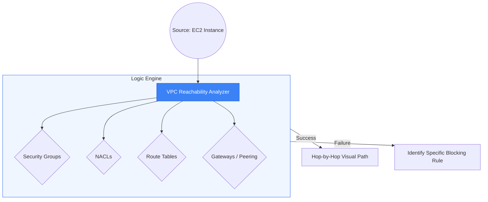

# 🔍 Module 10.02: Reachability Analyzer

> **"Traditional troubleshooting is like hunting for a needle in a haystack while blindfolded. Reachability Analyzer turns on the lights and tells you exactly which piece of hay is hiding the needle, without ever sending a single packet of data."**

## 📚 Overview

**VPC Reachability Analyzer** is a configuration analysis tool that enables you to perform connectivity testing between a source and a destination. Crucially, it **does not send any packets**. Instead, it builds a mathematical model of your network environment and performs a static analysis of your Security Groups, NACLs, Route Tables, and Gateways. This allows you to find "Black Holes" and "Security Walls" in seconds, even if the application servers are turned off.

## 🎓 Learning Objectives

By the end of this module, you will:

- ✅ Differentiate between **Predictive Static Analysis** and traditional **Network Probing**.
- ✅ Perform point-to-point analysis between **EC2 instances**, **VPNs**, and **Internet Gateways**.
- ✅ Identify the exact **Security Group** or **Route Table** entry causing a block.
- ✅ Understand the limitations of Reachability Analyzer (OS Firewalls, Payloads).
- ✅ Compare Reachability Analyzer with the **Network Access Analyzer** for auditing.

---

## 🏗️ How it Works: The Logic Engine

Reachability Analyzer doesn't "Ping." It "Reads."
1. **The Request**: You specify a source (e.g., App Server) and a destination (e.g., DB Server) and a port (e.g., 5432).
2. **The Logic**: It checks:
    - Does the Source SG allow outbound 5432?
    - Does the Source Subnet NACL allow outbound 5432?
    - Is there a route in the Subnet RT pointing to the destination?
    - Does the Destination SG allow inbound 5432?
3. **The Result**: If all are 'Yes', it shows the path. If even 1 is 'No', it highlights the exact rule ID in red.

---

## 🚀 Professional Pattern: The "Pre-Deployment" Smoke Test

Junior engineers deploy code and then spend 2 hours debugging why it can't talk to the database. Senior engineers test the network *before* the code exists.

**The Pro Standard**:
1. **The Workflow**: Before launching the application instances, create a **Reachability Analyzer Insights** path between the planned Source Subnet and Destination ENI.
2. **The Goal**: Ensure all Security Groups and Route Tables are "Plumbed" correctly.
3. **The Benefit**: When the application finally launches, if there is a connection error, you **know** 100% that the issue is inside the EC2 instance (e.g., local firewall, wrong port binding) and not the AWS network.
4. **The Resolution**: Cuts troubleshooting time by 50% by isolating the "AWS Layer" from the "OS Layer."

---

## 🏆 Real-World DevOps Story: The "Asymmetric Routing" Loophole

**The Scenario**: A company used a Transit Gateway (TGW) to connect two VPCs. They added a third VPC (Inspection VPC) with a firewall. Suddenly, traffic started dropping randomly.
**The Crisis**: Manual inspection of 15 route tables across 3 VPCs revealed no obvious errors. The team was about to spend thousands on third-party support.
**The Discovery**: They ran **Reachability Analyzer**. The tool highlighted the path from VPC A to B as "Reachable," but the return path from B to A showed as **Unreachable**.
**The Fix**: Reachability Analyzer pointed directly to a route in a TGW route table that was missing the return CIDR for VPC B.
**The Result**: The "Stealth" routing bug was found in 45 seconds after 6 hours of manual searching failed.
**The Lesson**: **If the network is complex, stop looking manually.** Use the math-based model to find the flaw.

---

## ❓ Interview Preparation (Reachability)

1. **Q: Does Reachability Analyzer send a test packet to the destination?**
    *A: **No.** It uses a mathematical model called 'Automated Reasoning' to perform static analysis of your configurations. It doesn't need the instances to be running or even for packets to be moving to give you a result.*

2. **Q: If Reachability Analyzer says 'Reachable' but I still can't connect, what is the problem?**
    *A: Reachability Analyzer only looks at the **AWS Infrastructure**. If it says reachable, the block is almost certainly inside the **OS level** (e.g., Windows Firewall, `iptables`, `ufw`) or the application itself is not listening on that port.*

3. **Q: Can Reachability Analyzer test connectivity to an On-Premises IP?**
    *A: Only up to the **AWS Edge**. It can tell you if a packet can reach the VPN Gateway or Direct Connect Gateway. It cannot "see" into your private data center or your Cisco/Juniper router configurations.*

4. **Q: What is the difference between Reachability Analyzer and Network Access Analyzer?**
    *A: **Reachability Analyzer** is for point-to-point debugging ("Can A talk to B?"). **Network Access Analyzer** is for broad security auditing ("Can anything from the internet reach my database?").*

5. **Q: Does Reachability Analyzer support Transit Gateway?**
    *A: **Yes.** It is one of the best tools for TGW troubleshooting because it can follow a packet across TGW attachments and through TGW route tables across multiple AWS accounts.*

---

## 📝 Knowledge Check

1. **What is the primary method Reachability Analyzer uses to find network blocks?**
    - [ ] a) Active ICMP Pings
    - [ ] b) Packet Sniffing
    - [x] c) Static Configuration Analysis (Mathematical Modeling)
    - [ ] d) Trace-routing

2. **Reachability Analyzer states 'Reachable', but SSH is failing. Where is the most likely problem?**
    - [ ] a) Subnet NACL
    - [ ] b) VPC Route Table
    - [x] c) Local OS Firewall (e.g., iptables)
    - [ ] d) Internet Gateway

3. **Which resource CANNOT be used as a source/destination in Reachability Analyzer?**
    - [ ] a) EC2 Instance
    - [ ] b) Transit Gateway
    - [x] c) S3 Bucket (S3 is a global service, not a VPC ENI)
    - [ ] d) VPC Peering Connection

4. **What does the tool provide if a path is identified as 'Unreachable'?**
    - [ ] a) An automated refund
    - [ ] b) A copy of the source code
    - [x] c) The specific resource (e.g., Security Group ID) causing the block
    - [ ] d) A recommendation to delete the VPC

5. **True or False: Reachability Analyzer can identify transitive routing issues through a Transit Gateway.**
    - [x] True 
    - [ ] False

---

## 🔗 Next Steps

Reachability Analyzer tests the "Logic." Now let's dive into the "Body" of the packet: Traffic Mirroring for deep packet inspection and intrusion detection.

Proceed to: **[03. Traffic Mirroring](../03-traffic-mirroring-deep-packet-inspection/readme.md)** →
Node: This link points to the deep-dive diagnostic tool.