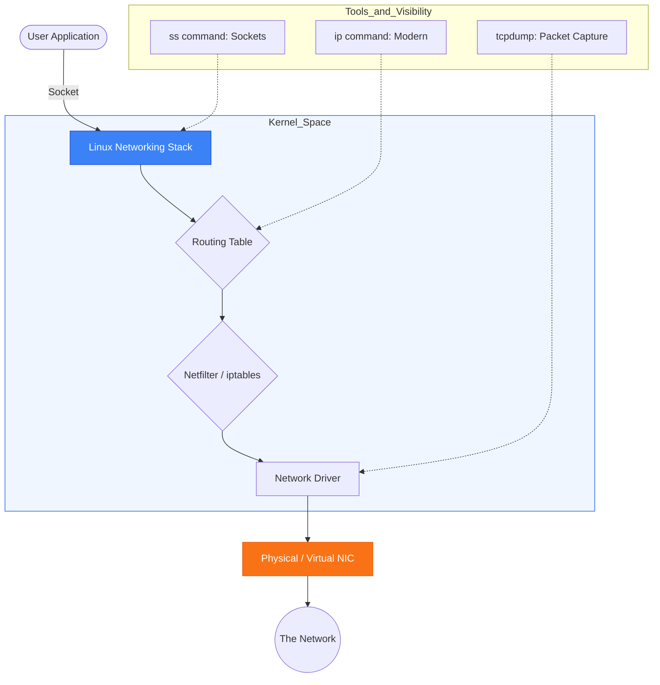

# 🐧 Module 02.04: Linux Networking Mastery

> **"Linux is the network, and the network is Linux. From the low-level kernel packet filtering to the high-level service discovery, mastering the Linux networking stack is the 'God Mode' of DevOps troubleshooting."**



## 📚 Overview

In the world of DevOps, Linux is more than just an operating system; it is the fundamental engine that moves data across your cloud. Whether you are debugging a Kubernetes pod connectivity issue or optimizing a high-traffic web server, you must be able to speak the "language of the kernel." This guide moves beyond basic commands to master the professional tools used for interface management, firewalling, DNS resolution, and deep packet inspection.

## 🎓 Learning Objectives

By the end of this module, you will:

- ✅ Deprecate legacy tools (`ifconfig`, `netstat`) in favor of modern equivalents (`ip`, `ss`).
- ✅ Configure persistent networking using **Netplan** (Ubuntu) and **NetworkScripts** (RHEL).
- ✅ Master the **Netfilter** framework via `iptables`, `UFW`, and `firewalld`.
- ✅ Perform deep packet analysis using `tcpdump` for forensic troubleshooting.
- ✅ Implement secure **SSH hardening** and **Fail2Ban** intrusion prevention.

---

## 🏗️ 1. Modern Interface Management

### The `ip` Command (The Industry Standard)
The `ip` tool from the `iproute2` package has replaced `ifconfig`. It is faster, more consistent, and provides access to features that legacy tools cannot see.

```bash
# View network interfaces and IP addresses
ip addr show                      # Show all IP addresses
ip -c addr                        # Show with color (easier to read)

# Configure IP addresses (Temporary/Dynamic)
sudo ip addr add 192.168.1.100/24 dev eth0    # Add an IP
sudo ip link set eth0 up                      # Bring interface up
sudo ip link set eth0 down                    # Bring interface down

# Routing Management
ip route show                                 # Show current routing table
sudo ip route add default via 192.168.1.1     # Add default gateway
```

### Persistent Configuration (Infrastructure as Code)

#### Ubuntu/Debian: Netplan
Modern Ubuntu uses YAML-based configuration for networking.

```yaml
# /etc/netplan/01-netcfg.yaml
network:
  version: 2
  ethernets:
    eth0:
      dhcp4: false
      addresses: [192.168.1.100/24]
      gateway4: 192.168.1.1
      nameservers:
        addresses: [8.8.8.8, 8.8.4.4]
```

---

## 🛡️ 2. Firewall & Security

Linux uses the **Netfilter** framework in the kernel to filter packets. We interact with it through different front-ends.

### iptables (The Power User Choice)
`iptables` is the classic tool for managing netfilter rules. It is stateful and highly granular.

```bash
# Basic rule to allow SSH and block everything else
sudo iptables -A INPUT -m conntrack --ctstate ESTABLISHED,RELATED -j ACCEPT
sudo iptables -A INPUT -p tcp --dport 22 -j ACCEPT
sudo iptables -P INPUT DROP
```

### UFW (Uncomplicated Firewall)
The default on Ubuntu, designed for ease of use.

```bash
sudo ufw allow 22/tcp
sudo ufw limit ssh                # Rate-limit to prevent brute force
sudo ufw enable
```

### Intrusion Prevention: Fail2Ban
Fail2Ban scans your logs and automatically bans IPs that show signs of an attack (e.g., too many failed SSH passwords).

```bash
# Check status of the SSH jail
sudo fail2ban-client status sshd
```

---

## 🕵️ 3. Monitoring & Troubleshooting

### Connection Visibility: `ss` vs `netstat`
The `ss` command (socket statistics) is much faster than `netstat` for systems with thousands of connections.

```bash
ss -tuln                          # Show all listening TCP/UDP ports
ss -tulpn                         # Show process IDs associated with ports
```

### Deep Packet Inspection: `tcpdump`
When you need to see exactly what is inside a packet, `tcpdump` is the ultimate forensic tool.

```bash
# Capture packets on eth0 for port 80 and save to file
sudo tcpdump -i eth0 port 80 -w traffic.pcap
```

---

## 🚀 Professional Pattern: "The IP-Only Admin"

Junior admins often rely on `ping` and `telnet` to test networks. Senior DevOps engineers use the `iproute2` suite because it bypasses application-level caches.

**The Pro Standard**:
1. **The Tool**: Use `ip route get <target_ip>` instead of just `ping`.
2. **The Discovery**: This command tells you exactly which local interface and source IP the kernel *would* use for that packet without actually sending it.
3. **The Benefit**: It identifies routing loops or "blackhole" routes instantly, even if the target server is down.
4. **The Outcome**: You find the networking bug in the "plumbing" before you waste time debugging the application.

---

## 🏆 Real-World DevOps Story: The "Silent" MTU Mystery

**The Scenario**: A company migrated a high-traffic database to a new data center. Small SQL queries worked perfectly, but large backups (multi-gigabyte) would hang at exactly 10% and then time out.
**The Crisis**: The network team swore the connection was healthy. The DB team swore the database was healthy.
**The Discovery**: A DevOps engineer used `tcpdump` and noticed "Fragmentation Needed" messages in the kernel logs.
**The Fix**: They realized the VPC used a standard 1500 MTU, but a VPN tunnel in the middle added a header, leaving only 1450 bytes for data.
**The Resolution**: They adjusted the **MSS Clamping** on the Linux server and reduced the MTU on the interface.
**The Result**: Backups finished in record time.
**The Lesson**: **Packet size matters.** When "Little traffic" works but "Big traffic" fails, check your **MTU** and **TCP MSS**.

---

## ❓ Interview Preparation (Linux Networking)

1. **Q: What is the difference between 'ip addr' and 'ifconfig'?**
    *A: `ifconfig` is legacy and unmaintained. `ip addr` (from iproute2) is modern, interacts directly with the kernel via netlink sockets, and can manage advanced features like Policy Routing and VXLANs that `ifconfig` cannot see.*

2. **Q: How does a 'Stateful' firewall like iptables handle return traffic?**
    *A: It uses the `conntrack` (connection tracking) module. If an outbound packet is allowed, the firewall remembers the "state" (Source/Dest IP and Ports). When the response comes back, it matches the existing state and is automatically allowed through.*

3. **Q: What command would you use to find out which process is using Port 80?**
    *A: `sudo ss -tulpn | grep :80` or `sudo lsof -i :80`. These show the numeric port and the associated Process ID (PID) and command name.*

4. **Q: Why is 'systemd-resolved' sometimes an issue for DevOps troubleshooting?**
    *A: It acts as a local DNS stub resolver. Sometimes `/etc/resolv.conf` points to `127.0.0.53` instead of the actual DNS server. If the cache is stale, `nslookup` might fail even if the network is fine. You must use `resolvectl query` or `resolvectl flush-caches` to debug.*

5. **Q: What does the 'ESTABLISHED,RELATED' rule in iptables do?**
    *A: It allows incoming packets that are part of an already existing connection (ESTABLISHED) or packets that are associated with an existing connection but on a different port (RELATED), such as FTP data transfers or ICMP error messages.*

---

## 📝 Knowledge Check

1. **Which command is the modern replacement for 'netstat'?**
    - [ ] a) ip show
    - [x] b) ss
    - [ ] c) tcpview
    - [ ] d) nmap

2. **In a Netplan configuration, which keyword defines the DNS servers?**
    - [ ] a) dns_servers
    - [ ] b) resolver
    - [x] c) nameservers
    - [ ] d) hosts

3. **What is the effect of the command 'ip link set eth0 down'?**
    - [ ] a) It deletes the interface
    - [ ] b) It clears the IP address
    - [x] c) It administratively disables the interface (shuts it down)
    - [ ] d) It reboots the networking service

4. **Which tool is used for 'Deep Packet Inspection' and saving traffic to .pcap files?**
    - [ ] a) mtr
    - [ ] b) traceroute
    - [x] c) tcpdump
    - [ ] d) dig

5. **Where is the local hostname-to-IP mapping file located in Linux?**
    - [ ] a) /etc/resolv.conf
    - [ ] b) /etc/hostname
    - [x] c) /etc/hosts
    - [ ] d) /etc/networks

---

## 🔗 Next Steps

You've mastered the Linux networking stack. Now let's explore how to automate the management and scaling of these systems.

Proceed to: **[SSH & Remote Management](../../../../readme.md)** →
Node: This link points to the next level of remote administration.