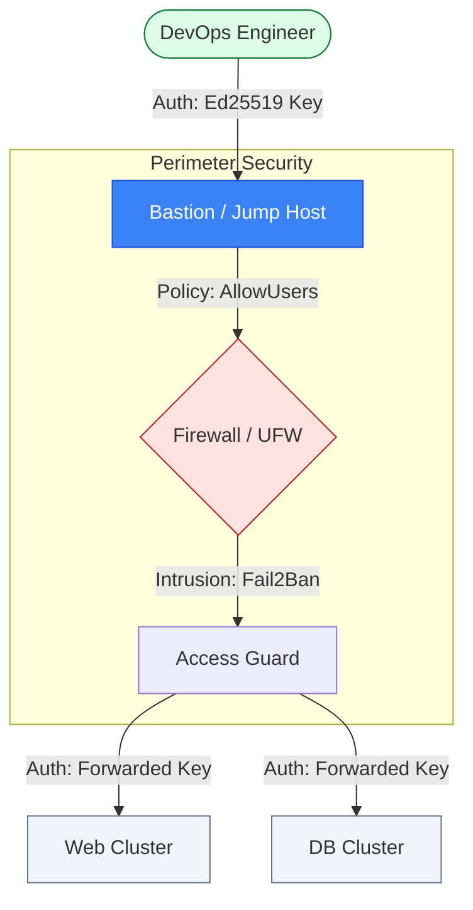

# 🔐 Module 02.04: SSH Best Practices

> **"SSH is not just a tool for logging into servers; it relates to the secure fabric of the modern cloud. In an era of automated attacks, your SSH configuration is the first and most critical line of defense for your entire infrastructure."**



## 📚 Overview

Secure Shell (SSH) is the industry standard for remote administration, but a default configuration is an invitation to hackers. In a production environment, the stakes are high: unauthorized access to a single server can lead to a full infrastructure compromise. This module covers the **professional standards** for hardening the SSH daemon, managing client configurations for speed, and implementing a "Defense in Depth" strategy that protects against brute-force attacks and credential theft.

## 🎓 Learning Objectives

By the end of this module, you will:

- ✅ Implement **Key-Based Authentication** and disable insecure password access.
- ✅ Harden the `sshd_config` using **Strong Ciphers** and non-standard ports.
- ✅ Configure **SSH Multiplexing** to reduce connection latency for automation.
- ✅ Design a **Jump-Host (Bastion)** workflow to hide private resources.
- ✅ Deploy **Fail2Ban** for automated intrusion prevention.
- ✅ Audit existing SSH access across a fleet of servers.

---

## 🏗️ 1. Hardening the Gateway (Server Side)

The server configuration (`/etc/ssh/sshd_config`) is where you define the security perimeter.

### Performance & Security Baseline
```bash
# /etc/ssh/sshd_config
Protocol 2              # Use modern protocol only
Port 2222              # Security through obscurity (optional but effective)
PermitRootLogin no     # Never allow root to log in directly
MaxAuthTries 3         # Kill brute-force attempts early

# Strong Cryptography (The modern standard)
KexAlgorithms curve25519-sha256@libssh.org,diffie-hellman-group16-sha512
Ciphers chacha20-poly1305@openssh.com,aes256-gcm@openssh.com
MACs hmac-sha2-256-etm@openssh.com,hmac-sha2-512-etm@openssh.com

# Authentication
PasswordAuthentication no
PubkeyAuthentication yes
AuthenticationMethods publickey # Require a key (Strict)
```

---

## 🚀 2. Client Efficiency (The CONFIG File)

Managing 50 different IP addresses and keys manually is impossible. The `~/.ssh/config` file is your control center.

### The Power-User Configuration
```bash
# ~/.ssh/config
Host *
    ServerAliveInterval 60      # Prevent connection drops
    ControlMaster auto           # Enable SSH Multiplexing (FAST!)
    ControlPath ~/.ssh/master-%r@%h:%p
    ControlPersist 10m           # Keep socket open for 10 minutes
    ForwardAgent yes            # Forward keys to the next hop

Host prod-db
    HostName 10.0.1.55
    User db-admin
    IdentityFile ~/.ssh/id_ed25519_prod
    ProxyJump bastion-host       # Transparently hop through the jump host
```

---

## 🚀 Professional Pattern: The "Jump-Host" (Bastion) Pattern

Exposing your database or internal application servers to the internet is a cardinal sin of DevOps.

**The Pro Standard**:
1. **The Infrastructure**: Put all internal servers in a private VPC subnet with no Public IP.
2. **The Gateway**: Deploy a single, ultra-hardened "Bastion" host in a public subnet.
3. **The Workflow**: Use `ProxyJump` in your SSH config. When you type `ssh prod-db`, your client automatically sets up an encrypted tunnel through the Bastion and connects to the private IP of the database.
4. **The Benefit**: Your attack surface is reduced from 100 servers to 1 gateway.
5. **The Outcome**: Maximum security with zero impact on developer productivity.

---

## 🏆 Real-World DevOps Story: The "Brute-Force" Blackout

**The Scenario**: A startup launched their first product. They left their public-facing web servers on the default SSH port (22) and allowed password authentication for "convenience."
**The Crisis**: Within 4 hours, automated Chinese and Russian botnets found the servers. They began a massive brute-force attack, hitting each server with 500 login attempts per minute.
**The Impact**: The servers didn't even get hacked—they crashed! The `sshd` process consumed 100% of the CPU trying to process the flood of fake login requests, making it impossible for the *real* engineers to log in and fix the site.
**The Discovery**: The `auth.log` was 4GB in size, filled entirely with failed "root" password attempts.
**The Fix**:
1. Changed SSH to port **2222**.
2. Switched to **Ed25519 keys**.
3. Enabled **Fail2Ban**.
**The Result**: The botnets immediately lost interest. CPU usage dropped to 1%, and the site was stable.
**The Lesson**: **If it's on the internet, it's being scanned.** Never use defaults for public-facing entry points.

---

## ❓ Interview Preparation (SSH Mastery)

1. **Q: Why is Ed25519 preferred over RSA for SSH keys?**
    *A: Ed25519 is faster, more secure (Elliptic Curve Cryptography), and has much smaller key sizes (easier to manage). RSA requires at least 4096 bits to be considered secure today, whereas Ed25519 provides equivalent security with just 256 bits.*

2. **Q: What is 'SSH Multiplexing' and why does it matter for automation?**
    *A: It allows multiple SSH sessions over a single existing TCP connection. For tools like Ansible that open dozens of connections, it reduces the overhead of the "TCP Handshake" and "SSH Exchange," often speeding up deployments by 5x.*

3. **Q: What is the risk of using 'ForwardAgent yes'?**
    *A: If the remote server is compromised, a malicious user with root privileges can access your local SSH agent and "borrow" your identity to connect to other servers as you. Use ProxyJump or `ProxyCommand` instead when possible.*

4. **Q: How does 'Fail2Ban' integrate with SSH?**
    *A: Fail2Ban monitors the authentication logs (e.g., `/var/log/auth.log`). When it sees too many "Failed password" messages from a single IP, it updates the firewall (iptables or UFW) to block that IP for a set period (the "Ban Time").*

5. **Q: What is the purpose of 'StrictHostKeyChecking'?**
    *A: It protects against Man-in-the-Middle (MITM) attacks. When set to `yes`, it forces you to explicitly verify the host key before connecting for the first time. If the host key ever changes (indicating a potential interceptor), SSH will refuse to connect.*

---

## 📝 Knowledge Check

1. **Which file contains the list of public keys allowed to log into a server?**
    - [ ] a) ~/.ssh/config
    - [ ] b) /etc/ssh/sshd_config
    - [x] c) ~/.ssh/authorized_keys
    - [ ] d) ~/.ssh/id_rsa.pub

2. **What happens to the server CPU during a large-scale brute-force attack on Port 22?**
    - [ ] a) It goes into sleep mode to save energy
    - [ ] b) It runs faster using Turbo Boost
    - [x] c) It spikes (100% usage) trying to process fake login attempts
    - [ ] d) Nothing, SSH is a low-resource service

3. **Which SSH key type is the modern recommendation for security and performance?**
    - [ ] a) DSA
    - [ ] b) RSA 2048
    - [ ] c) ECDSA
    - [x] d) Ed25519

4. **True or False: Disabling password authentication is enough to stop botnet scans.**
    - [ ] True 
    - [x] False (They will still scan the port; you should also change the port or use Fail2Ban)

5. **What does 'ControlPersist 10m' do in an SSH config?**
    - [ ] a) It logs the user out after 10 minutes
    - [x] b) It keeps the master connection socket open for 10 minutes after the last session ends
    - [ ] c) It rotates the SSH key every 10 minutes
    - [ ] d) It backups the server every 10 minutes

---

## 🔗 Next Steps

You've secured the front door. Now let's learn how to use SSH as a "Magic Tunnel" to shuttle traffic securely across networks without a VPN.

Proceed to: **[02. SSH Tunneling & Port Forwarding](../02-tunneling/readme.md)** →
Node: This link leads to the "Magic" of SSH.