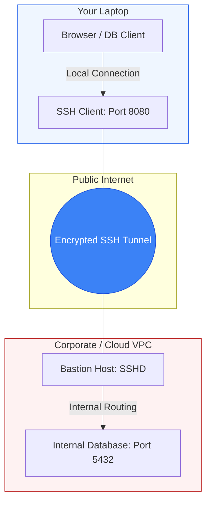

# 🕳️ Module 02.05: SSH Tunneling & Port Forwarding

> **"If SSH is the front door, Tunneling is the secret passage behind the bookshelf. It allows you to bypass firewalls, reach internal databases, and secure insecure protocols, all through a single encrypted pipe."**

## 📚 Overview

SSH Tunneling (also known as Port Forwarding) is one of the most powerful and versatile skills in a DevOps engineer's toolkit. It allows you to wrap any TCP traffic inside an encrypted SSH session. Whether you need to access a database in a private subnet, expose a local development server to the internet for webhook testing, or route your entire browser traffic through a secure server, SSH tunneling makes it possible without requiring a complex VPN.

## 🎓 Learning Objectives

By the end of this module, you will:

- ✅ Master **Local Port Forwarding (`-L`)** to reach internal services.
- ✅ Implement **Remote Port Forwarding (`-R`)** to expose local services.
- ✅ Configure **Dynamic Port Forwarding (`-D`)** as a SOCKS proxy.
- ✅ Orchestrate **Multi-Hop Tunnels** using `ProxyJump` and `-J`.
- ✅ Troubleshooting common tunnel failures (Address already in use, GatewayPorts).
- ✅ Understand the security implications of tunneling in a corporate environment.

---

## 🏗️ 1. The Three Primary Tunnels

### 1. Local Port Forwarding (`-L`)
**Use Case**: "I want to access a remote resource as if it were on my own machine."
- **Syntax**: `ssh -L [local_ip]:[local_port]:[remote_host]:[remote_port] [user]@[ssh_server]`
- **Example**: `ssh -L 5432:db-prod.internal:5432 admin@bastion.com`
- **Result**: You can now connect your DB client to `localhost:5432` to talk to the production database.

### 2. Remote Port Forwarding (`-R`)
**Use Case**: "I want to let someone on a remote server see a service running on my laptop."
- **Syntax**: `ssh -R [remote_port]:[local_host]:[local_port] [user]@[remote_server]`
- **Example**: `ssh -R 8080:localhost:3000 user@public-vps.com`
- **Result**: Anyone hitting `public-vps.com:8080` is actually talking to your laptop's port 3000. Great for webhooks!

### 3. Dynamic Port Forwarding (`-D`)
**Use Case**: "I want a private, secure SOCKS proxy for all my web traffic."
- **Syntax**: `ssh -D [local_port] [user]@[remote_server]`
- **Example**: `ssh -D 1080 user@home-server.com`
- **Result**: Set your browser to use `SOCKS5 localhost:1080`. All your web traffic now appears to come from your home server.

---

## 🚀 Professional Pattern: The "Ephemeral DB Connection"

Never leave persistent tunnels open to production databases. It increases the risk of accidental data deletion if you run a query in the wrong window.

**The Pro Standard**:
1. **The Script**: Create a small bash alias or script for the tunnel.
2. **The Flag**: Use `-f -N` (Background, No Command) combined with `sleep`.
3. **The Workflow**: `ssh -f -L 5432:db:5432 bastion sleep 60`.
4. **The Benefit**: The tunnel stays open for 60 seconds. If you connect your DB client within that time, the tunnel stays active as long as the connection is open. If you don't connect, it kills itself automatically.
5. **The Outcome**: High security with no "stray" ports left open on your laptop.

---

## 🏆 Real-World DevOps Story: The "Webhook" Rescue

**The Scenario**: A developer was building an integration with Stripe. Stripe sends "Webhooks" (HTTP calls) to your server when a payment is successful.
**The Crisis**: The developer was working on their local laptop, which had no public IP address. Stripe couldn't "reach" their laptop, so they had to deploy code to a server every single time they wanted to test a change—a process that took 5 minutes per test.
**The Fix**: The developer used **Remote Port Forwarding**. They ran `ssh -R 80:localhost:3000 my-dev-vps.com`.
**The Result**: They told Stripe to send webhooks to `http://my-dev-vps.com`. The webhook hit the VPS, traveled down the SSH tunnel, and landed on their laptop instantly. 
**The Lesson**: **Tunnels are bidirectional.** You don't need a public IP to receive public traffic if you have a "Meeting Point" server.

---

## ❓ Interview Preparation (Tunneling)

1. **Q: What is the difference between Local (-L) and Remote (-R) port forwarding?**
    *A: Local (-L) listens on your **local** machine and sends traffic to a remote destination. Remote (-R) listens on the **remote** server and sends traffic back to your local machine (or another local resource).*

2. **Q: How do you allow other machines on your network to use your SSH tunnel?**
    *A: By default, SSH binds tunnels to `localhost` (127.0.0.1) only. To allow others, you must specify the local IP (e.g., `-L 0.0.0.0:80:remote:80`) and, for remote tunnels, the server must have `GatewayPorts yes` enabled in `sshd_config`.*

3. **Q: What happens if you try to open a tunnel on a port that is already in use?**
    *A: SSH will usually connect to the shell successfully, but it will display an error: "bind [127.0.0.1]:8080: Address already in use" and the tunneling functionality will fail for that specific port.*

4. **Q: What is a SOCKS proxy, and how does it relate to SSH?**
    *A: A SOCKS proxy (created via SSH -D) is a dynamic tunnel. Unlike standard forwarding where you map one port to one destination, SOCKS allows the client (like a browser) to tell the SSH server where to go for *every* request, making it ideal for general web surfing or multi-service debugging.*

5. **Q: What common 'sshd_config' settings can disable tunneling?**
    *A: `AllowTcpForwarding no` (disables -L and -R) and `PermitTunnel no` (disables Layer 3 TUN/TAP devices).*

---

## 📝 Knowledge Check

1. **Which flag is used to create a Local Port Forward?**
    - [ ] a) -R
    - [x] b) -L
    - [ ] c) -D
    - [ ] d) -J

2. **You want to browse the web using your remote server's IP address. Which command do you use?**
    - [ ] a) ssh -L 80:google.com:80 user@server
    - [ ] b) ssh -R 80:localhost:80 user@server
    - [x] c) ssh -D 1080 user@server
    - [ ] d) ssh -J user@server

3. **To run an SSH tunnel in the background without opening a shell, which flags do you add?**
    - [ ] a) -v -p
    - [ ] b) -X -Y
    - [x] c) -f -N
    - [ ] d) -t -i

4. **Which setting in the remote server's sshd_config is required for remote tunnels to bind to public IPs?**
    - [ ] a) AllowTcpForwarding yes
    - [ ] b) PermitRootLogin yes
    - [x] c) GatewayPorts yes
    - [ ] d) X11Forwarding yes

5. **True or False: Using ProxyJump (-J) is more secure than manually nesting multiple -L tunnels.**
    - [x] True (It handles the encryption hops properly and is easier to manage)
    - [ ] False

---

## 🔗 Next Steps

You've mastered the art of shifting traffic. Now let's look at how to scale these operations across thousands of servers using **SSH Automation**.

Proceed to: **[03. SSH Automation & Scripting](../03-automation/readme.md)** →
Node: This link points to the final frontier of SSH efficiency.