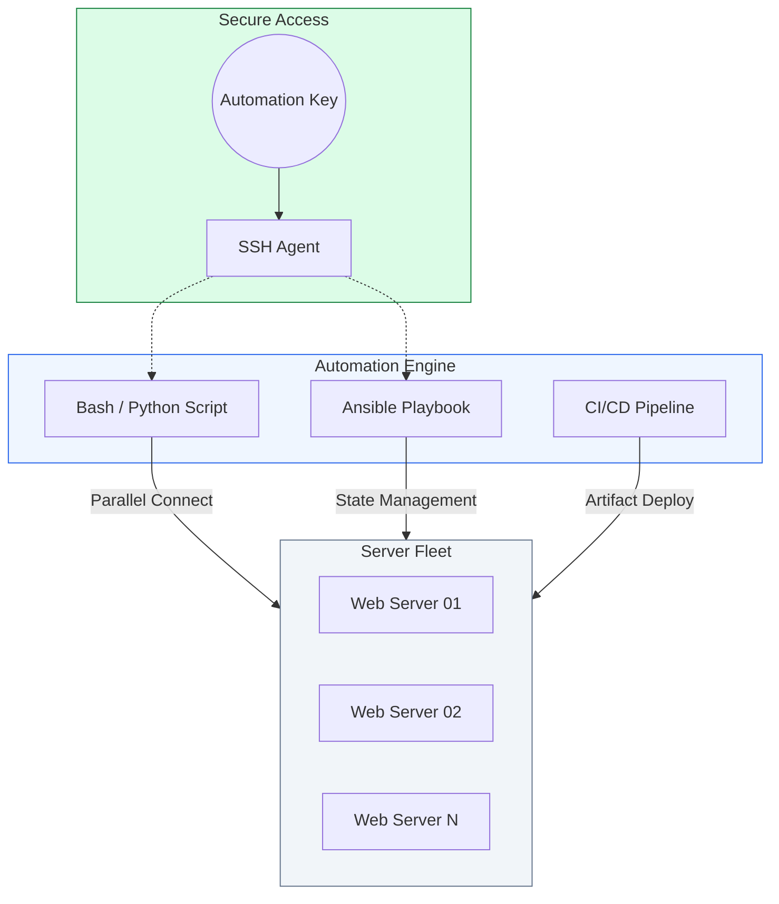

# 🤖 Module 02.06: SSH Automation & Scripting

> **"If you have to log into 100 servers manually, you aren't an engineer; you're a data entry clerk. True DevOps engineers build engines that do the logging in for them. Automation isn't just about speed; it's about consistency and the elimination of human error."**



## 📚 Overview

In the cloud-native era, infrastructure is never static. Managing a "fleet" of servers requires moving beyond individual `ssh` commands. **SSH Automation** is the practice of using scripts, parallel execution tools, and configuration management (like Ansible) to perform tasks across hundreds of instances simultaneously. This module covers the transition from manual interaction to automated "Infrastructure-at-Scale," including robust deployment scripts, health-checked rollouts, and CI/CD integration.

## 🎓 Learning Objectives

By the end of this module, you will:

- ✅ Execute commands across multiple servers in parallel using **Bash and GNU Parallel**.
- ✅ Build robust **Deployment Pipelines** with automated rollbacks and health checks.
- ✅ Integrate SSH automation into **GitHub Actions** and CI/CD workflows.
- ✅ Manage infrastructure secrets and keys within **Terraform** and **Ansible**.
- ✅ Implement "Infrastructure as Code" (IaC) for SSH daemon configurations.

---

## 🏗️ 1. Parallel Command Execution

When you need a quick status report (like `uptime` or `df -h`) from 50 servers, you don't log in 50 times. You use parallel execution.

### The "Industry Standard" Parallel Script
```bash
#!/bin/bash
# Multi-server command executor
SERVERS=("web1" "web2" "web3" "db1")
COMMAND="uptime"

# Run in parallel (background)
for host in "${SERVERS[@]}"; do
    ssh -n -o ConnectTimeout=5 "$host" "$COMMAND" &
done
wait # Wait for all background tasks to finish
```

---

## 🚀 2. The Deployment Architecture

Automating a deployment isn't just about `scp`. It's a sequence of state changes that must be verified at every step.

### The Professional Deployment Workflow
1. **Pre-Check**: Verify disk space and network health.
2. **Transfer**: Upload the new artifact to a unique folder (e.g., `/opt/app/releases/v2.1`).
3. **Atomic Switch**: Update a symbolic link (`current -> releases/v2.1`) so the switch is instant.
4. **Restart**: Reload the systemd service.
5. **Post-Check**: Perform a `curl` health check.
6. **Rollback**: If the health check fails, instantly point the symlink back to the previous version.

---

## 🚀 Professional Pattern: The "No-Touch" Key Management

Senior engineers never hardcode SSH keys into scripts. They use **SSH Agents** and **Environment Variables**.

**The Pro Standard**:
1. **The Secret**: Store the SSH Private Key in your CI/CD secret manager (e.g., GitHub Secrets).
2. **The Agent**: In your pipeline, use `ssh-agent -a $SSH_AUTH_SOCK` to load the key into memory.
3. **The Benefit**: Your deployment script doesn't need to know *where* the key is on disk. It simply asks the agent to perform the handshake.
4. **The Security**: The key never touches the server's permanent storage, and it is never accidentally committed to a Git repository.

---

## 🏆 Real-World DevOps Story: The "Fat Finger" Disaster

**The Scenario**: A company had a fleet of 200 servers. To update a security patch, an engineer used a simple `for` loop to log in and run `sudo apt upgrade -y`.
**The Crisis**: On server #47, a configuration prompt popped up. The loop hung, waiting for input. The engineer, thinking the script was just slow, pressed `Enter` multiple times.
**The Fix**: On server #48, the patch had a bug that broke the kernel. Because the script had no "Safe Exit," it continued to server #49, #50, and #51, breaking all of them before the engineer could kill the process.
**The Result**: 5 servers were dead, and the service was down for hours.
**The Lesson**: **Never automate without a "Kill Switch" and "Stop-on-Failure" logic.** A professional automation script (like the one in this module) checks the exit status (`$?`) of every command and aborts immediately if a server fails.

---

## ❓ Interview Preparation (SSH Automation)

1. **Q: Why use rsync instead of scp for automated deployments?**
    *A: `rsync` is more efficient because it only transfers the parts of files that have changed (delta-transfer). It also has better support for preserving permissions, symbolic links, and resuming interrupted transfers.*

2. **Q: What is a 'Symbolic Link' (Symlink) deployment, and why is it used?**
    *A: It's when you keep multiple versions of an app in different folders and point a 'current' link to the active one. It allows for "Atomic" (instant) updates and "Instant Rollbacks" by simply repointing the link, rather than re-copying files.*

3. **Q: How can an automation script bypass the 'Are you sure you want to continue connecting?' prompt?**
    *A: In non-interactive environments, you should use the SSH option `-o StrictHostKeyChecking=no`. However, for production, it is better to pre-populate the `known_hosts` file with the server's public keys to maintain a high security standard.*

4. **Q: What is 'Idempotency' in the context of SSH automation?**
    *A: Idempotency means that running the same script multiple times results in the same final state without causing errors. For example, a script that creates a directory should check if it already exists before trying to create it.*

5. **Q: How do you handle 'Sudo' passwords in an automated SSH script?**
    *A: You should avoid "piping" passwords. The professional way is to configure the automation user with **NOPASSWD** access in the `/etc/sudoers.d/` file for specific, required commands.*

---

## 📝 Knowledge Check

1. **Which command is best for checking the exit status of the LAST SSH command?**
    - [ ] a) ssh -status
    - [x] b) echo $?
    - [ ] c) tail /var/log/auth.log
    - [ ] d) ps aux

2. **What is the primary benefit of using an SSH Agent in a CI/CD pipeline?**
    - [ ] a) It makes the connection faster
    - [ ] b) It compresses the data
    - [x] c) It allows the script to use keys without knowing their location or passphrase
    - [ ] d) It hides the IP address of the server

3. **In the 'Atomic Switch' deployment pattern, what does the 'current' file typically point to?**
    - [ ] a) A database
    - [x] b) A symbolic link to the latest release folder
    - [ ] c) The engineer's laptop
    - [ ] d) A backup S3 bucket

4. **True or False: Using '-o BatchMode=yes' prevents SSH from hanging on interactive prompts.**
    - [x] True 
    - [ ] False

5. **Which tool is a higher-level 'Automation Engine' that uses SSH under the hood?**
    - [ ] a) Wireshark
    - [x] b) Ansible
    - [ ] c) Nmap
    - [ ] d) Netstat

---

## 🔗 Next Steps

You've mastered the remote engine. Now it's time to dive into the Core of Linux: **System Administration & Service Management**.

Proceed to: **[Phase 1.02.01: System Administration & Services](../../../../../readme.md)** →
Node: This leads to the next major phase of the Intermediate Curriculum.