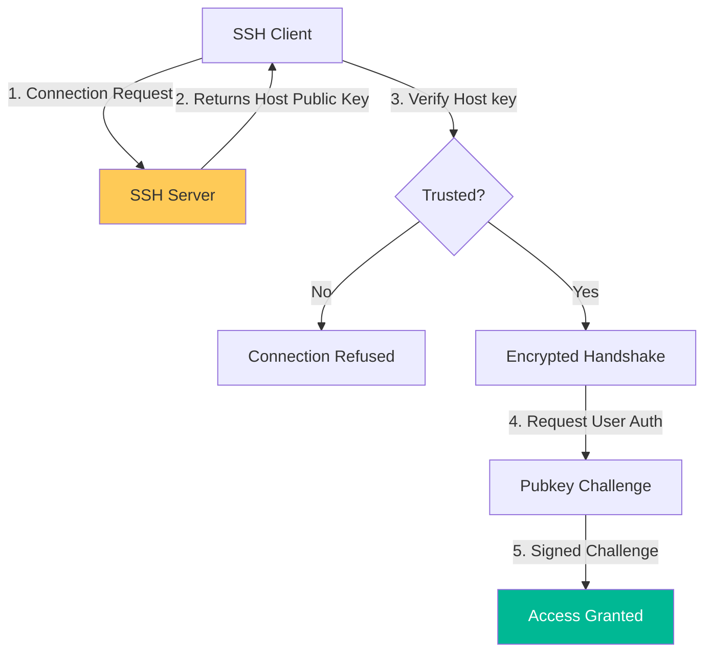

# SSH Architecture & Security Reference

**Doc Version:** 1.0.0
**Role:** Security Engineer / Linux Administrator
**Scope:** OpenSSH Architecture, Key Management, and Perimeter Security

---

## 1. The SSH Protocol & Architecture

SSH (Secure Shell) is a cryptographic network protocol for operating network services securely over an unsecured network. It operates on a **Client-Server** model.

### A. The Three Layers of SSH
1.  **Transport Layer**: Provides server authentication, confidentiality, and integrity (Host keys and Diffie-Hellman).
2.  **User Authentication Layer**: Verifies the identity of the client (Public keys, Passwords).
3.  **Connection Layer**: Multi-plexes the encrypted tunnel into multiple channels (Shells, Port Forwarding, X11).

### B. Host Keys vs. User Keys
- **Host Keys**: Stored in `/etc/ssh/ssh_host_*`. These identify the **Server** to the client, preventing Man-in-the-Middle (MITM) attacks.
- **User Keys**: Stored in `~/.ssh/id_*`. These identify the **User** to the server.

---

## 2. Modern Cryptographic Standards

Legacy algorithms like DSA and short RSA keys are no longer secure.

### A. Recommended Key Types
- **Ed25519**: (Recommended) Fast, high security, and small key size.
- **RSA 4096**: Compatible with older systems but slower and bulkier.

### B. Secure Ciphers & MACs
Production systems should restrict the available algorithms in `sshd_config`.
- **Ciphers**: `chacha20-poly1305@openssh.com`, `aes256-gcm@openssh.com`.
- **KEX (Key Exchange)**: `curve25519-sha256@libssh.org`.

---

## 3. Visualizing SSH Authentication

---

## 4. The Bastion Host Pattern (Perimeter Security)

A Bastion Host (or Jump Box) acts as a single gateway into a private network.

- **Architecture**: Internal servers are in a private subnet (No Public IP). The Bastion has a Public IP and is highly hardened.
- **Workflow**: `ssh -J user@bastion user@internal-server`.
- **Security Logic**: If the Bastion is compromised, the internal servers are still protected by their own SSH keys and narrowed firewall rules.

---

## 5. Enterprise Governance Standards

- **Zero-Password Policy**: `PasswordAuthentication no` must be enforced on all production servers.
- **Key Rotation**: Corporate SSH keys should be rotated at least once per year (or use a Certificate Authority like Teleport or Vault).
- **Session Auditing**: Centralized logging of all `sshd` events to a SIEM. Every login must record IP, Timestamp, and Key fingerprint.

> **Enterprise Pattern**: Implement **The "Strict" Host Verification**. Use the `known_hosts` file not just as a cache, but as an enforcement mechanism. In highly secure environments, utilize **SSH Certificates**. Instead of trust-on-first-use (TOFU), use a CA to sign server keys, allowing clients to instantly trust any server in the organization's fleet without manual intervention.
