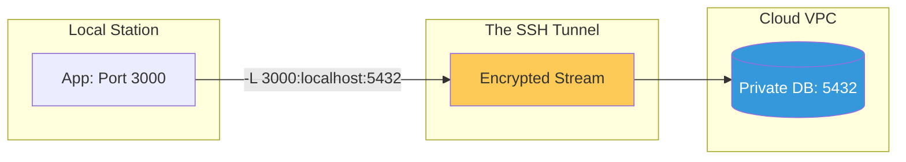

# SSH Enterprise Automation & Hardening Reference

**Doc Version:** 1.0.0
**Role:** DevOps Engineer / Automation Lead
**Scope:** Tunnelling, Multiplexing, and Automated Intrusion Prevention

---

## 1. High-Performance SSH (Multiplexing)

When running automation tools like **Ansible**, opening dozens of new SSH connections can be slow and resource-heavy.

- **The Concept**: Use a single TCP connection for multiple SSH channels.
- **Implementation**:
    ```bash
    Host *
        ControlMaster auto
        ControlPath ~/.ssh/master-%r@%h:%p
        ControlPersist 10m
    ```
- **Benefit**: Reduces connection overhead by 5x-10x for sequential tasks.

---

## 2. Advanced Tunneling & Port Forwarding

SSH can act as a "Magic Tunnel" to shuttle localized traffic securely across networks.

### A. Local Port Forwarding (`-L`)
Accessing a remote database as if it were on your localhost.
- `ssh -L 5432:localhost:5432 user@prod-db`

### B. Remote Port Forwarding (`-R`)
Exposing your local development server to a remote public server.
- `ssh -R 8080:localhost:80 user@public-server`

### C. Dynamic Port Forwarding (`-D`)
Creating a SOCKS proxy to route ALL browser traffic through the remote server.

---

## 3. Automated Intrusion Prevention (Fail2Ban)

Public-facing SSH servers are constant targets for automated brute-force attacks.

1.  **Monitor**: Fail2Ban reads `/var/log/auth.log` or `/var/log/secure`.
2.  **Analyze**: It looks for patterns of "Failed password" or "Connection closed" from the same IP.
3.  **Action**: After X attempts, it creates a temporary firewall rule (using `iptables` or `ufw`) to drop all traffic from that IP.

---

## 4. Visualizing common SSH Tunnels



---

## 5. SSH Configuration (The Config File)

Managing a fleet of servers requires a well-structured `~/.ssh/config`.

- **Alias Branding**: `ssh web-prod` instead of `ssh -i ~/.ssh/keys/prod.key admin@10.50.0.12`.
- **ProxyJump**: Transparently routing traffic through Bastion hosts without multiple manual steps.
- **Identity Enforcement**: Forcing a specific key for a specific host to prevent key-leakage.

---

## 6. Enterprise Governance Standards

- **Deny-List Management**: Automated scripts to remove authorized_keys for offboarded employees across the entire cluster within 5 minutes.
- **Strict Host Key Checking**: `StrictHostKeyChecking yes` must be default to prevent "silent" MITM attacks.
- **Banners & Warnings**: Displaying a legally binding "Authorized Use Only" banner upon login to satisfy compliance requirements (NIST/SOC2).

> **Enterprise Pattern**: Implement **The "Disposable" Bastion**. Use Infrastructure-as-Code to rotate your Bastion hosts every 24 hours. This ensures that even if a zero-day exploit allows an attacker to gain a foothold on the gateway, their persistence is automatically wiped daily. All session logs must be exported to a separate write-only logging server in real-time.
