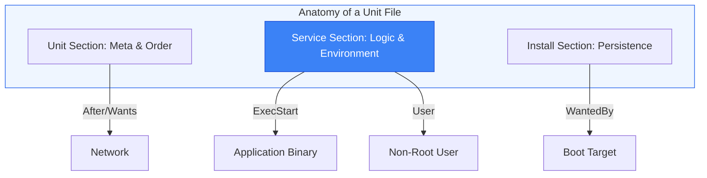

# 📄 Module 01.01: Unit File Fundamentals

> **"A unit file is the blueprint for your service. It tells the kernel what to run, who runs it, and what it needs to survive. Understanding its structure is the first step in Linux orchestration."**

## 📚 Overview

In the Systemd world, everything is a **Unit**. While we most commonly work with Services (`.service`), Systemd also manages Sockets, Timers, Mounts, and Targets via these declarative configuration files. This module focuses on the anatomy of the `.service` unit file—the building block of application management in Linux.

## 🎓 Learning Objectives

- ✅ Understand the 11 different types of Systemd units.
- ✅ Master the three core sections of a unit file: `[Unit]`, `[Service]`, and `[Install]`.
- ✅ Configure execution environments (User, WorkingDirectory, Environment).
- ✅ Implement secure logging redirection using `StandardOutput`.

---

## 🏗️ 1. Unit Types Overview

Systemd isn't just for services. It uses different extensions to manage different resources:

| Extension | Purpose |
| :--- | :--- |
| **.service** | Standard background applications or daemons. |
| **.timer** | Time-based activation (modern replacement for Cron). |
| **.socket** | Socket-based activation (service starts only when traffic arrives). |
| **.mount** | Manages file system mount points. |
| **.target** | Logic groups used to synchronize boot states (e.g., `multi-user.target`). |

---

## 🏗️ 2. The Core Sections

### [Unit] - Metadata & Ordering

This section deals with what the service *is* and when it should start.

- `Description`: A human-readable name.
- `After`: Start after these units are ready.
- `Before`: Start before these units.

### [Service] - The Engine

This is the "Meat" of the file. It defines how the application actually runs.

- `ExecStart`: The exact command to run the app.
- `User` / `Group`: The security context. **Never run as root.**
- `WorkingDirectory`: Where the app should "look" for its files.
- `Environment`: Key-value pairs for configuration (e.g., `DB_URL`).

### [Install] - Boot Behavior

This section defines how the service is "Enabled."

- `WantedBy`: Usually `multi-user.target`. This ensures the service starts automatically when the system reaches its normal state.

---

## 🚀 Professional Pattern: The "Clean Output" Standard

Junior admins often let their applications write logs to custom files like `/var/log/myapp.log`. This makes log rotation and analysis difficult.

**The Pro Standard**:
1. **The Config**: In your `[Service]` section, set `StandardOutput=journal` and `StandardError=journal`.
2. **The Logic**: The application writes to its standard output (the terminal), and Systemd catches it.
3. **The Benefit**: Your logs are instantly searchable with `journalctl`, they are compressed, they have high-resolution timestamps, and they are automatically rotated.
4. **The Outcome**: No more "Disk Full" errors due to rogue log files.

---

## ❓ Interview Preparation

1. **Q: Where are the default system-managed unit files located?**

    *A: `/lib/systemd/system/`. You should never edit files here directly; if you need to override them, use `/etc/systemd/system/`.*

1. **Q: What is the purpose of the 'Type=' setting in the [Service] section?**

    *A: It defines how Systemd knows the service has successfully started. `Type=simple` assumes it's ready immediately; `Type=notify` expects the app to send a signal when initialized; `Type=oneshot` is for scripts that run and then exit.*

1. **Q: How can you pass environment variables to a Systemd service without hardcoding them in the unit file?**

    *A: Use the `EnvironmentFile=` directive to point to a hidden file (like `/etc/myapp/.env`) that contains the key-value pairs.*

---

## 📝 Knowledge Check

1. **Which section of a unit file defines the execution behavior (ExecStart, User, etc.)?**

    - [ ] a) [Unit]
    - [x] b) [Service]
    - [ ] c) [Install]
    - [ ] d) [Exec]

1. **What unit type is used to replace the traditional 'Cron' scheduler?**

    - [ ] a) .cron
    - [ ] b) .schedule
    - [x] c) .timer
    - [ ] d) .event

1. **To ensure a service starts after the network is online, which directive is used?**

    - [ ] a) Requires=network.target
    - [x] b) After=network.target
    - [ ] c) Wants=network.target
    - [ ] d) Before=network.target

---

## 🔗 Next Steps

Now that you know how to build a blueprint, let's learn how to drive the engine. Proceed to: **[02. Service State Management](../02-service-state-management/readme.md)** →
 Node: Moving from configuration to operation.
