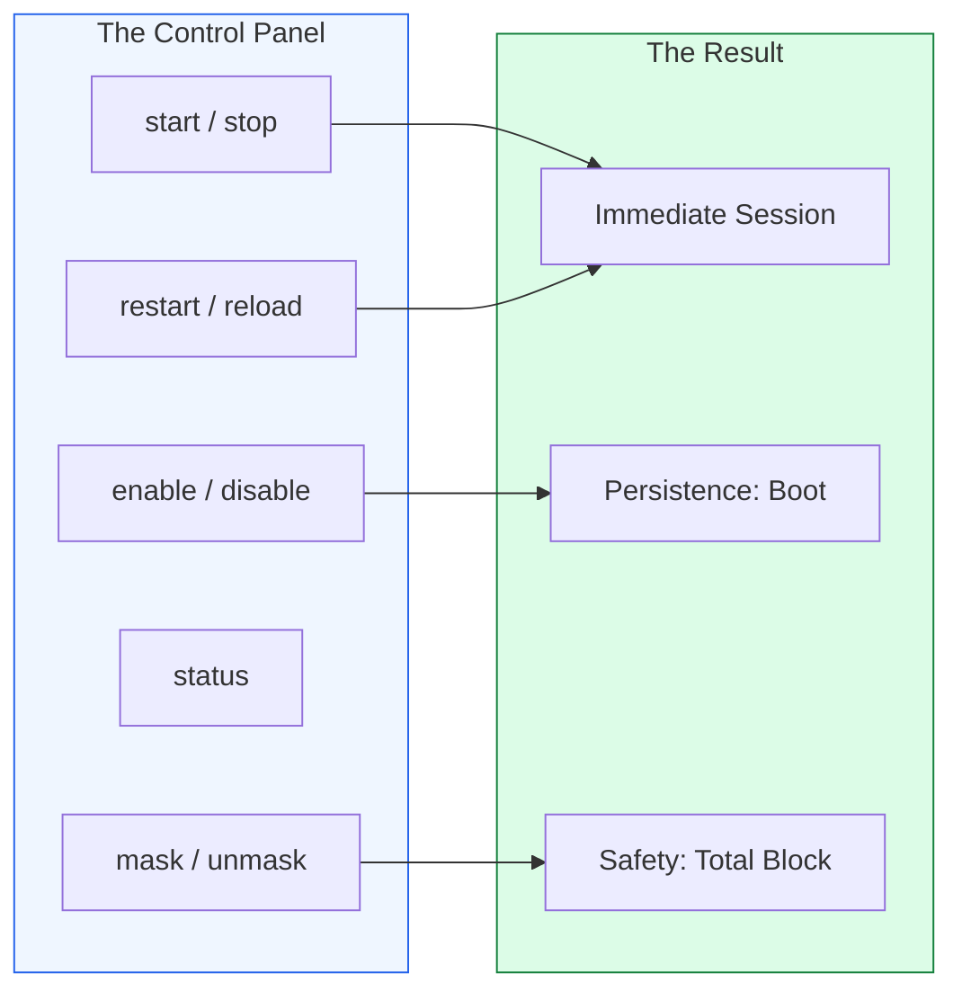

# 🕹️ Module 01.02: Managing Services with Systemctl

> **"If a unit file is the script, systemctl is the director. It controls the action, checks the health, and ensures the show goes on through reboots, crashes, and reloads."**



## 📚 Overview

The `systemctl` command is the primary interface for managing Systemd. It consolidates many of the functions that used to be spread across `service`, `chkconfig`, and `/etc/init.d/` scripts. It allows you to control the lifecycle of your application, from its initial deployment to its long-term persistence and security.

## 🎓 Learning Objectives

- ✅ Master the 5 core states of a service (Start, Stop, Restart, Enable, Disable).
- ✅ Differentiate between `restart` and `reload` for zero-downtime updates.
- ✅ Implement `masking` to prevent accidental service triggers.
- ✅ Audit the system state with `list-units` and `list-unit-files`.
- ✅ Perform a `daemon-reload` to apply configuration changes safely.

---

## 🏗️ 1. Core Management Commands

| Command | Action | Key Use Case |
| :--- | :--- | :--- |
| `systemctl status nginx` | Check | See if the service is running and view the last 10 log lines. |
| `systemctl start nginx` | Execute | Turn the service on right now. |
| `systemctl enable nginx` | Persist | Create symlinks so the service starts automatically at boot. |
| `systemctl restart nginx` | Reset | Kill the process and start it again (causes downtime). |
| `systemctl reload nginx` | Refresh | Tell the service to read its config without stopping (No downtime). |
| `systemctl daemon-reload` | Cache Sync | Force Systemd to reload its unit files from disk after an edit. |

---

## 🏗️ 2. Advanced Controls (Masking)

**Masking** is the "Force Field" of Systemd. While `disable` just prevents a service from starting at boot, `mask` makes it impossible to start the service manually.

```bash
# Total block of a service
sudo systemctl mask my-risky-service

# Verification
# The service is now symlinked to /dev/null
ls -l /etc/systemd/system/my-risky-service.service

# To restore access
sudo systemctl unmask my-risky-service
```

---

## 🚀 Professional Pattern: The "Dry-Run" Audit

Before you run an automation script or perform a migration, you should audit exactly what is running on the machine.

**The Pro Standard**:
1. **The Check**: Run `systemctl list-units --state=failed`.
2. **The Logic**: It's common for servers to have small, non-critical services that fail silently. If you don't check *before* your work, you might get blamed for them failing *after*.
3. **The Outcome**: You establish a clean baseline before making changes.

---

## ❓ Interview Preparation

1. **Q: What is the difference between 'enable' and 'start'?**
    *A: `start` triggers the service in the current session only. `enable` configures the service to trigger upon boot. To ensure a service is running now AND after a reboot, you must run both.*

2. **Q: When should you use 'systemctl daemon-reload'?**
    *A: Anytime you modify a unit file (e.g., `/etc/systemd/system/myapp.service`) on the disk. Systemd caches these files in RAM for speed; `daemon-reload` forces it to update its cache with your latest changes.*

3. **Q: How do you find all services that are currently 'running'?**
    *A: `systemctl list-units --type=service --state=running`.*

---

## 📝 Knowledge Check

1. **Which command ensures a service starts automatically when the server reboots?**

    - [ ] a) start
    - [x] b) enable
    - [ ] c) boot
    - [ ] d) persistent

1. **Which command is used to read a service configuration WITHOUT stopping it?**

    - [ ] a) restart
    - [ ] b) refresh
    - [x] c) reload
    - [ ] d) rsync

1. **What happens to a 'Masked' service if you try to start it?**

    - [ ] a) It starts normally
    - [ ] b) It starts in background mode
    - [x] c) It fails with a "Masked" error
    - [ ] d) It reboots the server

---

## 🔗 Next Steps

Operating a service is one thing; making it production-ready and secure is another. Proceed to: **[03. Hardening & Security](../03-hardening-and-security/readme.md)** →
 Node: Moving into production standards.
