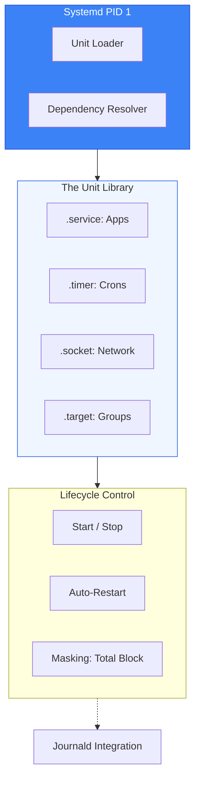

# ⚙️ Module 01: Systemd & Service Management

> **"Systemd is the architect of the Linux city. It decides which services live, which ones die, and how they talk to each other. Mastering it is the difference between a shaky server and a resilient infrastructure."**



## 📚 Overview

Modern Linux distributions (Ubuntu, RHEL, Debian, CentOS) use **Systemd** as their init system and service manager. It is the first process to start (PID 1) and remains the "Parent" of all other processes. For a DevOps engineer, Systemd is the primary way to manage application persistence, handle dependencies, and ensure that your services recover automatically from crashes.

## 🎓 Learning Objectives

By the end of this module, you will:

- ✅ Manage unit states with `systemctl` (Start, Enable, Mask).
- ✅ Build logic-driven **Unit Files** with custom execution environments.
- ✅ Configure **Auto-Restart Policies** to ensure 99.9% uptime.
- ✅ Orchestrate **Service Dependencies** using `After=`, `Wants=`, and `Requires=`.
- ✅ Troubleshoot failed services using `systemctl status` and `journalctl`.

---

## 🏗️ 1. The Service Management Toolkit

| Command | Action | Key Use Case |
| :--- | :--- | :--- |
| `systemctl status <name>` | Check Health | First step in debugging. |
| `systemctl enable <name>` | Persist | Ensure service starts after a reboot. |
| `systemctl mask <name>` | Hard Block | Prevent anyone (even another service) from starting it. |
| `systemctl daemon-reload` | Refresh | Tell Systemd you've edited a file on disk. |
| `systemctl list-units` | Audit | See what is active on the system right now. |

---

## 📂 Sub-Module Curriculum

Navigate through the technical deep-dives of Systemd:

| Module | Topic | Description |
| :--- | :--- | :--- |
| **[01.01](./01-unit-file-fundamentals/)** | **Unit File Fundamentals** | Anatomy of .service, .timer, and .socket files. |
| **[01.02](./02-service-state-management/)** | **Service State Management** | Commands, Masking, and Lifecycle control. |
| **[01.03](./03-hardening-and-security/)** | **Hardening & Security** | Sandboxing, Namespaces, and systemd-analyze. |
| **[01.04](./04-dependencies-and-targets/)** | **Dependencies & Targets** | Ordering, Requirements, and Runlevels. |

---

## 🏗️ 2. Anatomy of a .service File

This is how you define an application for the OS. Located in `/etc/systemd/system/`.

```ini
[Unit]
Description=My Cloud API
After=network.target postgresql.service # Don't start until DB is ready

[Service]
Type=simple
User=webapp_user
WorkingDirectory=/opt/myapp
ExecStart=/opt/myapp/bin/api --port 8080
Restart=always                # THE GOLD STANDARD for DevOps
RestartSec=5                  # Wait 5 seconds before trying again
Environment=DATABASE_URL=postgres://...

[Install]
WantedBy=multi-user.target    # Ensure it starts in the regular user mode
```

---

## 🚀 Professional Pattern: The "Auto-Healing" Service

Junior admins restart services manually when they crash. Senior engineers let the OS do it.

**The Pro Standard**:
1. **The Policy**: Always include `Restart=always` and `RestartSec=10` in your production unit files.
2. **The Limit**: Use `StartLimitIntervalSec` and `StartLimitBurst` to prevent a "Crash Loop" from overwhelming the system.
3. **The Benefit**: If your app crashes due to a temporary memory spike at 3 AM, Systemd will bring it back up in seconds without you ever knowing there was a problem.
4. **The Outcome**: High availability with zero manual intervention.

---

## 🏆 Real-World DevOps Story: The "Masked" Mystery

**The Scenario**: A company used a custom script to manage its database backups. One day, the script stopped working.
**The Crisis**: No matter how many times the admin ran `systemctl start backup.service`, the terminal just said "Service is masked."
**The Discovery**: A security-conscious engineer had "Masked" the service (`systemctl mask`) because it had a hardcoded password in the command line. Unlike `disable`, which just stops a service from booting, `mask` links the service to `/dev/null`, making it impossible to start manually.
**The Fix**:
1. Run `systemctl unmask backup.service`.
2. Move the password to a secure environment file protected by `chmod 600`.
3. Restart the service.
**The Lesson**: **Masking is a security tool.** Use it to prevent dangerous or deprecated services from ever being triggered accidentally.

---

## ❓ Interview Preparation (Systemd)

1. **Q: What is the difference between 'enable' and 'start'?**
    *A: `start` triggers the service immediately (current session). `enable` configures the service to trigger automatically upon the next system boot. You usually want to do both.*

2. **Q: How can you see the logs specifically for one service?**
    *A: Use `journalctl -u <service-name>`. Adding `-f` will allow you to "follow" the logs in real-time as they are written.*

3. **Q: What happens if a service crashes but hasn't reached its 'StartLimitBurst'?**
    *A: Systemd will attempt to restart the service according to the `RestartSec` timer. If it crashes too many times in a short window, Systemd will "give up" to protect the CPU.*

4. **Q: What is a 'Target' unit in Systemd?**
    *A: A Target is a synchronization point or a group of units. For example, `multi-user.target` represents the state where the system is fully booted and ready for users. It is the modern replacement for "Runlevels".*

5. **Q: Can you run a service as a specific user? Why should you?**
    *A: Yes, using `User=` in the [Service] section. You should **Always** run applications as a non-privileged user to minimize the 'blast radius' if the application is hacked.*

---

## 📝 Knowledge Check

1. **Where should you place custom .service files that you create manually?**
    - [ ] a) /lib/systemd/system/
    - [ ] b) /usr/lib/systemd/system/
    - [x] c) /etc/systemd/system/
    - [ ] d) /tmp/

2. **Which command forces Systemd to reload its unit files from disk?**
    - [ ] a) systemctl restart systemd
    - [x] b) systemctl daemon-reload
    - [ ] c) systemctl reload-all
    - [ ] d) reboot

3. **In a unit file, 'After=network.target' ensures that:**
    - [ ] a) The network is cleared before starting
    - [x] b) The service waits for the network stack to be ready before starting
    - [ ] c) The service is allowed to talk to the internet
    - [ ] d) The service is deleted if the network goes down

4. **What is the status of a service that has been 'Masked'?**
    - [ ] a) Active
    - [ ] b) Inactive (disabled)
    - [x] c) Linked to /dev/null
    - [ ] d) Deleted from the disk

5. **True or False: Systemd can manage the lifecycle of Docker containers directly via unit files.**
    - [x] True (Though Docker/K8s usually handle their own, you can wrap them in a .service file)
    - [ ] False

---

## 🔗 Next Steps

Services consume resources. Let's learn how to monitor, prioritize, and control those resources in the next module.

Proceed to: **[02. Process Management](../02-process-management/readme.md)** →
Node: This link points to the resource control module.
