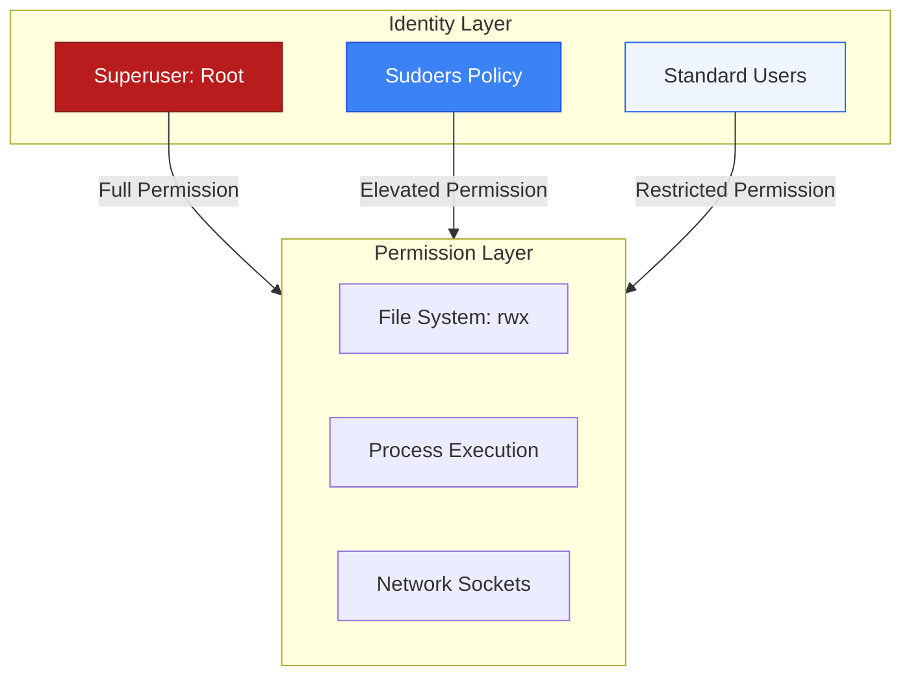

# 👤 Module 03: User & Identity Management

> **"In Linux, identity is power. Every file has an owner, and every process belongs to a user. Security in DevOps isn't just about firewalls; it's about ensuring every person and every machine has exactly the access they need—and not a byte more."**



## 📚 Overview

DevOps is a collaborative field, but collaboration requires strict boundaries. As an administrator, you manage the lifecycle of both **Humans** (Engineers, Admins) and **Automations** (Service Accounts). This module moves beyond the basics of `useradd` to master the multi-layered security of Linux identity: implementing granular `sudo` access, managing account expiration policies, and understanding the "Zero Trust" approach to service accounts.

## 🎓 Learning Objectives

By the end of this module, you will:

- ✅ Create and audit users with secure shell and home directory standards.
- ✅ Implement granular **Sudo Policies** using `visudo` to eliminate shared passwords.
- ✅ Enforce **Account Security** via password aging (`chage`) and locking policies.
- ✅ Group users strategically to simplify resource permissions.
- ✅ Configure **Service Accounts** without shell access to minimize attack surfaces.

---

## 🏗️ 1. The Identity Toolkit

| Tool | Action | Key Use Case |
| :--- | :--- | :--- |
| `visudo` | Edit Sudoers | SAFELY granting specific root permissions to users. |
| `chage` | Password Aging | Enforcing a policy where engineers must rotate keys/passwords every 90 days. |
| `usermod` | Modify Identity | Adding a developer to the `docker` group so they can run containers. |
| `id` / `groups` | Audit | Verifying exactly what "power" a user has on the system. |
| `last` | Forensic Audit | Seeing who logged in, from where, and for how long. |

---

## 🏗️ 2. The Granular Sudo Pattern

NEVER give a user `ALL=(ALL) ALL` if you can avoid it. Instead, give them only the commands they need.

```bash
# /etc/sudoers (Edited via visudo)

# Allow the 'deploy' user to restart nginx WITHOUT a password
deploy ALL=(ALL) NOPASSWD: /usr/bin/systemctl restart nginx

# Allow 'net-admins' group to only run networking tools
%net-admins ALL=(ALL) /usr/sbin/ip, /usr/sbin/tcpdump, /usr/bin/nmap
```

---

## 🚀 Professional Pattern: The "Nologin" Service Account

Junior admins create service accounts with default shells. Senior DevOps engineers create "Invisible" accounts that cannot be used to log in manually.

**The Pro Standard**:
1. **The Command**: `useradd -r -s /usr/sbin/nologin myapp_user`.
2. **The Logic**: The `-r` flag creates a "System Account" (no house-keeping overhead), and `-s /usr/sbin/nologin` ensures that if a hacker steals the password, they still can't get an interactive shell.
3. **The Benefit**: Your application can still own files and run processes, but the "Front Door" is physically missing for that user.
4. **The Outcome**: Significant reduction in the "Lateral Movement" risk during a breach.

---

## 🏆 Real-World DevOps Story: The "Forgotten" Contractor

**The Scenario**: A startup hired a contractor for 3 months to build their database. They gave the contractor a `root` SSH key and full `sudo` access.
**The Crisis**: Six months later—long after the contractor left—the company noticed strange database exports happening at midnight.
**The Discovery**: The contractor’s account was never deleted, and since there was no password/key expiration policy, their old key still worked perfectly.
**The Fix**:
1. Immediate `userdel -r` of old accounts.
2. Implemented a **chage** policy: `sudo chage -E $(date -d +90days +%Y-%m-%d) <username>` for all current contractors.
3. Switched to **Short-Lived Certificates** for SSH instead of permanent keys.
**The Lesson**: **Identity is a lifecycle.** You must have a process for both "Onboarding" and "Offboarding."

---

## ❓ Interview Preparation (Identity Management)

1. **Q: Why should you always use 'visudo' instead of 'nano /etc/sudoers'?**
    *A: `visudo` performs a syntax check before saving. If you make a mistake in the sudoers file with a regular editor, you can lock everyone out of root access, requiring a rescue boot to fix. `visudo` prevents you from saving a broken file.*

2. **Q: What is the purpose of the '/etc/shadow' file?**
    *A: It stores encrypted password hashes and aging information. Unlike `/etc/passwd` (which is world-readable), `/etc/shadow` is only readable by root, protecting the hashes from offline brute-force attacks.*

3. **Q: How can you lock a user account without deleting it?**
    *A: Use `sudo usermod -L <username>`. This puts a '!' in front of the encrypted password in the shadow file, preventing any password-based login.*

4. **Q: What is the difference between a 'Primary Group' and a 'Secondary Group'?**
    *A: The **Primary Group** is the group assigned to any new file the user creates. **Secondary Groups** (Supplemental) allow the user to access resources shared by other groups (like `docker` or `sudo`).*

5. **Q: What does the 'NOPASSWD' flag in sudoers mean?**
    *A: It allows the user to run the specified command via `sudo` without being prompted for their own password. This is essential for automation scripts and CI/CD runners.*

---

## 📝 Knowledge Check

1. **Which command is used to see the groups a user belongs to?**
    - [ ] a) id
    - [ ] b) groups
    - [x] c) Both a and b
    - [ ] d) whoami

2. **What is the effect of setting a user's shell to '/usr/sbin/nologin'?**
    - [ ] a) The user is deleted
    - [ ] b) The user can only log in via the console
    - [x] c) The user cannot establish an interactive shell session
    - [ ] d) The user has root access

3. **Which file stores the list of all user accounts and their basic info?**
    - [x] a) /etc/passwd
    - [ ] b) /etc/shadow
    - [ ] c) /etc/group
    - [ ] d) /home

4. **In 'chage -l username', what does the 'E' flag define?**
    - [ ] a) Encryption type
    - [x] b) Account Expiration date
    - [ ] c) Entry time
    - [ ] d) Effort level

5. **True or False: Deleting a user with 'userdel' automatically deletes their home directory.**
    - [ ] True 
    - [x] False (You must use 'userdel -r' to remove the home directory)

---

## 🔗 Next Steps

Identity defines who can touch the data. Now let's learn how to structure and grow the place where that data lives: Storage.

Proceed to: **[04. Storage & LVM](../04-storage-and-lvm/readme.md)** →
Node: This link points to the disk management module.
