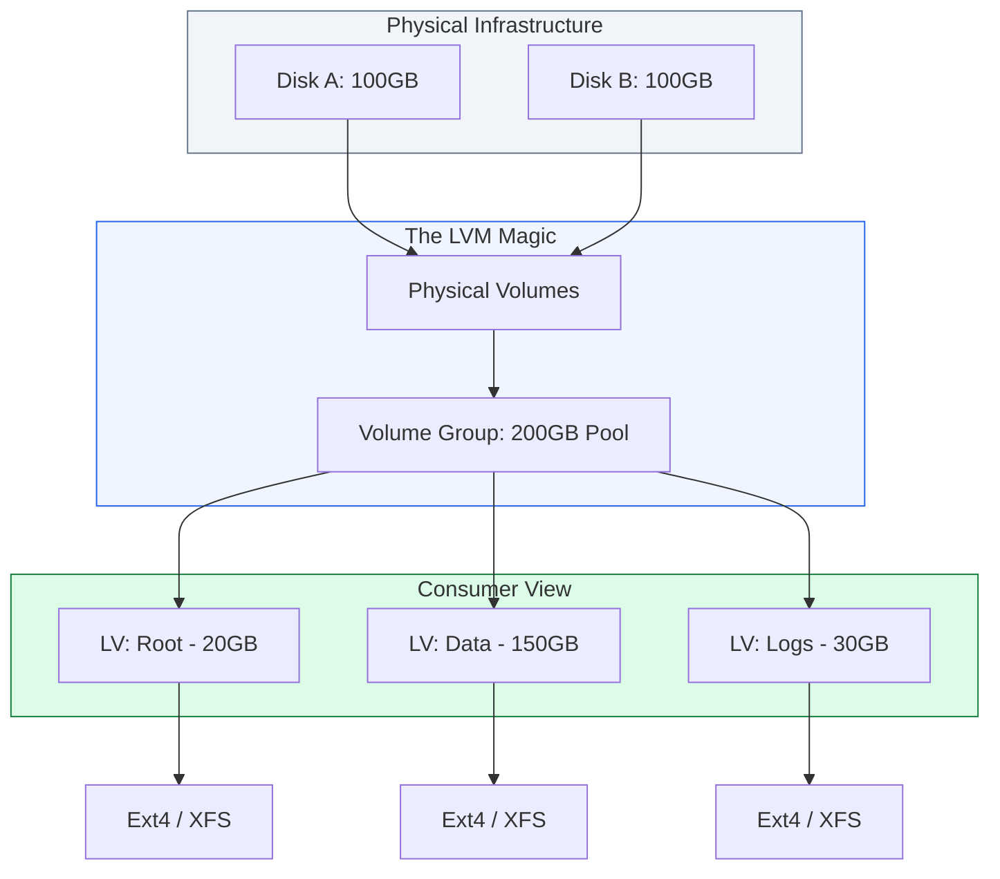

# 💾 Module 04: Storage & LVM (Logical Volume Management)

> **"Disks are the foundation of your persistence. In a world of elastic clouds, static partitions are a liability. LVM gives you the power to stretch, shrink, and snapshot your storage as your data grows."**

## 📚 Overview

In traditional computing, changing a partition size meant unmounting the disk, rebooting into a rescue environment, and crossing your prayers. **Logical Volume Management (LVM)** solves this by adding an abstraction layer between the physical hardware and the operating system. For DevOps engineers managing databases or log-heavy applications, LVM is mandatory for "Zero-Downtime" storage expansion and "Instant" backups via snapshots.

## 🎓 Learning Objectives

By the end of this module, you will:

- ✅ Construct the LVM hierarchy: **Physical Volumes (PV)** -> **Volume Groups (VG)** -> **Logical Volumes (LV)**.
- ✅ Expand storage volumes on-the-fly without unmounting file systems.
- ✅ Implement **Persistent Mounting** using the `/etc/fstab` and UUIDs.
- ✅ Create **Snapshots** for consistent backups of live data.
- ✅ Troubleshoot disk space issues using `lsblk`, `df`, and `du`.

---

## 🏗️ 1. The Storage Toolkit

| Tool | Action | Key Use Case |
| :--- | :--- | :--- |
| `lsblk` | List Blocks | Seeing how disks and partitions are physically connected. |
| `pvcreate` | Initialize PV | Preparing a raw disk or partition for use in LVM. |
| `vgextend` | Grow the Pool | Adding a new physical disk to an existing storage group. |
| `lvextend` | Grow the Volume | Increasing the size of a user-facing disk (e.g., `/var` is full). |
| `resize2fs` | Grow the File System | Telling the OS that the underlying LVM volume has grown. |

---

## 🏗️ 2. The LVM Expansion Workflow (Zero-Downtime)

The most common task: "We need more space for the database!"

1. **Physical**: Add a new disk to the server (Cloud or Physical).
2. **PV**: Initialize it: `pvcreate /dev/sdb`.
3. **VG**: Add it to the pool: `vgextend vg_data /dev/sdb`.
4. **LV**: Expand the logical disk: `lvextend -L +50G /dev/vg_data/lv_db`.
5. **FS**: Expand the file system: `resize2fs /dev/vg_data/lv_db`.

---

## 🚀 Professional Pattern: The "UUID" Safety Net

Junior admins use device names like `/dev/sdb1` in their `/etc/fstab`. Senior admins **never** do this.

**The Pro Standard**:
1. **The Risk**: If you add a new disk or change a cable, `/dev/sdb1` might become `/dev/sdc1` on the next reboot, causing the system to fail to boot.
2. **The Fix**: Find the unique ID: `blkid /dev/sdb1`.
3. **The Configuration**: Use `UUID=xxxx-xxxx-xxxx /data ext4 defaults 0 2` in your fstab.
4. **The Benefit**: The system will find the correct disk every time, regardless of the physical port or device name.
5. **The Outcome**: High reliability and predictable boots.

---

## 🏆 Real-World DevOps Story: The "Snapshot" Save

**The Scenario**: A company was performing a massive database migration. They expected it to take 4 hours.
**The Crisis**: Two hours into the migration, an error occurred that corrupted several tables. They had a tape backup, but it would take 6 hours to restore.
**The Discovery**: Before starting, a DevOps engineer had run `lvcreate -s -n db_snap -L 10G /dev/vg_data/lv_db`. 
**The Fix**: Instead of a full restore, they ran `lvconvert --merge /dev/vg_data/db_snap`. 
**The Result**: The entire database rolled back to its "Pre-Migration" state in less than 30 seconds.
**The Lesson**: **Snapshots are your Time Machine.** Use them before any risky operation.

---

## ❓ Interview Preparation (LVM & Storage)

1. **Q: What is a Physical Volume (PV) in LVM?**
    *A: A PV is the lowest layer of LVM. It is a raw disk or partition that has been initialized with 'pvcreate' so that LVM can manage it as a building block for higher layers.*

2. **Q: How do you check which Volume Group has free space?**
    *A: Run `vgs` for a summary or `vgdisplay` for detailed information. Look for the 'VFree' column.*

3. **Q: Can you reduce the size of an LVM volume?**
    *A: Yes, but it is risky. You must first shrink the file system (which often requires unmounting), and then shrink the logical volume. XFS filesystems (default on RHEL/CentOS) cannot be shrunk, only grown.*

4. **Q: What is the purpose of the 'defaults' option in /etc/fstab?**
    *A: It is shorthand for a set of common options: `rw` (read-write), `suid`, `dev`, `exec`, `auto`, `nouser`, and `async`.*

5. **Q: Why use LVM over simple partitions on a Virtual Machine?**
    *A: Because you can add a small virtual disk now and grow it later without having to recreate the VM or shift data between partitions. It provides the "elasticity" that cloud computing expects.*

---

## 📝 Knowledge Check

1. **Which command initializes a physical disk for LVM?**
    - [ ] a) vgcreate
    - [x] b) pvcreate
    - [ ] c) lvcreate
    - [ ] d) mkfs

2. **In /etc/fstab, what does the 6th field (pass) control?**
    - [ ] a) Password access
    - [ ] b) Backup priority
    - [x] c) File system check (fsck) order
    - [ ] d) Mounting priority

3. **Which file system type CANNOT be shrunk?**
    - [ ] a) Ext3
    - [ ] b) Ext4
    - [x] c) XFS
    - [ ] d) Btrfs

4. **Which command shows the UUID of a partition?**
    - [ ] a) ls -l
    - [x] b) blkid
    - [ ] c) fdisk -l
    - [ ] d) cat /etc/fstab

5. **True or False: An LVM Volume Group (VG) can span across multiple physical disks.**
    - [x] True 
    - [ ] False

---

## 🔗 Next Steps

Storage holds the state, but logs hold the history. Let's learn to capture and manage those logs properly.

Proceed to: **[05. Logging & Forensics](../05-log-management/readme.md)** →
Node: This link points to the log management module.
