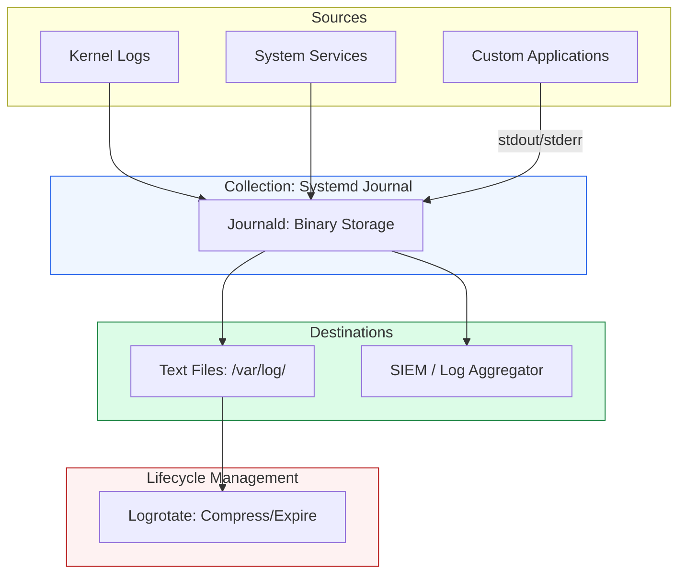

# 📜 Module 05: Logging & Forensics

> **"A server without logs is like a blind pilot. You know you're moving, but you have no idea where you've been or if there's a mountain ahead. Logs are the black box of the Linux world—the ultimate source of truth when things go wrong."**



## 📚 Overview

Logging is the "Memory" of your infrastructure. In a production environment, you don't have the luxury of watching every screen; you rely on logs to tell you what happened at 2 AM. This module covers the dual-stack logging system of modern Linux: **Journald** (the high-speed, binary storage) and **Rsyslog/Logrotate** (the human-readable text storage). You will learn to perform forensic investigations into crashes, manage disk space using automated rotation, and capture application logs even when things are failing.

## 🎓 Learning Objectives

By the end of this module, you will:

- ✅ Query binary logs with speed and precision using `journalctl`.
- ✅ Configure **Logrotate** to prevent disks from filling up with old logs.
- ✅ Trace the "Chain of Events" during a system crash or reboot.
- ✅ Analyze authentication logs to detect brute-force attacks.
- ✅ Redirect application output to the system journal for centralized viewing.

---

## 🏗️ 1. The Forensic Toolkit

| Tool | Action | Key Use Case |
| :--- | :--- | :--- |
| `journalctl -f` | Follow | Real-time monitoring of every service on the machine. |
| `journalctl -u <service>` | Service Logs | Isolating the errors of a single app. |
| `logrotate -f` | Force Rotation | Manually clearing disk space by forcing a log compression. |
| `tail -F /var/log/auth.log` | Auth Monitor | Watching for login failures in real-time. |
| `grep -i "error"` | Search | Finding the needle in the haystack of a 1GB log file. |

---

## 🏗️ 2. The Journald Query Masterclass

Stop scrolling through text files. Use the power of the binary journal:

```bash
# See logs from a specific time window
journalctl --since "2024-01-01 12:00:00" --until "2024-01-01 13:00:00"

# See logs for the CURRENT boot only (ignores old data)
journalctl -b

# See high-priority errors only (Error, Critical, Alert)
journalctl -p err..emerg

# Check how much disk space logs are taking
journalctl --disk-usage
```

---

## 🚀 Professional Pattern: The "Silent" Application Fix

Many junior developers write logs to a file inside their app directory (e.g., `/opt/app/logs/app.log`). Senior DevOps engineers know this is a disk-failure waiting to happen.

**The Pro Standard**:
1. **The Logic**: Configure your application to log to `STDOUT` (Standard Out) and `STDERR`.
2. **The Integration**: Let Systemd capture it automatically.
3. **The Benefit**: Your logs are now centrally managed by `journald`. You get automatic rotation, binary indexing, and you can see your app's logs mixed with system errors (like OOM kills) in the same timeline.
4. **The Outcome**: Faster troubleshooting and no more manual log cleanup.

---

## 🏆 Real-World DevOps Story: The "Midnight" Disk Filling

**The Scenario**: Every Sunday at midnight, a database server would crash. The monitoring showed "Disk Full," but by the time the engineer logged in at 9 AM, there was plenty of free space.
**The Crisis**: The phantom space was making it impossible to find the culprit.
**The Discovery**: An engineer ran `logrotate -d` (Debug) and realized that a legacy cron job was generating 50GB of debug logs in a single hour. Logrotate was then running at 4 AM, compressing the logs and freeing the space.
**The Fix**:
1. Fixed the code to stop the debug "noise."
2. Updated the logrotate policy to rotate based on **size** (`size 100M`) rather than just time.
**The Result**: The disk never filled up again, and the server stayed online.
**The Lesson**: **Rotate by size, not just time.** If an app goes crazy, your disk won't wait for Sunday morning.

---

## ❓ Interview Preparation (Logging)

1. **Q: Where does 'journalctl' store its data?**
    *A: It depends on the configuration. By default, it stays in `/run/log/journal/` (volatile RAM). To make it persistent across reboots, you must create the directory `/var/log/journal/` and restart systemd-journald.*

2. **Q: How does 'logrotate' know when to rotate a file?**
    *A: It is typically triggered daily by a cron job (`/etc/cron.daily/logrotate`). It checks its configuration files (in `/etc/logrotate.d/`) to see if the file meets certain criteria, such as age (weekly) or size (100MB).*

3. **Q: What is the 'delaycompress' option in logrotate?**
    *A: It tells logrotate to wait until the *next* rotation cycle before compressing the log file. This is useful for applications that might still be holding onto a file handle for a short time after rotation.*

4. **Q: How do you see logs for the Kernel specifically?**
    *A: Use `journalctl -k` or `dmesg`. `dmesg` is the classic tool for reading the kernel's ring buffer.*

5. **Q: Why are binary logs (journald) better than text logs?**
    *A: Binary logs are indexed. This allows for near-instant searching by time, service (unit), or priority, whereas searching a 10GB text file with `grep` can take minutes and heavy CPU usage.*

---

## 📝 Knowledge Check

1. **Which command shows logs from the current machine boot only?**
    - [ ] a) journalctl -f
    - [x] b) journalctl -b
    - [ ] c) journalctl -k
    - [ ] d) last

2. **In which directory are individual service logrotate policies stored?**
    - [ ] a) /etc/logrotate/
    - [x] b) /etc/logrotate.d/
    - [ ] c) /var/log/
    - [ ] d) /lib/logrotate/

3. **Which priority level in 'journalctl -p' is the most urgent?**
    - [ ] a) info
    - [ ] b) warning
    - [ ] c) error
    - [x] d) emerg

4. **Which file contains the authentication history (logins, sudo attempts)?**
    - [ ] a) /var/log/syslog
    - [x] b) /var/log/auth.log
    - [ ] c) /var/log/apache2/access.log
    - [ ] d) /var/log/boot.log

5. **True or False: Deleting a log file manually while a service is running frees up the disk space immediately.**
    - [ ] True 
    - [x] False (The space is only freed when the service closes the file handle. You should 'truncate' the file or reload the service instead)

---

## 🔗 Next Steps

You've mastered the administration of a single machine. Now it's time to learn how to speak the language of the machine itself through **Shell Scripting & Automation**.

Proceed to: **[Phase 1.02.02: Shell Scripting & Automation](../../../../../readme.md)** →
Node: This link points to the next level of the Linux curriculum.
