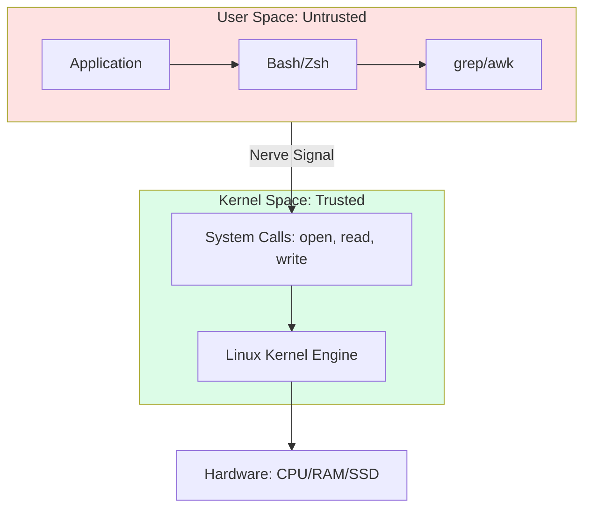

# 🐧 Intermediate Linux: Systems Observability & Governance

> **"Pay attention, Junior. In the beginner phase, you learned how to survive in the terminal. Here, you learn how to master the kernel. If you don't understand how Linux breathes, you'll never be able to automate it."**

---

## 🧠 The Mental Model: The System Vitals

**The Junior Struggle**: "I just run `sudo systemctl restart nginx` when it breaks. Why do I need to know about system calls, cgroups, or zombie processes?"

**The Senior Solution**: You realize that a Linux server is like a **Living Organism**:
- **The Kernel**: The brain and central nervous system that manages everything.
- **System Calls**: The nerves that send signals from the apps to the brain.
- **Systemd**: The heartbeat that keeps services alive.
- **cgroups**: The metabolism that limits how much energy (CPU/RAM) an app can consume.

---

## 🆚 Junior Way vs. Senior Way

| Feature | The Junior Way (Problematic) | The Senior Way (Architected) |
|:---|:---|:---|
| **Restarts** | Manual command execution | **Auto-restarting** systemd units |
| **Identity** | Using `root` or `sudo` for everything | **Principle of Least Privilege** (RBAC) |
| **Logs** | `tail -f` and manual scrolling | **Structured logging** and `journalctl` |
| **Resources** | One app per server (Wasteful) | **Cgroups & Resource Limits** |
| **Security** | Firewall is "Off" or "Open" | **SELinux/AppArmor** Mandatory Access |

---

## 🏗️ Visual: The Linux Architecture Layers

---

## 🗺️ Curriculum Path

### 🚀 Intermediate Topics
- **[System Administration](./03-system-administration/readme.md)**: Master the core engine - Systemd, Processes, Storage, and Identity.
- **[Shell Scripting](readme.md)**: Moving from command snippets to robust, idempotent automation.
- **[Linux Networking](readme.md)**: Deep dives into `ss`, `ip`, `netstat`, and MTU troubleshooting.
- **[Intermediate SSH](./02-ssh/readme.md)**: Config files, ProxyJump, Tunneling, and Key management.

---

## 🏆 Real-World DevOps Story: The Zombie Apocalypse

**The Scenario**: A Junior engineer wrote a script that didn't clean up after itself, leaving thousands of "Zombie" processes in the system.
**The Crisis**: Even though CPU usage was low, the system stopped allowing new processes (SSH, Cron, Web) because the **Process Table** was full. 
**The Fix**: Used `ps aux | grep 'Z'` to identify the parent process and sent a `SIGHUP` to the master to reap the bodies.
**The Lesson**: **Junior, a process isn't dead until the parent acknowledges its death.** Always manage your process lifecycles.

---

## 🎤 Interview Preparation (Linux Ops)

1. **Q: Junior, explain the difference between a Hard Link and a Soft (Symbolic) Link.**
   - *A: A **Hard Link** points directly to the inode (the data); if the original file is deleted, the link still works. A **Soft Link** is just a shortcut to the file path; if the path changes, the link breaks.*

2. **Q: What is a 'Zombie Process' and how do you fix it?**
   - *A: A Zombie is a process that has finished execution but still has an entry in the process table. You don't 'kill' zombies (they are already dead); you must kill or signal the **Parent** process to reap the status.*

3. **Q: What is the 'OOM Killer'?**
   - *A: Out-Of-Memory Killer. When the Linux kernel runs out of RAM, it selects a process (based on a score) and kills it to save the system from crashing.*

4. **Q: Explain 'Inodes' in simple terms.**
   - *A: An Inode is a data structure on a Linux file system that stores everything about a file (permissions, owner, size, location) EXCEPT the filename.*

5. **Q: What is the difference between `SIGTERM` and `SIGKILL`?**
   - *A: `SIGTERM` (15) is a polite request to shut down; the app can clean up logs and close connections. `SIGKILL` (9) is an immediate termination by the kernel; the app has no time to clean up.*

6. **Q: What is a 'Load Average' and why isn't it just CPU usage?**
   - *A: It represents the average number of processes in the 'Runnable' or 'Uninterruptible' (waiting for Disk I/O) state. High load with low CPU usage usually means a Disk Bottleneck.*

7. **Q: Explain 'Swap' and why we use it (or don't).**
   - *A: Swap is an area on the disk used as 'overflow' when RAM is full. It prevents crashes but is 1,000x slower. In high-performance systems, we often disable swap to force OOM and avoid 'latency death'.*

8. **Q: What is `Systemd` and why did it replace many Init systems?**
   - *A: Systemd is a system and service manager. It allows for parallel service startup, better log management via journald, and better resource tracking via cgroups.*

9. **Q: How do you identify which process is listening on port 80?**
   - *A: `sudo ss -tulpn | grep :80` or `sudo lsof -i :80`.*

10. **Q: What is a 'cgroup' in Linux?**
    - *A: Control Groups. They allow the kernel to limit, account for, and isolate the resource usage (CPU, memory, disk I/O) of a collection of processes. This is the foundation of Docker.*

---

## 📝 Knowledge Check

1. **Which command shows real-time process usage with a text interface?**
   - [x] `top` or `htop`.

2. **What is the PID (Process ID) of the `systemd` process?**
   - [x] 1.

3. **True/False: Root can perform any action, even if SELinux says 'No'.**
   - [x] **False**. SELinux can block Root.

4. **Which signal number represents `SIGKILL` (Immediate death)?**
   - [x] 9.

5. **Where are global log files typically stored in Linux?**
   - [x] `/var/log`.

6. **What is the name of the modern tool to read systemd logs?**
   - [x] `journalctl`.

7. **Which command is used to change file permissions?**
   - [x] `chmod`.

8. **A process in the 'Z' state is called what?**
   - [x] Zombie.

9. **Which file contains the list of users authorized to use `sudo`?**
   - [x] `/etc/sudoers`.

10. **Which command shows the current disk usage per partition?**
    - [x] `df -h`.

---

## 🔗 Next Steps
Junior, the kernel is healthy. Now let's learn how to manage the services.
1. Proceed to: **[System Administration](./03-system-administration/readme.md)** →
2. Return to: **[Phase 1 Hub](../readme.md)** →
