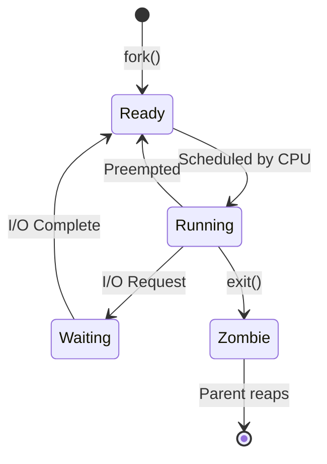
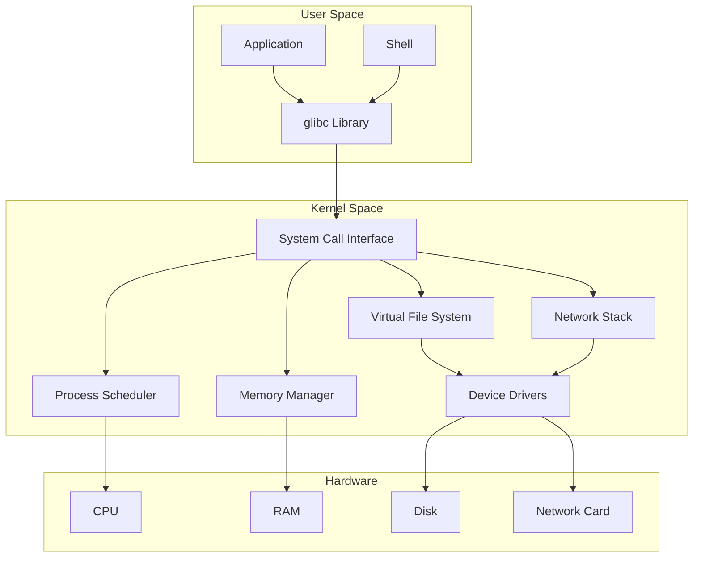

# Linux Kernel Architecture Reference

**Doc Version:** 1.0.0
**Role:** Systems Engineer
**Scope:** Kernel Internals, System Calls, and Process Management

---

## 1. The Kernel: The Core of Linux

The **Linux Kernel** is the bridge between hardware and user applications.

### Kernel Responsibilities
1. **Process Management**: Scheduling, creation, termination
2. **Memory Management**: Virtual memory, paging, swapping
3. **Device Drivers**: Hardware abstraction (disk, network, GPU)
4. **File System**: VFS (Virtual File System) abstraction
5. **Networking**: TCP/IP stack implementation
6. **Security**: Access control, capabilities, namespaces

---

## 2. User Space vs Kernel Space

### Memory Layout
```
┌─────────────────────┐ 0xFFFFFFFF (4GB on 32-bit)
│   Kernel Space      │ ← Privileged, direct hardware access
│   (1GB)             │
├─────────────────────┤ 0xC0000000
│   User Space        │ ← Unprivileged, isolated processes
│   (3GB)             │
└─────────────────────┘ 0x00000000
```

**Separation**: User processes cannot directly access kernel memory (protection).

### System Calls (Syscalls)
The **only** way user space communicates with the kernel.

**Examples**:
| Syscall | Purpose | User Command |
|:---|:---|:---|
| `open()` | Open file | `cat file.txt` |
| `read()` | Read data | `cat file.txt` |
| `write()` | Write data | `echo "hello" > file.txt` |
| `fork()` | Create process | `bash script.sh` |
| `execve()` | Execute program | `./myapp` |
| `socket()` | Create network socket | `curl example.com` |

**Tracing Syscalls**:
```bash
strace ls /tmp
# Output shows every syscall: open(), read(), write(), close()
```

---

## 3. Process Management

### Process States


**States**:
- **Running (R)**: Executing on CPU
- **Sleeping (S)**: Waiting for event (disk I/O, network)
- **Stopped (T)**: Paused (Ctrl+Z)
- **Zombie (Z)**: Terminated but parent hasn't reaped (bad!)

**Viewing States**:
```bash
ps aux
# S column shows state: R, S, D (uninterruptible sleep), Z
```

### Process Hierarchy
Every process has a **parent** (except PID 1: `systemd`).

```bash
pstree
# systemd─┬─sshd───sshd───bash───vim
#         ├─nginx───nginx (worker)
#         └─docker───containerd───runc
```

**Orphan Processes**: If parent dies, `systemd` (PID 1) adopts them.

---

## 4. Memory Management

### Virtual Memory
Each process sees its own **virtual address space** (illusion of having all RAM).

**Benefits**:
- **Isolation**: Process A cannot access Process B's memory
- **Overcommit**: Total virtual memory > physical RAM (via swap)

### The OOM Killer
When RAM + Swap are exhausted, the **Out-of-Memory (OOM) Killer** terminates processes.

**Selection Criteria**:
- High memory usage
- Low priority (nice value)
- Not critical (e.g., not `sshd`)

**Logs**:
```bash
dmesg | grep -i "killed process"
# Example: "Out of memory: Killed process 1234 (java)"
```

**Prevention**:
- Set memory limits (`cgroup` or `systemd` MemoryMax)
- Monitor with `free -h`, `vmstat`

---

## 5. File System Hierarchy

### Everything is a File
In Linux, **everything** is represented as a file:
- **Regular files**: `/home/user/data.txt`
- **Directories**: `/etc`
- **Devices**: `/dev/sda` (disk), `/dev/null` (black hole)
- **Sockets**: `/var/run/docker.sock`
- **Pipes**: Named pipes for IPC

### VFS (Virtual File System)
Abstraction layer that allows different file systems to coexist:
- **ext4**: Traditional Linux FS
- **xfs**: High-performance, large files
- **btrfs**: Copy-on-write, snapshots
- **tmpfs**: RAM-based (fast, volatile)
- **proc**: Kernel/process info (`/proc/cpuinfo`)
- **sysfs**: Device info (`/sys/class/net`)

---

## 6. Systemd: The Init System

**PID 1**: The first process started by the kernel.

### Responsibilities
1. **Boot**: Start all services in parallel (faster than old SysVinit)
2. **Service Management**: `systemctl start/stop/restart`
3. **Logging**: `journald` (binary logs, queryable via `journalctl`)
4. **Cgroups**: Resource limits (CPU, memory)

### Unit Files
Services are defined in `.service` files:
```ini
[Unit]
Description=My Application
After=network.target

[Service]
Type=simple
ExecStart=/usr/bin/myapp
Restart=on-failure
User=appuser

[Install]
WantedBy=multi-user.target
```

**Location**: `/etc/systemd/system/` (custom) or `/lib/systemd/system/` (package-provided)

---

## 7. Visualizing the Architecture



> **Enterprise Pattern**: Use **cgroups v2** (via systemd) to enforce resource limits on services. This prevents a single runaway process from consuming all system resources and crashing the server.
