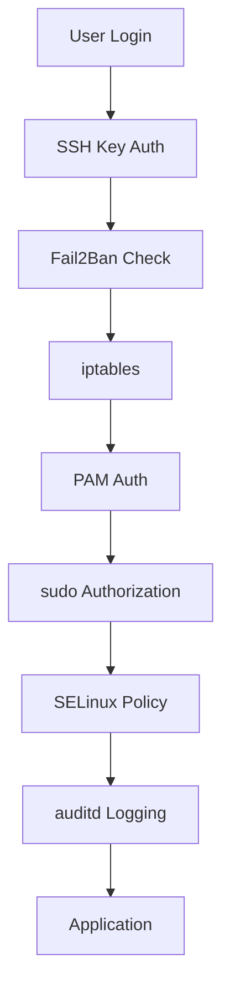

# Linux Security & Hardening Reference

**Doc Version:** 1.0.0
**Role:** Security Engineer
**Scope:** Permissions, SELinux, SSH Hardening, and Audit

---

## 1. Linux Permission Model

### Standard Permissions (UGO)
**Format**: `rwxrwxrwx` (User, Group, Other)

```bash
ls -l /etc/passwd
# -rw-r--r-- 1 root root 2847 Jan 29 02:00 /etc/passwd
#  │││ │││ │││
#  │││ │││ └── Other: read
#  │││ └────── Group: read
#  └────────── User: read, write
```

**Numeric Representation**:
- `r = 4`, `w = 2`, `x = 1`
- `chmod 755 script.sh` = `rwxr-xr-x`
- `chmod 600 private.key` = `rw-------`

### Special Permissions

#### A. SUID (Set User ID)
**Effect**: Execute file as the file's owner (not the user running it).
```bash
ls -l /usr/bin/passwd
# -rwsr-xr-x 1 root root 68208 /usr/bin/passwd
#    ^
#    SUID bit (s instead of x)
```

**Why**: `passwd` needs root to modify `/etc/shadow`, but regular users must be able to change their password.

**Security Risk**: SUID binaries are attack vectors. Audit regularly:
```bash
find / -perm -4000 -type f 2>/dev/null
```

#### B. SGID (Set Group ID)
**Effect**: Execute file as the file's group.
**Use Case**: Shared directories where all files should inherit group ownership.

#### C. Sticky Bit
**Effect**: Only file owner can delete files in directory (even if others have write permission).
```bash
ls -ld /tmp
# drwxrwxrwt 1 root root 4096 /tmp
#         ^
#         Sticky bit (t instead of x)
```

**Why**: Prevents users from deleting each other's files in `/tmp`.

---

## 2. Mandatory Access Control (MAC)

### SELinux (Security-Enhanced Linux)
**Purpose**: Enforce policies that restrict what processes can do, even if running as root.

#### Modes
- **Enforcing**: Policies are enforced (denials are blocked)
- **Permissive**: Policies are logged but not enforced (audit mode)
- **Disabled**: SELinux is off

**Check Status**:
```bash
getenforce
# Output: Enforcing
```

#### Contexts
Every file and process has a **security context**: `user:role:type:level`

```bash
ls -Z /var/www/html/index.html
# -rw-r--r--. apache apache unconfined_u:object_r:httpd_sys_content_t:s0 index.html
#                                                    ^^^^^^^^^^^^^^^^^^^^
#                                                    Type (httpd can read this)
```

**Common Issue**: Wrong context prevents service from accessing files.
```bash
# Fix: Restore default context
restorecon -Rv /var/www/html
```

### AppArmor (Alternative to SELinux)
**Used by**: Ubuntu, SUSE
**Simpler**: Path-based (not label-based like SELinux)

**Example Profile** (`/etc/apparmor.d/usr.bin.firefox`):
```
/usr/bin/firefox {
  /home/*/.mozilla/** rw,
  /tmp/** rw,
  /usr/lib/** r,
  deny /etc/shadow r,
}
```

---

## 3. SSH Hardening

### A. Disable Password Authentication
**Problem**: Passwords can be brute-forced.
**Solution**: Use SSH keys only.

**Config** (`/etc/ssh/sshd_config`):
```
PasswordAuthentication no
PubkeyAuthentication yes
PermitRootLogin prohibit-password
```

### B. Restrict Users
**Allow only specific users**:
```
AllowUsers alice bob
```

**Or allow only specific groups**:
```
AllowGroups sysadmin
```

### C. Change Default Port
**Reduce automated attacks**:
```
Port 2222
```

**Note**: Security by obscurity is NOT a substitute for real security, but it reduces noise.

### D. Use Fail2Ban
**Purpose**: Automatically ban IPs after failed login attempts.

**Install**:
```bash
apt install fail2ban
```

**Config** (`/etc/fail2ban/jail.local`):
```ini
[sshd]
enabled = true
port = ssh
filter = sshd
logpath = /var/log/auth.log
maxretry = 3
bantime = 3600
```

---

## 4. Audit Logging

### auditd (Linux Audit Framework)
**Purpose**: Track security-relevant events (file access, syscalls, user actions).

**Install**:
```bash
apt install auditd
```

**Example Rules** (`/etc/audit/rules.d/audit.rules`):
```bash
# Watch /etc/passwd for modifications
-w /etc/passwd -p wa -k passwd_changes

# Watch /etc/shadow
-w /etc/shadow -p wa -k shadow_changes

# Audit all executions of sudo
-a always,exit -F arch=b64 -S execve -F auid>=1000 -k sudo_commands
```

**Query Logs**:
```bash
ausearch -k passwd_changes
# Shows all events tagged with "passwd_changes"
```

**Why**: Compliance (PCI-DSS, HIPAA) requires audit trails of privileged actions.

---

## 5. Principle of Least Privilege

### A. Run Services as Non-Root
**Bad**:
```bash
./myapp  # Runs as root
```

**Good**:
```bash
useradd -r -s /bin/false appuser
sudo -u appuser ./myapp
```

**Systemd**:
```ini
[Service]
User=appuser
Group=appuser
```

### B. Use sudo Instead of Root Login
**Disable root login**:
```bash
passwd -l root  # Lock root password
```

**Grant specific sudo permissions** (`/etc/sudoers.d/alice`):
```
alice ALL=(ALL) /usr/bin/systemctl restart nginx
```

**Why**: Auditability. `sudo` logs who did what.

---

## 6. Firewall (iptables / nftables)

### Basic iptables Rules
```bash
# Default deny
iptables -P INPUT DROP
iptables -P FORWARD DROP
iptables -P OUTPUT ACCEPT

# Allow established connections
iptables -A INPUT -m state --state ESTABLISHED,RELATED -j ACCEPT

# Allow SSH
iptables -A INPUT -p tcp --dport 22 -j ACCEPT

# Allow HTTP/HTTPS
iptables -A INPUT -p tcp --dport 80 -j ACCEPT
iptables -A INPUT -p tcp --dport 443 -j ACCEPT

# Allow loopback
iptables -A INPUT -i lo -j ACCEPT

# Save rules
iptables-save > /etc/iptables/rules.v4
```

---

## 7. Visualizing Security Layers



> **Enterprise Pattern**: Implement **Bastion Hosts** (jump boxes) for SSH access. Users SSH to the bastion, then SSH from bastion to internal servers. This creates a single audit point and allows IP whitelisting.
