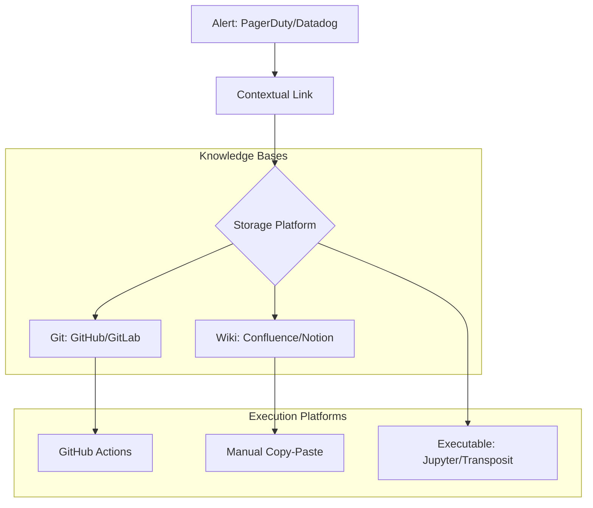

# Tools and Platforms

Where you store your runbooks is just as important as what's inside them.

## 1. Git-Based (Markdown)
The "Docs as Code" approach.
- **Tools**: GitHub, GitLab, Bitbucket.
- **Workflow**: Pull Requests for updates, Mermaid for diagrams.
- **Pros**: Version history, developer-friendly, stays with the HCL/Code.

## 2. Integrated Wiki
- **Tools**: Confluence, Notion, Obsidian.
- **Pros**: Easy search, collaborative editing, good for non-technical stakeholders.
- **Cons**: Can become a "Document Cemetery" if not strictly managed.

## 3. Incident Management Platforms
- **Tools**: PagerDuty, Opsgenie, FireHydrant.
- **Pros**: Automatically serves the runbook link *inside* the alert notification.

## 4. Executable Runbook Tools
- **Tools**: Jupyter Notebooks, Runbear, Transposit.
- **Pros**: You can run the code blocks directly inside the doc.

## Tool Comparison

| Platform | Best For | Accessibility | Automation Level |
| :--- | :--- | :--- | :--- |
| **GitHub** | Engineering Teams | High (Web/CLI) | Medium (Actions) |
| **Confluence** | General Biz Knowledge | High (Web) | Low |
| **Jupyter** | Data/Complex Troubleshooting | Medium (Notebooks) | High |
| **PagerDuty** | High-Priority Alerts | High (Mobile/Web) | Medium |

---

## The Runbook Ecosystem

---

## 🏗️ Real-Life Scenarios

### Scenario 1: The "Offline" Wiki
**Problem**: An SRE team keeps their recovery docs in a self-hosted Confluence instance.
**Crisis**: The company's internal network goes down. The SREs need the runbook to fix the network, but the wiki is *on* that same network.
**Outcome**: They are locked out of their own instructions.
**Solution**: Move critical recovery runbooks to a Git repo hosted on a public platform (like GitHub) or ensure the tool supports offline cached access.
**Result**: In the next network outage, the team accessed the docs via their local clones of the Git repo and resolved the issue.

### Scenario 2: The "Interactive" Payoff
**Problem**: Troubleshooting a complex database lag involved 15 different SQL queries. Engineers often mistyped the parameters when copy-pasting from a static document.
**Solution**: Migration to **Executable Runbooks** (Jupyter Notebooks). The parameters (like `DB_ID`) are defined once at the top, and all 15 queries update automatically.
**Result**: Reduced troubleshooting time by 60% and eliminated all syntax errors during the incident.

### Scenario 3: The PR Guardrail
**Problem**: An intern accidentally updated a runbook with a dangerous `rm -rf` command in a public Wiki. No one noticed until a senior engineer ran it a week later.
**Solution**: Move to **Docs-as-Code** (Git-based). All changes now require a Pull Request (PR) and a "LGTM" (Looks Good To Me) from at least one other engineer.
**Result**: Dangerous edits are caught during code review, significantly increasing operational safety.

---

## ❓ Interview Questions

1.  **Why would an SRE prefer 'Docs as Code' (Git) over a traditional Wiki?**
    - *Answer*: Git allows for the same rigorous peer-review process as application code (Pull Requests), provides a perfect version history, and ensures that documentation evolves alongside the features it describes.
2.  **What is an 'Executable Runbook' and when should it be used?**
    - *Answer*: It's a document (like a Jupyter Notebook) where instructions and code blocks are integrated. It should be used for complex, multi-step troubleshooting where manual parameter entry is error-prone.
3.  **Explain the risk of 'Self-Hosting' your documentation platform.**
    - *Answer*: If the infrastructure you are trying to fix is the same infrastructure that hosts your documentation, you face a "Circular Dependency." You can't fix the system without the docs, but you can't see the docs because the system is down.
4.  **How do incident management tools like PagerDuty integrate with runbooks?**
    - *Answer*: They use "Contextual Linking." Based on the alert type or tag, PagerDuty can automatically append a direct link to the specific runbook in the notification sent to the engineer.
5.  **What is the benefit of using Markdown for runbooks?**
    - *Answer*: It's platform-independent, lightweight, human-readable, and can be rendered by almost any Git host, editor, or static site generator. It supports embedded diagrams via Mermaid.
6.  **What is a 'Document Cemetery'?**
    - *Answer*: A Wiki or folder that has grown so large and unorganized that it's impossible to find useful information, leading to engineers ignoring it and creating their own "Shadow Docs."

---

## 🧠 Comprehensive Quiz (25 Questions)

<b>1. Which approach involves managing documentation in the same repository as the source code?</b>

Show Answer

Answer: B

<b>2. What is a major risk of a 'Self-Hosted' documentation wiki?</b>

Show Answer

Answer: B

<b>3. Which format is the industry standard for Git-based runbooks?</b>

Show Answer

Answer: B

<b>4. An 'Executable Runbook' allows you to:</b>

Show Answer

Answer: B

<b>5. Which tool focuses on 'Alert Orchestration' and linking runbooks to notifications?</b>

Show Answer

Answer: B

<b>6. 'Docs as Code' enables which quality control process?</b>

Show Answer

Answer: B

<b>7. Jupyter Notebooks are popular for which type of runbook?</b>

Show Answer

Answer: B

<b>8. What is the main disadvantage of 'Confluence' or 'Notion' for technical runbooks?</b>

Show Answer

Answer: B

<b>9. 'Mermaid' is a tool used for:</b>

Show Answer

Answer: B

<b>10. Why should you avoid storing runbooks ONLY as PDFs?</b>

Show Answer

Answer: B

<b>11. A 'Centralized' documentation store helps prevent:</b>

Show Answer

Answer: B

<b>12. 'Transposit' or 'Runbear' are examples of:</b>

Show Answer

Answer: B

<b>13. Version history in Git is superior because it shows:</b>

Show Answer

Answer: B

<b>14. What is a 'Hybrid' tool approach?</b>

Show Answer

Answer: B

<b>15. 'Sreachability' is the most critical feature when:</b>

Show Answer

Answer: B

<b>16. True/False: VS Code has extensions to preview Markdown runbooks.</b>

Show Answer

Answer: A

<b>17. 'Public' cloud Git providers (GitHub/GitLab) offer what advantage during internal network failures?</b>

Show Answer

Answer: B

<b>18. A 'README.md' file in a service's root directory is often used as:</b>

Show Answer

Answer: B

<b>19. Why use 'Variables' in scripts within runbooks?</b>

Show Answer

Answer: B

<b>20. Which tool is best for 'Collaborative' live editing?</b>

Show Answer

Answer: B

<b>21. 'CI/CD Pipelines' can be used to:</b>

Show Answer

Answer: B

<b>22. 'Stale Docs' are a symptom of:</b>

Show Answer

Answer: B

<b>23. What is 'Markdown Linting'?</b>

Show Answer

Answer: B

<b>24. A 'Deep Link' in a runbook points to:</b>

Show Answer

Answer: B

<b>25. The final goal of choosing a platform is:</b>

Show Answer

Answer: B

