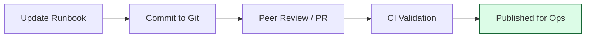

# ⚙️ Part 2: The Engine (Anatomy & Execution)

> **"Code that is never run rots. Documentation that is never used is a lie. Treat your runbooks like production code."**

Welcome to **Part 2**. This is where we look under the hood. We study the anatomy of a professional runbook and the tools we use to turn static instructions into live operations.

## 🛣️ The Curriculum

### [01-Runbook-Anatomy](./01-runbook-anatomy/)
**The Objective**: The essential sections of a "War-Ready" document.
*   **Key Sections**: Abstract, Impact, Verification, Rollback, Post-mortem links.

### [02-Tools-and-Platforms](./02-tools-and-platforms/)
**The Objective**: Moving from Wikis to "Docs-as-Code."
*   **Key Tools**: Markdown, Git, CI/CD for docs, Jupyter Notebooks as "Executable Runbooks."

### [03-Manual-vs-Automated](./03-manual-vs-automated/)
**The Objective**: The friction of manual steps and the bridge to self-healing.
*   **Key Concepts**: Identifying toil and the "Automation ROI" (Return on Investment).

---

## 🏗️ The Docs-as-Code Workflow

---

## 🛠️ The Toolkit
- **Markdown**: The universal language of technical docs.
- **Git**: Version control for operational truth.
- **Backstage/Confluence**: The "Single Pane of Glass" for discovery.

---
**Status**: ✅ Organized (2026-02-02)
