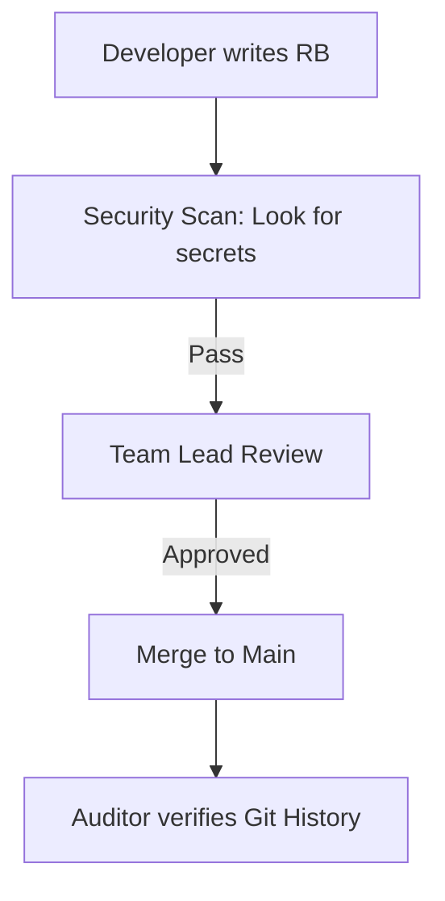
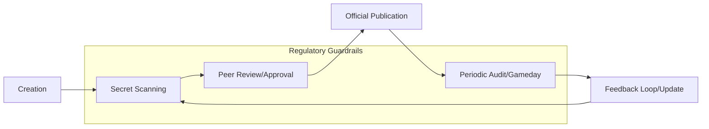

# Runbook Audit and Compliance

In regulated industries (Fintech, Healthcare, Govt), runbooks aren't just for SREs—they are legal requirements.

## 🛡️ Audit Requirements
1.  **Traceability**: Who changed the runbook, and when? (Solved by Git History).
2.  **Approval**: Who authorized the procedure? (Solved by Pull Request reviews).
3.  **Review Cycle**: When was this last checked for accuracy? (Industry standard: Once every 6-12 months).
4.  **Separation of Duties**: The person who writes the runbook shouldn't be the only one who can merge it.

## The Compliance Checklist
- [ ] Document is version-controlled.
- [ ] Sensitive info (passwords) is NOT in the text.
- [ ] Access is restricted to authorized personnel.
- [ ] Review date is set in the metadata.

## Mermaid Diagram: Security & Compliance Flow

---

## The Compliance Lifecycle

---

## 🏗️ Real-Life Scenarios

### Scenario 1: The "Secret" Leak
**Problem**: An engineer adds a runbook for "Database Password Reset." To be helpful, they include the current root password in the doc.
**Outcome**: A month later, a data breach occurs. The hacker didn't break into the DB; they just read the "Database Password Reset" runbook in the internal wiki.
**Solution**: Use **Environment Variables** or **Secrets Manager** links (e.g., `{{secret/db/root_pw}}`) in the runbook. Never write the actual secret.
**Policy**: Run a secret-scanner (like TruffleHog) on your documentation repo.

### Scenario 2: The "Ghost" Procedure
**Problem**: During a SOC2 audit, the auditor asked to see the procedure for "Revoking User Access." The team showed a Slack message from 2022.
**Outcome**: The company failed the audit requirement for "Standardized and Documented Procedures."
**Solution**: Formally document the process in a version-controlled Markdown file, with a clear **Approval Signature** (PR Merge) from the Security Officer.
**Result**: In the follow-up audit, the team presented the Git history showing the documented, reviewed, and approved procedure, passing with zero findings.

### Scenario 3: The "Separation of Duties" Breach
**Problem**: A senior engineer had "Admin" access to both the code and the documentation. They bypassed the review process to change a critical "Deployment Runbook" to allow skipping security scans.
**Solution**: Implement **Protected Branches** for the documentation repo. Even the Admin's PRs now require a second "Approve" from a different team member (Security or QA).
**Result**: The unauthorized change was blocked, preserving the integrity of the release process and satisfying the "Separation of Duties" requirement.

---

## ❓ Interview Questions

1.  **How do you handle 'Separation of Duties' in technical documentation?**
    - *Answer*: By using a Git-based workflow where a different engineer must approve the Pull Request (PR) before the operational procedure is officially adopted. This prevents a single person from unilaterally changing critical processes.
2.  **What steps should you take if an auditor identifies an outdated runbook?**
    - *Answer*: Acknowledge the gap immediately. Create a P0 ticket to validate and update the document via a "Gameday" simulation. Long-term, implement an automated "Review Reminder" system based on the "Last Updated" metadata.
3.  **Why is 'Git History' a powerful tool for compliance auditors?**
    - *Answer*: It provides an immutable, cryptographic audit trail of exactly **who** made **what** change, **when** it was made, and **who** approved it. It replaces the need for manual, signed paper logs.
4.  **Describe how to safely document procedures that involve sensitive credentials.**
    - *Answer*: Reference the *location* of the secret in a secure vault (e.g., HashiCorp Vault, AWS Secrets Manager) rather than the secret itself. Use placeholders like `{{SECRET_PATH}}` and run automated scanners to catch accidents.
5.  **What is the 'Industry Standard' for runbook review frequency?**
    - *Answer*: In highly regulated sectors (Fintech/Healthcare), critical runbooks should be reviewed every 6-12 months. Non-critical docs can be reviewed annually or based on usage feedback.
6.  **How do you prove that a runbook is 'Actionable' to an auditor?**
    - *Answer*: Provide logs or tickets from a "Gameday" or a real incident where the runbook was successfully followed to a verified outcome. This proves the document isn't just "shelfware."

---

## 🧠 Comprehensive Quiz (25 Questions)

<b>1. What is the standard review frequency for critical runbooks in regulated industries?</b>

Show Answer

Answer: B

<b>2. True/False: Storing passwords in a runbook is acceptable if the wiki is private.</b>

Show Answer

Answer: B** - Privacy is not security; use a dedicated Secrets Manager.

<b>3. Which Git feature provides a timeline of who changed a document?</b>

Show Answer

Answer: B

<b>4. 'Separation of Duties' means:</b>

Show Answer

Answer: B

<b>5. Why is a 'Draft' runbook usually not compliant for an audit?</b>

Show Answer

Answer: B

<b>6. 'Traceability' in an audit refers to:</b>

Show Answer

Answer: B

<b>7. Which tool can automatically find secrets (passwords) leaked in documentation?</b>

Show Answer

Answer: B

<b>8. SOC2 and ISO 27001 are examples of:</b>

Show Answer

Answer: B

<b>9. In a 'Compliance Lifecycle', what follows 'Peer Review'?</b>

Show Answer

Answer: B

<b>10. Metadata like 'Last Reviewed Date' is important for:</b>

Show Answer

Answer: B

<b>11. An 'Immutable' audit log means the log:</b>

Show Answer

Answer: B

<b>12. True/False: Auditors prefer manual signatures on paper over digital Git logs.</b>

Show Answer

Answer: B

<b>13. 'Read-Only' access for runbooks should be given to:</b>

Show Answer

Answer: A** - Broad read access democratizes knowledge, while write access is restricted for compliance.

<b>14. What is a 'Findings Report' from an auditor?</b>

Show Answer

Answer: B

<b>15. 'Least Privilege' applies to documentation by:</b>

Show Answer

Answer: B

<b>16. 'Governance' in SRE refers to:</b>

Show Answer

Answer: B

<b>17. Why is referencing a 'Secrets Manager' better than hardcoding a password?</b>

Show Answer

Answer: B

<b>18. A 'Stale' runbook is a compliance risk because:</b>

Show Answer

Answer: B

<b>19. 'Role-Based Access Control' (RBAC) helps manage:</b>

Show Answer

Answer: B

<b>20. True/False: Compliance is only necessary for large banks.</b>

Show Answer

Answer: B

<b>21. A 'Pre-commit hook' can assist compliance by:</b>

Show Answer

Answer: B

<b>22. 'Evidence' in a documentation audit includes:</b>

Show Answer

Answer: A

<b>23. 'Auditor Access' means:</b>

Show Answer

Answer: B

<b>24. 'Version Pinning' in a runbook refers to:</b>

Show Answer

Answer: B

<b>25. The ultimate goal of Runbook Compliance is:</b>

Show Answer

Answer: B

