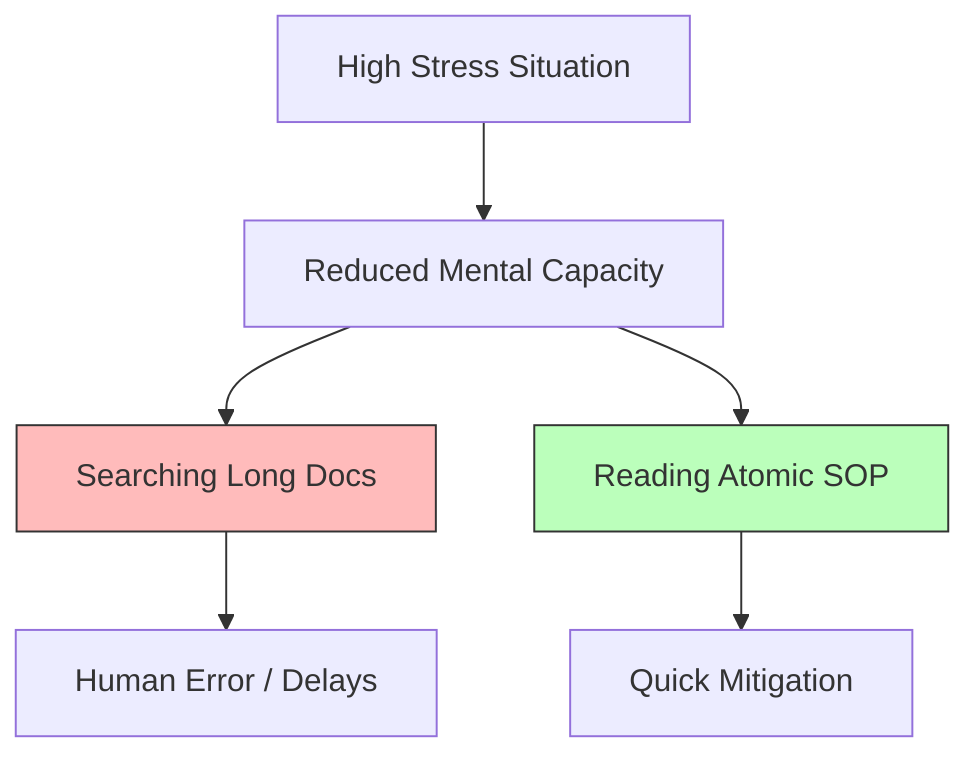

## The Cognitive Load Gap

---

## 🏗️ Real-Life Scenarios

### Scenario 1: The "Knowledge Silo" Collapse
**Problem**: An insurance firm relies on one SRE who has been there for 10 years. He knows every "hook and crook" of the legacy system. He goes on a sabbatical.
**Crisis**: The middleware server crashes. The new team looks for an SOP. They find a Word document from 2018 that is 50 pages long. They spend 2 hours reading it only to find the instructions for the wrong version of the OS.
**Outcome**: A 6-hour outage and a $50k fine.
**Fix**: The team adopts a "Documentation First" philosophy, breaking large documents into atomic, versioned sub-SOPs.
**Result**: In a subsequent failure, a junior member recovered the system in 15 minutes using the new atomic SOP.

### Scenario 2: The "3 AM" Verification
**Problem**: A startup had a "Recovery Guide" that required the reader to explain *why* they were taking an action before they were allowed to see the command.
**Crisis**: At 3 AM, an engineer was too tired to write a valid explanation. The site stayed down because the "Helpful" security feature blocked the tired engineer.
**Solution**: Pivoted to the **Atomic Mindset**. Commands are presented immediately, with the "Why" placed in an optional footer or link for post-incident review.
**Result**: Recovery time dropped from 40 minutes to 5 minutes.

### Scenario 3: The Blameless Failure
**Problem**: An outage occurred because an SOP step said "Run script.sh." The script accidentally deleted the database because it wasn't tested for the new OS version.
**Solution**: Instead of blaming the engineer who ran it, the company held a **Blameless Post-Mortem**. They identified that the SOP failed to specify the OS verification step.
**Result**: The SOP was updated with a pre-check command, and the culture shifted from "Fear of Mistakes" to "Rigorous Process Improvement."

---

## ❓ Interview Questions

1.  **Why is documentation considered a 'Scalability' tool for SRE teams?**
    - *Answer*: It allows teams to grow without increasing the communication overhead proportionally. By documenting procedures, you turn "Tribal Knowledge" into "Institutional Knowledge," enabling any competent engineer to handle routine or critical tasks without blocking senior members.
2.  **What does 'Cognitive Load' mean in the context of an incident, and how does an SOP address it?**
    - *Answer*: Cognitive Load is the mental effort required to process information. Under stress, mental capacity drops. A high-quality SOP reduces this load by providing "pre-calculated" solutions and atomic steps, allowing the engineer to focus on execution rather than deep theory.
3.  **Explain the '3 AM Test' for operational documentation.**
    - *Answer*: It's a benchmark for clarity. A document passes the test if a competent but exhausted engineer can follow it at 3 AM and resolve an incident without needing external help or spending time searching for basic information.
4.  **How do you reconcile 'Security' with 'Actionable Documentation'?**
    - *Answer*: Documentation is a security control. Missing or vague docs force engineers to guess (a major security risk). Secure docs reference secret paths (e.g., in Vault) rather than the secrets themselves, ensuring the engineer has the *process* without exposing sensitive data.
5.  **What is 'Siloed Knowledge' and how does an SRE mindset combat it?**
    - *Answer*: Siloed knowledge is information locked in the heads of a few individuals. SREs combat this by creating "SOPs as Code," versioning everything, and making it a requirement that no production change is "Done" until the SOP is updated and shared.
6.  **Why is the concept of 'Blame' counterproductive in documentation culture?**
    - *Answer*: If people are blamed for following a bad document, they will stop using documentation or stop documenting their own tricks. Blameless culture focuses on the *process failure*, ensuring the document is fixed so the same mistake can't happen again.

---

## 🧠 Comprehensive Quiz (25 Questions)

<b>1. What is the primary goal of an SOP in a DevOps environment?</b>

Show Answer

Answer: B

<b>2. True/False: A longer document is always better than a shorter one for incident response.</b>

Show Answer

Answer: B** - Short, atomic, and clear is the goal for outages.

<b>3. The '3 AM Test' measures:</b>

Show Answer

Answer: B

<b>4. Documentation acts as a 'Security Control' because:</b>

Show Answer

Answer: B

<b>5. 'Scalability through Silence' means:</b>

Show Answer

Answer: B

<b>6. If an engineer follows a flawed SOP and causes an outage, a 'Blameless' culture blames:</b>

Show Answer

Answer: B

<b>7. 'Cognitive Load' increases when:</b>

Show Answer

Answer: B

<b>8. 'Tribal Knowledge' refers to:</b>

Show Answer

Answer: B

<b>9. Atomic SOPs are:</b>

Show Answer

Answer: B

<b>10. Why is 'Guessing' a database password a security risk?</b>

Show Answer

Answer: B

<b>11. The 'Definition of Done' for a new feature should include:</b>

Show Answer

Answer: B

<b>12. True/False: Theory and history should be the first sections in an emergency SOP.</b>

Show Answer

Answer: B

<b>13. A 'Knowledge Silo' usually causes:</b>

Show Answer

Answer: B

<b>14. What is 'Institutional Knowledge'?</b>

Show Answer

Answer: B

<b>15. 'Stress-resilient' documentation works best when it is:</b>

Show Answer

Answer: B

<b>16. 'Predictability' in SRE means:</b>

Show Answer

Answer: B

<b>17. Why is 'Cloning Expertise' through SOPs valuable?</b>

Show Answer

Answer: B

<b>18. An 'Operational Requirement' is:</b>

Show Answer

Answer: B

<b>19. 'Document Rot' describes:</b>

Show Answer

Answer: B

<b>20. True/False: Empathy for the 'tired' engineer is a core part of the SOP mindset.</b>

Show Answer

Answer: A

<b>21. 'Drift' occurs when the real system state differs from:</b>

Show Answer

Answer: B

<b>22. Which role is responsible for maintaining the SOP 'Philosophy'?</b>

Show Answer

Answer: A** - Culture starts from the top.

<b>23. 'Shadow Procedures' are:</b>

Show Answer

Answer: B

<b>24. The 'Cognitive Load' gap is bridged by:</b>

Show Answer

Answer: B

<b>25. The ultimate result of a documentation-first philosophy is:</b>

Show Answer

Answer: B

