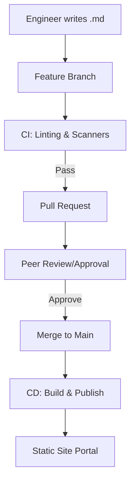

## The Docs-as-Code Feedback Loop

---

## 🏗️ Real-Life Scenarios

### Scenario 1: The "Which Version?" Nightmare
**Problem**: A developer updates the API to version 2.0. They update the Wiki manually. A week later, they have to rollback the API to version 1.9 due to a bug.
**Conflict**: The Wiki is now "stuck" on version 2.0 instructions. The next person who tries to deploy is following the wrong guide, causing further errors.
**Solution**: Switch to **Docs-as-Code**. The `deployment.md` is in the same repository as the code.
**Outcome**: When the code rolls back to version 1.9, the documentation automatically rolls back with it. Perfect synchronization.

### Scenario 2: The "Broken Link" Outage
**Problem**: An SOP for "Database Scaling" had a link to a dashboard that was deleted. No one noticed until a real incident occurred. The engineer was unable to find the correct dashboard during the outage.
**Solution**: Implement **CI Validation** for documentation. A "Link Checker" script runs on every PR and fails if any internal or external links are broken.
**Result**: Dead links are caught before they ever reach the "Main" documentation site, ensuring high reliability during stress.

### Scenario 3: The Secret in the Wiki
**Problem**: An engineer pasted a production API key into a Wiki page to "help others" test a CLI command. The Wiki had no version control or scanning.
**Solution**: Move to **Docs-as-Code** with **Automated Scanners** (e.g., GitLeaks).
**Result**: When the next engineer tried to commit a secret, the CI pipeline blocked the commit and notified security, preventing a breach.

---

## ❓ Interview Questions

1.  **What are the primary benefits of keeping documentation in the same repository as the code?**
    - *Answer*: Atomic changes (code and docs update together), version synchronization (docs always match the specific code version/branch), and improved discoverability (developers don't have to leave their IDE to update docs).
2.  **How can Continuous Integration (CI) improve documentation quality?**
    - *Answer*: CI pipelines can run automated linters for formatting, link checkers for dead links, and security scanners to ensure secrets aren't accidentally exposed. It ensures docs meet a "Minimum Viable Quality" before being published.
3.  **Explain the role of a 'Static Site Generator' (SSG) in a DaC workflow.**
    - *Answer*: SSGs (like MkDocs, Hugo, or Docusaurus) take simple Markdown files from Git and transform them into a fast, searchable, and professional web portal. This balances "Markdown simplicity" with "Web-based accessibility."
4.  **How do you handle 'Approvals' for operational changes in a DaC model?**
    - *Answer*: Using Pull Request (PR) reviews. A change to a critical SOP requires a mandatory review and approval from a peer or a team lead before it can be merged into the master documentation.
5.  **What is 'Git Blame' and why is it useful for documentation?**
    - *Answer*: It is a Git command that shows exactly who modified each line of a file and in which commit. For docs, it helps identify the "Subject Matter Expert" (SME) who last updated a procedure if the steps are unclear.
6.  **Why is Markdown preferred over Word or PDF for DevOps documentation?**
    - *Answer*: Markdown is lightweight, text-based (easy for Git to diff), platform-independent, and can be rendered by almost any modern tool, including VS Code and GitHub/GitLab.

---

## 🧠 Comprehensive Quiz (25 Questions)

<b>1. Which format is the industry standard for Docs-as-Code?</b>

Show Answer

Answer: B

<b>2. True/False: In a DaC model, documentation updates should skip the peer-review process to save time.</b>

Show Answer

Answer: B** - Peer review via Pull Requests is critical for accuracy.

<b>3. What is the main purpose of a 'Linter' in the documentation pipeline?</b>

Show Answer

Answer: B

<b>4. 'Atomic Updates' means that:</b>

Show Answer

Answer: B

<b>5. Which tool turns Markdown into a searchable website?</b>

Show Answer

Answer: B** (e.g., MkDocs, Hugo)

<b>6. 'Syncing Docs with Code' is easiest when:</b>

Show Answer

Answer: B

<b>7. A 'Link Checker' in a CI pipeline prevents:</b>

Show Answer

Answer: B

<b>8. Pull Request (PR) logs provide what for an auditor?</b>

Show Answer

Answer: B

<b>9. Why is a 'Binary' format (like .docx) bad for Git?</b>

Show Answer

Answer: B

<b>10. What is 'Git Blame'?</b>

Show Answer

Answer: B

<b>11. The 'Cycle Time' of documentation refers to:</b>

Show Answer

Answer: B

<b>12. True/False: Markdown supports diagrams through tools like Mermaid.</b>

Show Answer

Answer: A

<b>13. Which of these is a popular SSG?</b>

Show Answer

Answer: B

<b>14. An 'Internal Doc Portal' improves:</b>

Show Answer

Answer: B

<b>15. 'Branching' for documentation allows you to:</b>

Show Answer

Answer: A

<b>16. 'Secret Scanning' in DaC protects against:</b>

Show Answer

Answer: B

<b>17. Why is 'Version Control' essential for runbooks?</b>

Show Answer

Answer: B

<b>18. A 'Headless CMS' is which type of approach?</b>

Show Answer

Answer: B

<b>19. 'YAML Front Matter' is used in Markdown files to:</b>

Show Answer

Answer: B

<b>20. True/False: DaC works best when documentation is automated where possible.</b>

Show Answer

Answer: A** (e.g., auto-generating API docs)

<b>21. What is 'Documentation Debt'?</b>

Show Answer

Answer: B

<b>22. 'Pre-commit hooks' can check:</b>

Show Answer

Answer: B

<b>23. Which role usually manages the 'Docs Pipeline'?</b>

Show Answer

Answer: B

<b>24. 'Contextual Docs' means:</b>

Show Answer

Answer: B

<b>25. The final goal of the Docs-as-Code Lifecycle is:</b>

Show Answer

Answer: B

