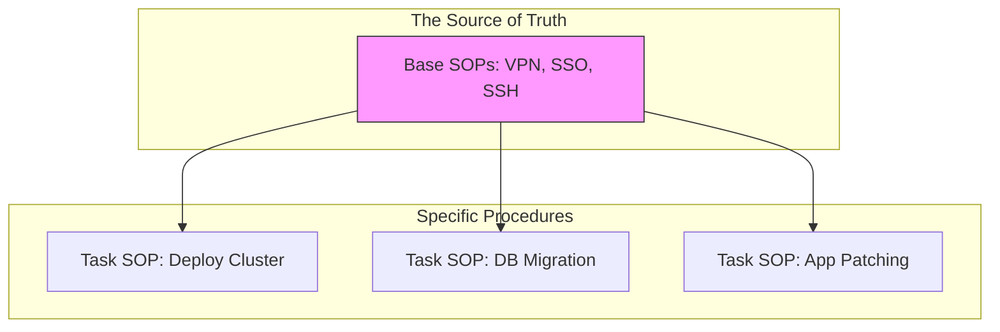

## Modular Documentation Structure

---

## 🏗️ Real-Life Scenarios

### Scenario 1: The 100-File Update
**Problem**: A company changes its SSO provider from Okta to Azure AD. Every single SOP (120 files) ends with "Log in using your Okta credentials."
**Outcome**: 5 engineers spend a whole day manually updating 120 files. They inevitably miss 5 files, causing confusion and failed logins during the next on-call rotation.
**Solution**: Refactor the docs. Now, every file links to a single `GBL-AUTH-01: Authentication Guide`.
**Result**: Next year, when they move to another provider, it takes 1 engineer exactly 2 minutes to update the one file.

### Scenario 2: The "Ghost" VPN Server
**Problem**: An internal VPN server was decommissioned and replaced by a new Zero Trust gateway. 50% of the runbooks still had the old IP address because they were "copy-pasted" clones of an original 2018 guide.
**Crisis**: An engineer followed an old guide during a weekend outage and couldn't connect, wasting 30 minutes of critical MTTR.
**Solution**: Adopted **SDRY**. All VPN steps were deleted from specific runbooks and replaced with a link to the central "Access Gateway" guide.
**Result**: When the gateway changed again 6 months later, the single update propagated instantly to all 50 runbooks.

### Scenario 3: The Copy-Paste Corruption
**Problem**: A complex script for "Database Sanitization" was copied into 5 different maintenance SOPs. One copy had a typo in the `DELETE` command introduced during a manual copy-paste event.
**Crisis**: A junior engineer used the "corrupted" SOP and deleted more data than intended.
**Solution**: Centralized the script in a repository and used **Transclusion** (MkDocs snippets) to include the exact file content in the SOPs.
**Result**: No more "human error" during document creation. The code is verified once and reused safely everywhere.

---

## ❓ Interview Questions

1.  **What is the 'SDRY' principle in technical documentation?**
    - *Answer*: It stands for **Single Source of Truth / Don't Repeat Yourself**. It means creating modular documentation where foundational tasks (like authentication or environment setup) are written once in a central location and then referenced or linked by many specific SOPs.
2.  **How do you handle 'Global Prerequisites' in a large documentation portal?**
    - *Answer*: By creating a 'Base' or 'Common' category for fundamental tasks (VPN, SSH, Login, Tool Installation). All specific task-based SOPs reference these guides in their 'Prerequisites' section rather than restating the instructions, ensuring consistency across the board.
3.  **Explain the risks of 'Copy-Paste' documentation.**
    - *Answer*: The primary risks are **Inconsistency** (some docs are updated, others are not), **Staleness** (old information persists in forgotten files), and **Error Injection** (accidental changes made during the paste process). It significantly increases the "maintenance tax" of the documentation system.
4.  **What is 'Transclusion' or 'Snippets' in the context of Docs-as-Code?**
    - *Answer*: It is an advanced SDRY technique where a documentation tool (like MkDocs or Jekyll) pulls the contents of an external file (e.g., a shared YAML config or a bash script) and injects it into the Markdown at build time. This ensures the docs always show the actual, live version of the code.
5.  **How do you balance 'SDRY' with 'Readability' (not making the user click 20 links)?**
    - *Answer*: You follow the "Rule of Three." If a task is small and used in only 1-2 places, it stays in the file. If it's used in 3+ places, it becomes a Base SOP. We also use clear, descriptive links so the user knows exactly what they are clicking.
6.  **Why is SDRY critical for 'Audit and Compliance'?**
    - *Answer*: Auditors want to see that policies (like "Access Control") are applied consistently. With SDRY, you can prove that every engineer is following the exact same approved authentication procedure because they are all referencing the same source file.

---

## 🧠 Comprehensive Quiz (25 Questions)

<b>1. What does SDRY stand for?</b>

Show Answer

Answer: B**（The documentation equivalent of DRY in coding）

<b>2. True/False: You should copy-paste instructions to make each document 'Self-Contained' and avoid links.</b>

Show Answer

Answer: B** - This creates a maintenance nightmare. Use links or transclusion.

<b>3. 'Modular Documentation' means:</b>

Show Answer

Answer: B

<b>4. A 'Base SOP' is best used for:</b>

Show Answer

Answer: C

<b>5. 'Transclusion' refers to:</b>

Show Answer

Answer: B

<b>6. The "Copy-Paste Trap" lead to:</b>

Show Answer

Answer: B

<b>7. Updating a 'Base SOP' once results in:</b>

Show Answer

Answer: B

<b>8. Which of these is a 'Single Source of Truth'?</b>

Show Answer

Answer: B

<b>9. SDRY is the documentation version of which programming principle?</b>

Show Answer

Answer: B

<b>10. True/False: Transclusion ensures that if you update a script, the doc showing that script is automatically updated.</b>

Show Answer

Answer: A

<b>11. Descriptive Links (e.g., "[Connect to VPN](../base/vpn.md)") are better because:</b>

Show Answer

Answer: B

<b>12. 'Maintenance Debt' in documentation increases when:</b>

Show Answer

Answer: B

<b>13. A 'Global Header/Footer' is an example of:</b>

Show Answer

Answer: B

<b>14. If a task is used in more than __ places, it should probably be centralized.</b>

Show Answer

Answer: B** (The 'Rule of Three')

<b>15. 'Shared Variables' in MkDocs (e.g., `$VERSION`) allow you to:</b>

Show Answer

Answer: B

<b>16. True/False: SDRY makes the initial writing phase longer but saves time in the long run.</b>

Show Answer

Answer: A** - Planning modularity takes effort upfront.

<b>17. 'Reference Documentation' usually contains:</b>

Show Answer

Answer: B

<b>18. A 'Nested List' of instructions is NOT SDRY if:</b>

Show Answer

Answer: B

<b>19. 'Documentation Health' is measured by:</b>

Show Answer

Answer: B

<b>20. True/False: It's okay to have "near-duplicate" docs for Dev vs Prod if only 1 line changes.</b>

Show Answer

Answer: A

<b>21. 'Content Fragments' are:</b>

Show Answer

Answer: B

<b>22. Which section of an SOP is the best place to link to a Base SOP?</b>

Show Answer

Answer: B

<b>23. 'Centralization' helps with Compliance because:</b>

Show Answer

Answer: B

<b>24. The 'Rule of Three' suggests:</b>

Show Answer

Answer: C

<b>25. The ultimate enemy of SDRY is:</b>

Show Answer

Answer: B

