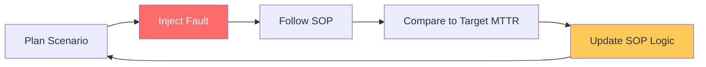

# SOP Governance, Quality & Compliance Reference

**Doc Version:** 1.0.0
**Role:** Operations Manager / Regulatory Lead
**Scope:** Quality Control, Gamedays, and Compliance Framework Alignment

---

## 1. Quality Control & The "3 AM Test"

A high-performance SOP must be functional under extreme stress. We use the "3 AM Test" to validate quality.

- **Accessibility**: Is the document discoverable within 10 seconds of an alert triggering?
- **Clarity**: Can a non-subject matter expert follow the instructions without asking questions?
- **Actionability**: Are there clear, copy-pasteable commands for every step?

---

## 2. Gamedays: Stress-Testing Documentation

Operational documentation is only "verified" once it has been executed in a real or simulated environment.

| Stage | Activity | Goal |
| :--- | :--- | :--- |
| **Desk Check** | Read-through by the author. | Catch typos and flow errors. |
| **Bystander Test** | A peer from another team executes the SOP. | Identify "Tribal Knowledge" gaps. |
| **Gameday** | Execution in Staging during a fault injection. | Validate technical accuracy. |
| **Post-Mortem Review** | Updating SOPs after a production incident. | Capture real-world edge cases. |

---

## 3. Visualizing the Gameday Cycle

---

## 4. Compliance Framework Alignment

In regulated industries (FinTech, HealthTech), SOPs are legal artifacts.

- **SOC2 Control**: Demonstrating that changes to infrastructure are documented and followed according to approved procedures.
- **HIPAA Privacy**: Ensuring SOPs for data handling strictly adhere to encryption and access controls.
- **PCI-DSS**: Documentation of environment isolation and secret management procedures.

---

## 5. Secret Management & PII Hygiene

SOPs must NEVER contain sensitive information.
- **Placeholders**: Use `<AWS_ACCOUNT_ID>` or `<ENVIRONMENT_NAME>`.
- **Reference**: Direct the user to secret stores (e.g., "Retrieve the token from Vault path `secret/prod/api-key`").
- **Scanning**: Automatic scanning of Git repositories to block PRs containing secrets in markdown files.

---

## 6. Enterprise Governance Standards

- **The "Bystander Sign-off"**: All critical service SOPs require a sign-off from someone who did NOT write them, confirming they could complete the task.
- **Auditable Revision History**: Every SOP change must be linked to a JIRA ticket or Incident ID to explain the "Why" behind the update.
- **Standardized Templates**: Use a mandatory organizational template to ensure all SOPs have the same "Mental Map," reducing cognitive friction.

---

> **Enterprise Pattern**: Implement **The "Feedback Loop" Integration**. Every rendered SOP page should have a "Was this helpful?" or "Report an Issue" button that automatically creates a bug in the documentation backlog. This turns every reader into a potential quality auditor.
