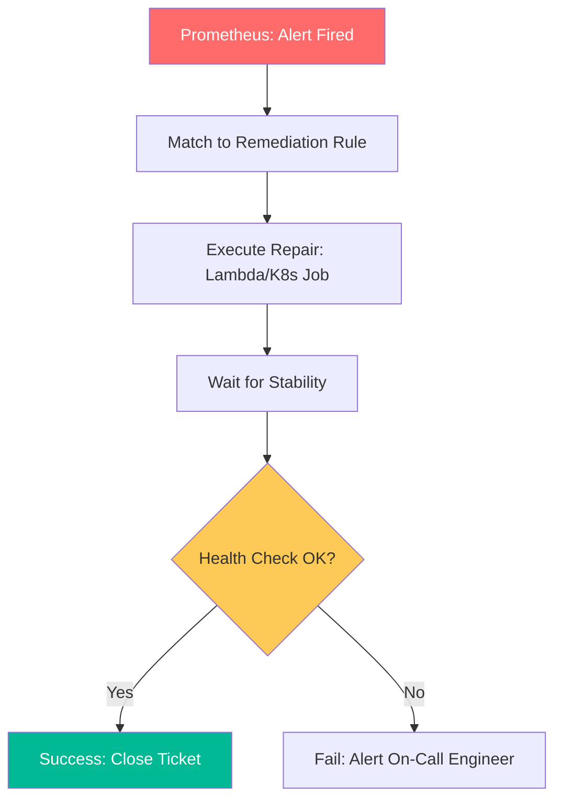

# Auto-Remediation Architectures & Self-Healing Reference

**Doc Version:** 1.0.0
**Role:** SRE Architect / Automation Engineer
**Scope:** Self-Healing Philosophies, Closed-Loop Systems, and Core Remediation Patterns

---

## 1. The Self-Healing Philosophy

The goal of auto-remediation is to eliminate **Toil**—repetitive, manual tasks that provide no long-term value. By automating the response to known failure modes, SRE teams can focus on innovation and proactive reliability engineering.

### A. The 80/20 Rule of Operations
- **80%** of incidents are often caused by the same **20%** of common failure modes (e.g., Disk Full, Service Down).
- **Strategy**: Target these repetitive issues first to maximize the "Rest Time" for engineers.

---

## 2. Closed-Loop Architecture

A reliable self-healing system must operate as a "Closed-Loop," ensuring that actions are verified and the system returns to a known good state.

1.  **Observe**: Detect an anomaly via metrics (Prometheus), logs (Loki), or traces.
2.  **Decide**: Match the anomaly to a specific remediation rule or "Heuristics."
3.  **Act**: Execute the remediation script or API call (e.g., Restart Container, Expand Volume).
4.  **Verify**: Check health metrics to ensure the action fixed the root symptom.
5.  **Notify**: Document the action in a tracking system (Jira/Slack) for post-incident review.

---

## 3. Core Remediation Patterns

| Pattern | Trigger | Automated Action |
| :--- | :--- | :--- |
| **Service Bounce** | 3 consecutive health check failures. | Restart container/service. |
| **Storage Flush** | Disk usage > 85% on log volume. | Purge temporary files/rotate logs. |
| **Scale-Out** | CPU/Memory utilization > 70% for 5 mins. | Add instances to the cluster. |
| **Dray-and-Reboot** | Unresponsive host or kernel panic. | Drain traffic and trigger hardware reboot. |

---

## 4. Visualizing the Closed-Loop Workflow

---

## 5. Implementation Platforms

- **Kubernetes Operators**: Native "reconciliation loops" that constantly work to match the actual state to the desired state.
- **Event-Driven FaaS**: Using AWS Lambda or Google Cloud Functions to respond to CloudWatch/Stackdriver alerts.
- **Workflow Engines**: Using systems like StackStorm or Temporal to orchestrate complex, multi-step repairs.

---

## 6. Enterprise Governance Standards

- **Idempotency**: Remediation scripts MUST be idempotent; running them twice should never cause harm.
- **Verification Integrity**: A remediation is not complete until a secondary, independent health check confirms the fix.
- **Logging for Post-Mortems**: Every automated action must be logged with the original alert context for auditability.

> **Enterprise Pattern**: Implement **The "Probabilistic" Self-Healer**. For complex systems, don't just "Restart." Use your automation to collect forensics (e.g., thread dumps, heap snapshots) *before* the restart. This ensures that even if the system heals itself, you don't lose the evidence needed to find the root cause.
