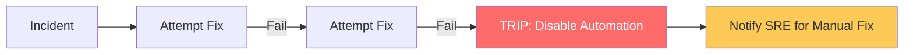

# Safety, Governance & Self-Healing Guardrails Reference

**Doc Version:** 1.0.0
**Role:** Reliability Lead / Safety Officer
**Scope:** Circuit Breakers, Remediation Limits, and Automated Governance

---

## 1. Safety Guardrails: Preventing "The Cascading Failure"

Automated remediation is a double-edged sword. If not properly guarded, an automated "fix" can accidentally destroy a cluster (e.g., automatically deleting "stale" nodes that were actually processing traffic).

- **Rate Limiting**: "Do not restart more than 1 instance per 5 minutes."
- **Concurrency Limits**: "Only remediate 10% of the fleet simultaneously."
- **Kill-Switches**: A manual button that globally disables all auto-remediation during major outages to allow humans full control.

---

## 2. The Automation Circuit Breaker

An automation circuit breaker prevents a failing remediation loop from making a bad situation worse.

1.  **Closed State**: Automation runs normally.
2.  **Open State**: If a remediation fails 3 times in a row, the circuit "trips."
3.  **Human Intervention**: The circuit remains open (automation disabled) until an SRE manually resets it.

---

## 3. Visualizing the Safety Circuit

---

## 4. Verification & Automated Rollback

If a remediation action (like a configuration update) fails to improve health metrics, the system must automatically roll back.

- **Pre-Flight Checks**: Ensure dependencies are healthy before acting.
- **Canary Remediation**: Apply the fix to one instance first; wait 2 minutes for metrics; only then proceed to the rest.
- **Rollback Logic**: Every "Step Forward" must have a corresponding "Step Back" defined in the automation code.

---

## 5. Enterprise Governance & Compliance

In regulated environments, "Bots" performing system changes must be governed as if they were human administrators.

- **Non-Prod Validation**: All auto-remediation logic must be stress-tested in a Staging/UAT environment using **Chaos Engineering** (e.g., Gremlin, LitmusChaos).
- **Service Level Objectives (SLOs)**: Remediation success rates must be tracked. If auto-remediation fails more than 5% of the time, the logic must be retired for redesign.
- **Audit Trails**: Every automated action must link to the specific Business Approval or "Generic Pattern Approval" that authorized it.

---

## 6. Proactive Chaos Testing

Don't wait for a real outage to see if your self-healing works. Use Chaos Engineering to "Exercise" your robots.
- **Scenario**: Inject "Disk Full" into a node.
- **Expected Outcome**: The auto-remediation platform detects the event, purges logs, and records the success in Slack—all within 30 seconds.

---

> **Enterprise Pattern**: Implement **The "Human Approval" Bridge**. For high-risk remediations (e.g., DB Failover), use a Slack-based approval system. The bot proposes the fix: *"I detect a primary DB hang. Should I trigger failover to Secondary-East?"* An SRE clicks **[Yes/No]** in Slack. This provides the speed of automation with the safety of a human "Final Check."
