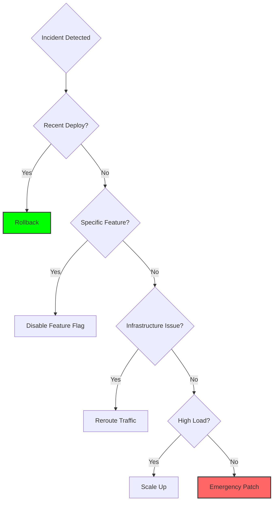

# Mitigation Strategies

Mitigation is about **stopping the bleeding**, not finding the root cause. Speed matters more than perfection.

## The Mitigation Hierarchy

### 1. Rollback (Fastest)
Revert to the last known good state.
```bash
# Kubernetes
kubectl rollout undo deployment/api-server

# Git-based deployment
git revert HEAD && git push
```
**When**: Recent deployment caused the issue.
**Time**: < 2 minutes.

### 2. Feature Flag Disable
Turn off the problematic feature without full rollback.
```python
if feature_flags.is_enabled("new_checkout"):
    # New code
else:
    # Old stable code
```
**When**: Specific feature is broken but rest of app is fine.
**Time**: < 30 seconds.

### 3. Traffic Rerouting
Redirect traffic away from failing component.
- **DNS**: Point to backup region.
- **Load Balancer**: Remove unhealthy instances.
- **CDN**: Serve cached version.

**When**: Infrastructure failure in one region/zone.
**Time**: 1-5 minutes.

### 4. Scaling (Horizontal)
Add more capacity to handle load.
```bash
# Kubernetes
kubectl scale deployment/api-server --replicas=10

# AWS
aws autoscaling set-desired-capacity --desired-capacity 20
```
**When**: Performance degradation due to load.
**Time**: 2-5 minutes (depending on boot time).

### 5. Emergency Patch (Slowest)
Deploy a hotfix.
**When**: No other option available.
**Time**: 15-60 minutes.
**Risk**: Highest (could make things worse).

---

## The Decision Tree



---

## Mitigation Anti-Patterns

### Anti-Pattern 1: The "Let Me Debug First" Trap
**Problem**: Spending 30 minutes debugging before mitigating.
**Fix**: Mitigate first, debug later.

### Anti-Pattern 2: The "Perfect Fix" Fallacy
**Problem**: Trying to find the perfect solution instead of a quick fix.
**Fix**: Accept that mitigation is temporary. Root cause fix comes later.

### Anti-Pattern 3: The "Untested Hotfix"
**Problem**: Deploying an emergency patch without any testing.
**Fix**: Even in emergencies, test in staging first (if possible).

---

---

## 🏗️ Real-Life Scenarios

### Scenario 1: The "Debugging During Fire" Outage
**Problem**: Payment processing for a large retail site failed immediately after a 2:00 PM deployment.
**Mistake**: The on-call engineer started "Tailing Logs" and "Checking Database Locks" to find the exact line of code that was failing.
**Crisis**: This "Investigation" took 2 hours. During those 2 hours, the company lost $250,000 in revenue.
**Outcome**: A senior SRE joined the bridge, asked "When was the last deploy?", and immediately ordered a rollback.
**Solution**: The **Rollback** took 2 minutes. The site was restored instantly.
**Result**: The team implemented a "Rollback-First, Debug-Later" policy for any incident starting within 30 minutes of a deployment.

### Scenario 2: The "Poisoned" Feature Flag
**Problem**: A new "AI-Recommended Products" widget was deployed. It worked in staging but caused a "Memory Leak" in production that crashed the web servers every 10 minutes.
**Constraint**: A full rollback was risky because the deployment also included critical security patches that couldn't be reverted.
**Solution**: The team used a **Feature Flag** manager to "Kill" the AI widget globally.
**Outcome**: The widget disappeared from the site, the memory leak stopped immediately, and the security patches stayed in place.
**Result**: MTTR was 45 seconds (the time it took to toggle a button in a UI).

### Scenario 3: The "Region Failure" Reroute
**Problem**: An AWS region (US-EAST-1) experienced a major networking outage, making the application unreachable for 50% of the world.
**Crisis**: Scaling up or patching wasn't an option because the underlying infrastructure was broken.
**Solution**: The team updated their **Route 53 DNS records** to reroute all traffic to their backup region (US-WEST-2).
**Outcome**: Although US-WEST-2 was slightly slower due to latency, 100% of users were able to access the site again within 5 minutes of the DNS propagation.
**Result**: The company prioritized "Multi-Region Active-Active" architecture for all critical services.

---

## ❓ Interview Questions

1.  **What is the 'Golden Rule' of Mitigation?**
    - *Answer*: **Mitigate First, Debug Later**. Your priority is "Stopping the Bleeding" and restoring service to users. You can investigate the "Why" (Root Cause) once the site is stable.
2.  **When is a 'Rollback' NOT the best option?**
    - *Answer*: 1. When the issue isn't related to a recent change. 2. When a database schema change (migration) has already been applied and cannot be easily reverted without data loss. 3. When the previous version also has the bug.
3.  **Explain the benefit of 'Feature Flags' for incident response.**
    - *Answer*: Feature flags allow for "Surgical Mitigation." They let you disable the *specific* broken part of an application without needing a full redeploy or rollback, minimizing the "Blast Radius" of the fix.
4.  **What is a 'Hotfix' and why is it considered high risk?**
    - *Answer*: A hotfix is a code patch written and deployed under pressure during an incident. It is high risk because there is often no time for full QA/Testing, which can lead to "Secondary Outages" (where the fix causes a new problem).
5.  **How does 'Traffic Rerouting' differ from 'Horizontal Scaling'?**
    - *Answer*: **Scaling** adds more capacity to an existing area. **Rerouting** moves traffic *away* from a broken area to a healthy one (e.g., changing DNS from one data center to another).
6.  **Why should you mitigate even if you don't know the root cause?**
    - *Answer*: Because SREs are measured on **MTTR (Mean Time To Recovery)**. Every minute of user downtime is a violation of the SLA. Finding the root cause is for the Post-Mortem phase; restoring service is for the Incident Response phase.

---

## 🧠 Comprehensive Quiz (25 Questions)

<b>1. What is the primary focus of the Mitigation phase?</b>
<details>
<summary>Show Answer</summary>
Answer: B
</details>


<b>2. True/False: Speed is more important than perfection during mitigation.</b>
<details>
<summary>Show Answer</summary>
Answer: A
</details>


<b>3. Which mitigation strategy is usually the FASTEST?</b>
<details>
<summary>Show Answer</summary>
Answer: B
</details>


<b>4. A 'Feature Flag' allows you to:</b>
<details>
<summary>Show Answer</summary>
Answer: B
</details>


<b>5. 'Rolling back' a Kubernetes deployment is done with:</b>
<details>
<summary>Show Answer</summary>
Answer: B
</details>


<b>6. 'Traffic Rerouting' is best used when:</b>
<details>
<summary>Show Answer</summary>
Answer: B
</details>


<b>7. True/False: You should always debug for 1 hour before rolling back.</b>
<details>
<summary>Show Answer</summary>
Answer: A
</details>


<b>8. 'Horizontal Scaling' involves:</b>
<details>
<summary>Show Answer</summary>
Answer: B
</details>


<b>9. An 'Emergency Patch' is generally:</b>
<details>
<summary>Show Answer</summary>
Answer: B
</details>


<b>10. What is 'Blast Radius' in mitigation?</b>
<details>
<summary>Show Answer</summary>
Answer: B
</details>


<b>11. True/False: If a database migration can't be reverted, you might be forced to Hotfix.</b>
<details>
<summary>Show Answer</summary>
Answer: A
</details>


<b>12. 'Failover' refers to:</b>
<details>
<summary>Show Answer</summary>
Answer: B
</details>


<b>13. Why use 'Canary Deployments' to prevent mitigation crises?</b>
<details>
<summary>Show Answer</summary>
Answer: B
</details>


<b>14. If you have 100% error rates after a deploy, you should:</b>
<details>
<summary>Show Answer</summary>
Answer: B
</details>


<b>15. 'Surgical Mitigation' means:</b>
<details>
<summary>Show Answer</summary>
Answer: B
</details>


<b>16. True/False: Root cause analysis happens *during* the mitigation phase.</b>
<details>
<summary>Show Answer</summary>
Answer: A
</details>


<b>17. 'DNS Propagation' time affects which strategy?</b>
<details>
<summary>Show Answer</summary>
Answer: B
</details>


<b>18. What is the 'MTTR' target during mitigation?</b>
<details>
<summary>Show Answer</summary>
Answer: B
</details>


<b>19. A 'Circuit Breaker' is an automated way to:</b>
<details>
<summary>Show Answer</summary>
Answer: B
</details>


<b>20. True/False: You should always communicate your mitigation plan to the Incident Commander.</b>
<details>
<summary>Show Answer</summary>
Answer: A
</details>


<b>21. 'Shadow Traffic' helps test fixes by:</b>
<details>
<summary>Show Answer</summary>
Answer: B
</details>


<b>22. 'Rate Limiting' can be a mitigation strategy against:</b>
<details>
<summary>Show Answer</summary>
Answer: B
</details>


<b>23. Under-mitigating means:</b>
<details>
<summary>Show Answer</summary>
Answer: B
</details>


<b>24. The 'Mitigation First' mindset is core to which philosophy?</b>
<details>
<summary>Show Answer</summary>
Answer: B
</details>


<b>25. Mitigation is to an incident what _____ is to a doctor.</b>
<details>
<summary>Show Answer</summary>
Answer: B
</details>
