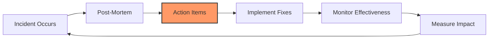

# Continuous Improvement

Incidents are expensive lessons. **The goal is to never have the same incident twice.**

## The Improvement Cycle

---

## Tracking Metrics

### 1. Incident Frequency
How often do incidents occur?
- **Target**: Decreasing trend month-over-month.
- **Red Flag**: Same incident type recurring.

### 2. MTTR (Mean Time To Recovery)
How fast do we recover?
- **Target**: < 1 hour for P1.
- **Improvement**: Track trend over time.

### 3. MTTD (Mean Time To Detect)
How fast do we detect issues?
- **Target**: < 5 minutes for P0/P1.
- **Improvement**: Better monitoring and alerting.

### 4. Repeat Incident Rate
What percentage of incidents are repeats?
- **Target**: < 10%.
- **Red Flag**: > 25% indicates poor follow-through on action items.

---

## Action Item Management

### The Problem
Action items from post-mortems often get forgotten.

### The Solution
1.  **Assign Owners**: Every action item has a specific owner.
2.  **Set Due Dates**: Realistic but firm deadlines.
3.  **Track in Sprint**: Add to sprint planning, not a separate backlog.
4.  **Review in Retros**: Discuss progress in retrospectives.
5.  **Executive Visibility**: Share action item completion rates with leadership.

---

## The Incident Review Board

### Purpose
Monthly meeting to review all incidents and trends.

### Attendees
- SRE Team Lead
- Engineering Managers
- Product Managers
- CTO (for major incidents)

### Agenda
1.  Review incident metrics (frequency, MTTR, MTTD).
2.  Discuss repeat incidents.
3.  Review action item completion rates.
4.  Identify systemic patterns.
5.  Allocate resources for major improvements.

---

## Building a Learning Culture

### 1. Celebrate Learning
Share post-mortems company-wide.
- **Example**: "Incident of the Month" presentation.

### 2. Reward Honesty
Thank people who surface issues early.

### 3. Gamedays
Simulate incidents to practice response.

### 4. Runbook Reviews
Quarterly review of all runbooks for accuracy.

### 5. Knowledge Sharing
Rotate on-call roles so everyone learns.

---

---

## 🏗️ Real-Life Scenarios

### Scenario 1: The "Groundhog Day" Database Lock
**Problem**: For 6 months, the same database "Lock Contention" issue caused a 10-minute P1 incident every Monday morning at 9:00 AM.
**Mistake**: After each incident, the post-mortem action item was simply "Add more database monitoring." The monitoring showed the problem, but it didn't fix it.
**Outcome**: The team became "Alert Fatigued," and customers started expecting a Monday morning outage as "Normal."
**Solution**: The Incident Review Board mandated a **Zero-Repeat Policy**. SREs were given 3 days of "Feature-Free" time to rewrite the problematic SQL query and add a caching layer.
**Result**: The Monday morning incident disappeared forever. The "Repeat Incident Rate" for that service dropped to zero.

### Scenario 2: The "Ghost" Action Items
**Problem**: A major payment outage resulted in 15 "Critical" action items. Three months later, a similar outage occurred.
**Discovery**: During the new post-mortem, it was discovered that 12 of the 15 original action items were still "In Progress" or "To-Do" in a separate SRE Jira board that developers never looked at.
**Outcome**: The company suffered a nearly identical outage because the "Improvement" wasn't prioritized.
**Solution**: Integrated SRE action items directly into the **Product Development Sprint**. Action items now have the same priority as "Feature" work and are reviewed by the Engineering Manager weekly.
**Result**: Completion rate for P0 action items rose from 20% to 95%.

### Scenario 3: The "Learning" Culture Shift
**Problem**: A junior engineer accidentally deleted a production Kubernetes namespace.
**Old Way**: The engineer would have been "Written Up" or fired, leading to a culture of fear and hiding mistakes.
**New Way**: The company held a **Blameless Learning Session**. They discovered that the `kubectl` context didn't show which cluster was "Production" vs "Staging" in the terminal.
**Result**: Instead of a "Correction," the team implemented `kube-ps1` (to show the cluster in the prompt) and restricted "Delete" permissions to a specialized service account only.
**Outcome**: No production namespaces were accidentally deleted again, and the junior engineer felt safe and empowered to share their learning with the rest of the company.

---

## ❓ Interview Questions

1.  **Why is 'Continuous Improvement' the most important part of the SRE lifecycle?**
    - *Answer*: Because incidents are expensive. If you don't learn from them, you are paying for the "Lesson" without getting the "Knowledge." Continuous improvement turns failures into systemic strengths, progressively making the platform more reliable.
2.  **How do you prevent 'Post-Mortem Action Items' from being forgotten?**
    - *Answer*: 1. Assign a clear **Owner**. 2. Set a **Due Date**. 3. Integrate them into the main **Product Sprint/Backlog**. 4. Review completion rates in monthly **Incident Review Board** meetings.
3.  **What are the 3 most important SRE reliability metrics to track?**
    - *Answer*: 1. **MTTR (Mean Time To Recovery)**: How fast we fix things. 2. **MTTD (Mean Time To Detect)**: How fast we find things. 3. **Repeat Incident Rate**: How well we learn from things.
4.  **Explain the purpose of an 'Incident Review Board'.**
    - *Answer*: It is a high-level meeting (usually monthly) where leadership and SREs review trends, identify patterns across different teams, and ensure that resources are being allocated to fix major reliability gaps.
5.  **What is a 'Runbook Review' and why is it part of continuous improvement?**
    - *Answer*: It's a periodic (e.g., quarterly) audit of all incident response documents. Systems change fast; if a runbook points to an old server or an obsolete dashboard, it is useless. Reviews ensure the "Bible" of response is always accurate.
6.  **How do 'Gamedays' contribute to continuous improvement?**
    - *Answer*: Gamedays (simulated failures) allow a team to "Practice" their response in a safe, controlled environment. It identifies gaps in monitoring, communication, and automation *before* a real customer-impacting incident occurs.

---

## 🧠 Comprehensive Quiz (25 Questions)

<b>1. The main goal of Continuous Improvement is to:</b>

Show Answer

Answer: B

<b>2. True/False: 'MTTR' should ideally decrease over time.</b>

Show Answer

Answer: A

<b>3. A 'Repeat Incident' rate of 50% indicates:</b>

Show Answer

Answer: B

<b>4. Where should Post-Mortem 'Action Items' be tracked?</b>

Show Answer

Answer: B

<b>5. 'MTTD' stands for:</b>

Show Answer

Answer: B

<b>6. An 'Incident Review Board' meeting is usually held:</b>

Show Answer

Answer: B

<b>7. True/False: Gamedays are for practicing response to simulated failures.</b>

Show Answer

Answer: A

<b>8. 'SLA' stands for:</b>

Show Answer

Answer: B

<b>9. What is the target rate for Repeat Incidents?</b>

Show Answer

Answer: B

<b>10. 'Root Cause' fix meant to prevent a whole class of errors is:</b>

Show Answer

Answer: B

<b>11. True/False: You should reward engineers for finding systemic bugs.</b>

Show Answer

Answer: A

<b>12. 'Runbook Reviews' ensure that:</b>

Show Answer

Answer: B

<b>13. 'Knowledge Sharing' involves:</b>

Show Answer

Answer: B

<b>14. If MTTR is increasing month-over-month, the team should:</b>

Show Answer

Answer: B

<b>15. 'MTTD' measures the efficiency of:</b>

Show Answer

Answer: B

<b>16. True/False: Feature development should stop if reliability falls below a certain threshold.</b>

Show Answer

Answer: A

<b>17. 'Trend Analysis' looks at:</b>

Show Answer

Answer: B

<b>18. Why include 'Product Managers' in incident reviews?</b>

Show Answer

Answer: B

<b>19. A 'Post-Mortem Action Item' without an owner is:</b>

Show Answer

Answer: A

<b>20. True/False: Continuous Improvement is the 'feedback loop' of SRE.</b>

Show Answer

Answer: A

<b>21. 'Blamelessness' is a prerequisite for:</b>

Show Answer

Answer: B

<b>22. 'Toil Reduction' is an example of:</b>

Show Answer

Answer: B

<b>23. Under-investing in reliability leads to:</b>

Show Answer

Answer: A

<b>24. The 'SRE' mindset treats operations as:</b>

Show Answer

Answer: B

<b>25. Reliable systems are not built; they are _____.</b>

Show Answer

Answer: B

