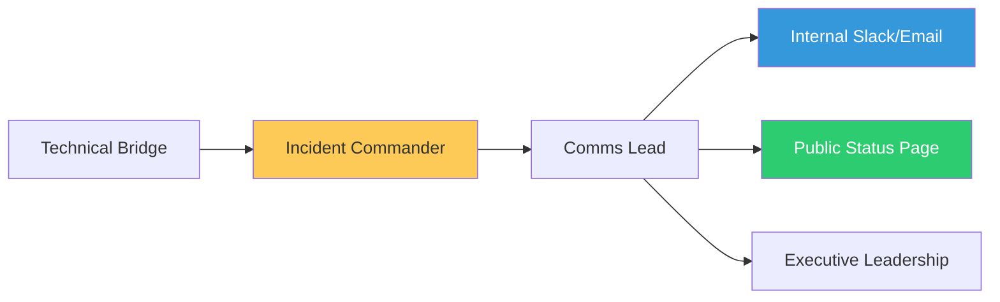

# Enterprise Incident Governance & Communication Reference

**Doc Version:** 1.0.0
**Role:** Incident Manager / Communications Lead
**Scope:** Governance Frameworks, Communication Standards, and Post-Mortem Excellence

---

## 1. Governance & Severity Frameworks

Consistency in how we classify pain is the foundation of trust between engineering and the business.

- **P0 (Severe Outage)**: Critical loss of core business functionality (e.g., Checkout is broken).
- **P1 (Major Disruption)**: High impact but with a manual workaround or partial functionality.
- **P2 (Moderate Impact)**: Significant but non-critical feature is down.
- **P3/P4 (Minor/Trivial)**: Cosmetic bugs or individual user issues.

---

## 2. Communication Standards (The Stakeholder Shield)

The IC protects the engineers from distractions by ensuring the business is informed at regular intervals.

### A. Internal Status Updates
- **Frequency**: Every 15-30 minutes for P0/P1 incidents.
- **Format**: **Current Status | Action Taken | Next Update Time | Blockers**.

### B. External Communications (The Status Page)
- **Tone**: Transparent, professional, and empathetic.
- **Detail**: Focus on the *impact* and the *restoration*, not the deep-dive technical root cause until the Post-Mortem.

---

## 3. Visualizing the Communication Flow

---

## 4. Post-Mortem (Learning from Failure)

The Post-Mortem is the most valuable output of an incident. It is a legal and technical document of record.

- **The "Blameless" Policy**: It must be safe for an engineer to say "I typed the wrong command."
- **Root Cause Analysis (RCA)**: Using "The Five Whys" to dig past the human error to the systemic failure (e.g., Why was the command possible without a guardrail?).
- **Corrective Actions**: Every Post-Mortem MUST result in at least one actionable JIRA ticket to prevent recurrence.

---

## 5. Enterprise Metrics (Beyond MTTR)

- **MTTD (Mean Time to Detect)**: How good is our monitoring?
- **MTTA (Mean Time to Acknowledge)**: How fast is our on-call?
- **MTTR (Mean Time to Resolve/Restore)**: How effective are our runbooks?
- **Escalation Frequency**: Are we waking up the same people too often?

---

## 6. Enterprise Governance Standards

- **The "War Room" Protocol**: For P0 incidents, all involved parties MUST join a dedicated video/physical bridge immediately.
- **Mandatory Scribe**: No P0/P1 analysis can be completed without a Scribe's log showing exactly what was done and when.
- **Compliance Audit**: In regulated industries, incident logs must be stored for specified periods (e.g., 7 years) to satisfy legislative audit requirements.

---

> **Enterprise Pattern**: Implement **The "Anti-Hero" Promotion**. Do not reward engineers who "save the day" through 20 hours of manual effort. Reward the engineers who write the **Post-Mortem Action Items** that prevent that heroics from ever being necessary again. This builds a culture of durability rather than burnout.
