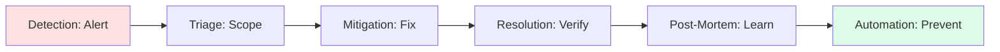

# 📜 Runbooks & Procedures: The SRE Playbook

> **"Listen up, Junior. At 3 AM when the database is crashing and the CEO is calling, you don't want to be 'creative.' You want a plan. A professional engineer follows the manual so they can think clearly during the fire."**

---

## 🧠 The Mental Model: The Flight Manual

**The Junior Struggle**: "Documentation is boring. I'll just remember how I fixed it. Besides, the code *is* the documentation, right?"

**The Senior Solution**: You realize that memory is the first thing to fail during a crisis. A professional runbook is like a **Pilot's Flight Manual**:
- **Checklists**: Prevents skipped steps when you're tired.
- **Decision Trees**: Guides you through "If this, then that" logic.
- **Safety Boundaries**: Tells you when to STOP and call for backup.
- **Post-Mortems**: The "Black Box" recorder that ensures we never make the same mistake twice.

---

## 🆚 Junior Way vs. Senior Way

| Feature | The Junior Way (Problematic) | The Senior Way (Architected) |
|:---|:---|:---|
| **Incident Response** | Panicked guessing / Group Slack calls | **Incident Commander** roles & roles |
| **Documentation** | Static Wiki pages (outdated) | **Docs-as-Code** (lives in Git) |
| **Repair** | Manual terminal commands | **Auto-remediation** scripts |
| **Culture** | Finding someone to blame | **Blameless Post-mortems** |
| **Recovery** | "I think I fixed it" | **Verified Recovery** steps |

---

## 🏗️ Visual: The Incident Response Lifecycle

---

## 🗺️ Curriculum Path

1. **[01-Runbook-Fundamentals](./01-runbook-fundamentals/readme.md)**: Philosophy, doc hierarchy, and 10-part deep dive into SRE standards.
2. **[02-Writing-Effective-SOPs](./02-writing-effective-sops/writing-effective-sop's.md)**: The "Docs-as-Code" philosophy and standard templates.
3. **[03-Auto-Remediation-Patterns](03-auto-remediation-patterns/reference/auto-remediation-architectures-ref.md)**: Building self-healing infrastructure.
4. **[04-Incident-Management-and-Response](reference/incident-response-governance-ref.md)**: Roles, escalation, and post-mortems.
5. **[05-Interview-Questions-and-Quizzes](./05-interview-questions-and-quizzes/interview-questions-and-quizzes.md)**: Career validation.

---

## 🏆 Real-World DevOps Story: The 3 AM Delete

**The Scenario**: A Junior engineer tried to clean up disk space by deleting "old" logs but accidentally deleted the active database transaction log.
**The Crisis**: The database crashed, and the team spent 6 hours manually rebuilding the state from backups because there was no "Accidental Deletion" recovery plan.
**The Fix**: Created an **Immutable Runbook** and automated the cleanup script so no human ever has to run `rm -rf` in a production log folder again.
**The Lesson**: **Junior, if a process involves risk, it must be scripted and documented.** Never rely on human fingers to be perfect.

---

## 🎤 Interview Preparation (Operational Excellence)

1. **Q: Junior, what is a 'Blameless Post-Mortem'?**
   - *A: It's a review process where we focus strictly on **system flaws** rather than human errors. The goal is to find out why the system allowed a human to make a mistake, not to punish the person.*

2. **Q: What is the difference between a 'Runbook' and an 'SOP'?**
   - *A: A **Runbook** is usually a technical set of steps to solve a specific alert (e.g., 'Fixing Disk Full'). An **SOP** is a broader organizational procedure (e.g., 'How to onboard a new employee').*

3. **Q: What is 'Docs-as-Code'?**
   - *A: It's the practice of writing documentation in Markdown/Git, ensuring it goes through the same PR review and versioning process as our application code.*

4. **Q: Explain the role of an 'Incident Commander' (IC).**
   - *A: The IC is the single person in charge of the response. They don't touch the keyboard; they focus on communication, delegation, and managing the 'big picture' so the engineers can focus on the fix.*

5. **Q: What is 'MTTR' and 'MTBF'?**
   - *A: **MTTR** (Mean Time To Recovery): How fast you fix it. **MTBF** (Mean Time Between Failures): How often it breaks. We want low MTTR and high MTBF.*

6. **Q: What is an 'Escalation Matrix'?**
   - *A: A defined list of who to contact when an incident exceeds a certain time or severity. If the primary on-call doesn't respond in 15 mins, it 'escalates' to the secondary.*

7. **Q: Explain 'Auto-Remediation'.**
   - *A: Using automated scripts (like a Lambda function or an AWS EventBridge rule) to resolve common issues (like restarting a dead service) without human intervention.*

8. **Q: What is 'Toil' in SRE terms?**
   - *A: Toil is manual, repetitive, tactical work that provides no long-term value. Our goal is to eliminate toil through automation so we can focus on engineering.*

9. **Q: Why should you keep a 'Changelog' for every system?**
   - *A: Because 80% of incidents are caused by **Changes**. Knowing exactly what was changed in the last hour is the fastest way to find the root cause.*

10. **Q: What is a 'Game Day' or 'Chaos Engineering'?**
    - *A: It's the practice of intentionally breaking things in production (safely) to test if our monitoring works and if the team knows how to use the runbooks.*

---

## 📝 Knowledge Check

1. **What is the first goal of an Incident Responder?**
   - [x] Mitigation (Stop the bleeding).

2. **True/False: Post-mortems should name the person who caused the error.**
   - [x] **False**. (Blameless culture).

3. **What does 'SOP' stand for?**
   - [x] Standard Operating Procedure.

4. **Which role is responsible for the 'Hands-on-keyboard' during an incident?**
   - [x] Operations Lead.

5. **Which metric measures how long a system stays healthy?**
   - [x] MTBF.

6. **In 'Docs-as-Code', where is the documentation stored?**
   - [x] In the Git Repository.

7. **What is 'Alert Fatigue'?**
   - [x] When there are so many notifications that engineers start ignoring them.

8. **Which tool is a common standard for automated incident paging?**
   - [x] PagerDuty.

9. **What is the final step in a 10-part professional runbook?**
   - [x] Post-Incident Review / Post-Mortem.

10. **What is 'Drift'?**
    - [x] When the actual state of a system differs from the documentation or IaC.

---

## 🔗 Next Steps
Junior, the playbook is ready. Let's learn to write the perfect SOP.
1. Proceed to: **[01-Runbook-Fundamentals](./01-runbook-fundamentals/readme.md)** →
2. Return to: **[Phase 1 Hub](../readme.md)** →