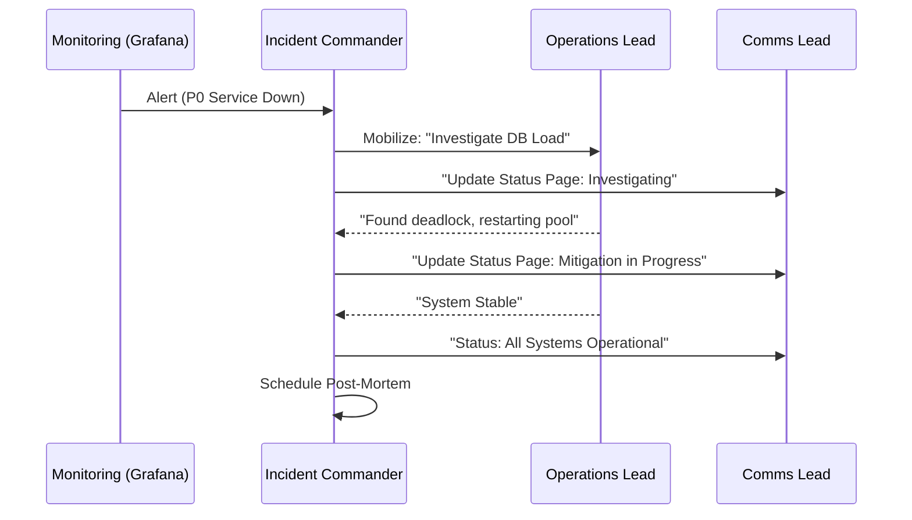

# Incident Management & Response Governance Reference

**Doc Version:** 1.0.0
**Role:** Incident Commander / SRE
**Scope:** Lifecycle, Roles, and Blameless Culture

---

## 1. The Incident Lifecycle

Incident Management follows a standardized lifecycle to ensure consistency and minimize MTTR (Mean Time To Recovery).

1.  **Detection**: Alerting (Prometheus/Grafana) or manual report.
2.  **Triage**: Assigning severity (P0-P3) and confirming the incident.
3.  **Mobilization**: Assembling the response team and establishing a communication channel.
4.  **Mitigation**: The "First Aid" phase. Stop the bleeding (e.g., Rollback, Scale up).
5.  **Resolution**: The root cause is fixed, and the system is back to normal.
6.  **Post-Mortem**: Documenting what happened and how to prevent it.

---

## 2. Standard Incident Roles

In a high-severity incident, roles must be clearly defined to avoid "Too many cooks in the kitchen."

| Role | Responsibility |
| :--- | :--- |
| **Incident Commander (IC)** | Higher-level lead. Holds the clipboard. Manages roles and escalation. |
| **Operations Lead (OPS)** | The "Hands on Keyboard." Executes the commands to fix the system. |
| **Communications Lead (COMM)** | Managing the status page, notifying executives and customers. |
| **Scribe** | Maintains the timeline in the incident log/Slack thread. |

---

## 3. Communication Strategy

### The "Golden Rule" of Status Pages
- **Frequency**: Update every 15-30 mins for P0, even if there's "No New Info."
- **Transparency**: Be honest about the scope ("Users in US-East-1").
- **External vs Internal**: Internal channels (Slack) are for technical debate; external (Statuspage.io) is for customer trust.

---

## 4. Blameless Post-Mortems

The goal of a post-mortem is to **fix the system, not the person.**

### Standard Template
- **Timeline**: When was it detected? When mitigated?
- **Impact**: How many users? What features?
- **The "Five Whys"**: Drill down into the root cause.
- **Action Items**: Tickets (Jira/GitHub) that MUST be resolved to prevent recurrence.

---

## 5. Visualizing Response Flow

> **Enterprise Note**: Use **Escalation Policies** in PagerDuty or Opsgenie. If the primary on-call doesn't acknowledge within 5 minutes, automatically escalate to the secondary or the manager.
