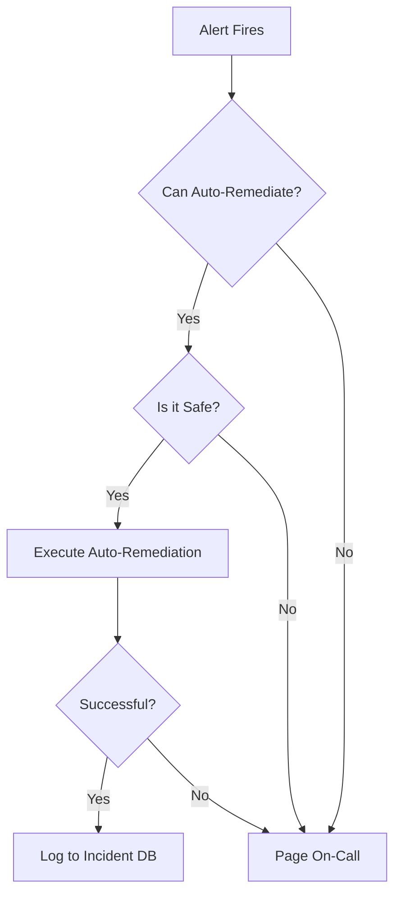
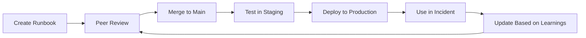

# Runbook Architecture & Standards Reference

**Doc Version:** 1.0.0
**Role:** Site Reliability Engineer (SRE)
**Scope:** Runbook Design, Documentation Standards, and Operational Excellence

---

## 1. The Runbook Hierarchy

### What is a Runbook?
A **runbook** is an operational manual that documents how to perform routine tasks, respond to incidents, and maintain systems.

**Types**:
1. **Diagnostic Runbooks**: "How to troubleshoot X"
2. **Remediation Runbooks**: "How to fix Y"
3. **Maintenance Runbooks**: "How to perform routine task Z"
4. **Incident Response Runbooks**: "What to do when alert fires"

---

## 2. The 10-Part SRE Runbook Standard

Based on Google SRE practices, every runbook should contain:

### 1. **Title & Metadata**
```markdown
# Runbook: Database Connection Pool Exhaustion

**Service**: PostgreSQL Primary
**Severity**: P1 (Critical)
**Owner**: Database Team
**Last Updated**: 2026-01-29
**Version**: 2.1.0
```

### 2. **Summary**
One-sentence description of the problem and solution.
```markdown
## Summary
This runbook addresses connection pool exhaustion in PostgreSQL, which manifests as "FATAL: remaining connection slots are reserved" errors.
```

### 3. **Symptoms**
Observable indicators that this runbook applies.
```markdown
## Symptoms
- Alert: `postgres_connections > 95%`
- Application logs: "could not connect to server"
- Dashboard: Connection pool graph spiking to max
```

### 4. **Diagnosis**
How to confirm the root cause.
```markdown
## Diagnosis
1. Check current connections:
   ```sql
   SELECT count(*) FROM pg_stat_activity;
   ```
2. Identify top connection consumers:
   ```sql
   SELECT usename, count(*) FROM pg_stat_activity GROUP BY usename ORDER BY count DESC;
   ```
```

### 5. **Immediate Mitigation**
Stop the bleeding (temporary fix).
```markdown
## Immediate Mitigation
1. Kill idle connections:
   ```sql
   SELECT pg_terminate_backend(pid) FROM pg_stat_activity WHERE state = 'idle' AND state_change < now() - interval '10 minutes';
   ```
2. Restart application servers to reset connection pools (if safe).
```

### 6. **Root Cause Analysis**
Why did this happen?
```markdown
## Root Cause
- Application not closing connections properly (connection leak)
- Connection pool size too small for traffic volume
- Long-running queries holding connections
```

### 7. **Permanent Fix**
Long-term solution.
```markdown
## Permanent Fix
1. Increase `max_connections` in `postgresql.conf` (requires restart)
2. Implement connection pooling middleware (PgBouncer)
3. Fix application code to use `try-finally` blocks for connection cleanup
```

### 8. **Prevention**
How to avoid recurrence.
```markdown
## Prevention
- Set up alerting on connection pool usage >80%
- Implement connection timeout policies
- Regular code reviews for connection handling
```

### 9. **Escalation Path**
Who to contact if this doesn't work.
```markdown
## Escalation
1. Database Team Lead: @alice (Slack)
2. On-Call SRE: PagerDuty rotation
3. VP Engineering: Only for P0 incidents
```

### 10. **Related Runbooks**
Links to related procedures.
```markdown
## Related Runbooks
- [Database Performance Tuning](../../../02-phase-2/01-infrastructure-automation/03-cloud-platforms/04-data-and-automation/02-storage-and-lifecycle-management/s3-performance-optimization.md)
- [PostgreSQL Restart Procedure](../../../../01-beginner/01-phase-1/03-windows-basics/part-1-powershell-automation/commands/network/restart-netadapter.md)
```

---

## 3. Docs-as-Code Philosophy

### Principles
1. **Version Control**: Store runbooks in Git, not wikis
2. **Code Review**: All changes go through pull requests
3. **Automation**: Generate runbooks from code/config where possible
4. **Testing**: Validate runbooks in staging before production

### Directory Structure
```
runbooks/
├── README.md                    # Index of all runbooks
├── database/
│   ├── postgres-connection-pool.md
│   ├── postgres-replication-lag.md
│   └── mysql-deadlock.md
├── networking/
│   ├── dns-resolution-failure.md
│   └── load-balancer-health-check.md
└── kubernetes/
    ├── pod-crashloop.md
    └── node-not-ready.md
```

---

## 4. Runbook Quality Metrics

### A. Completeness
- [ ] All 10 sections present
- [ ] Commands are copy-pasteable
- [ ] No broken links
- [ ] Includes expected output examples

### B. Accuracy
- [ ] Tested in last 90 days
- [ ] Reflects current infrastructure
- [ ] No outdated tool versions

### C. Usability
- [ ] Can be executed by junior engineer at 3 AM
- [ ] No assumptions about prior knowledge
- [ ] Includes rollback procedures

---

## 5. Auto-Remediation Decision Tree

Not all incidents require human intervention.



**Safe Auto-Remediation Examples**:
- Restart crashed service (if stateless)
- Clear disk space (delete old logs)
- Scale up auto-scaling group

**Unsafe (Requires Human)**:
- Database failover
- Rollback production deployment
- Modify firewall rules

---

## 6. Incident Severity Levels

| Level | Name | Impact | Response Time | Example |
|:---|:---|:---|:---|:---|
| **P0** | Critical | Total outage | Immediate | Website down |
| **P1** | High | Major degradation | 15 minutes | 50% error rate |
| **P2** | Medium | Minor degradation | 1 hour | Slow page loads |
| **P3** | Low | No user impact | Next business day | Log warnings |

---

## 7. Visualizing Runbook Lifecycle



> **Enterprise Pattern**: Implement **Runbook Rotation**. Every quarter, assign each runbook to a different engineer to execute in a staging environment. This validates accuracy and cross-trains the team.
