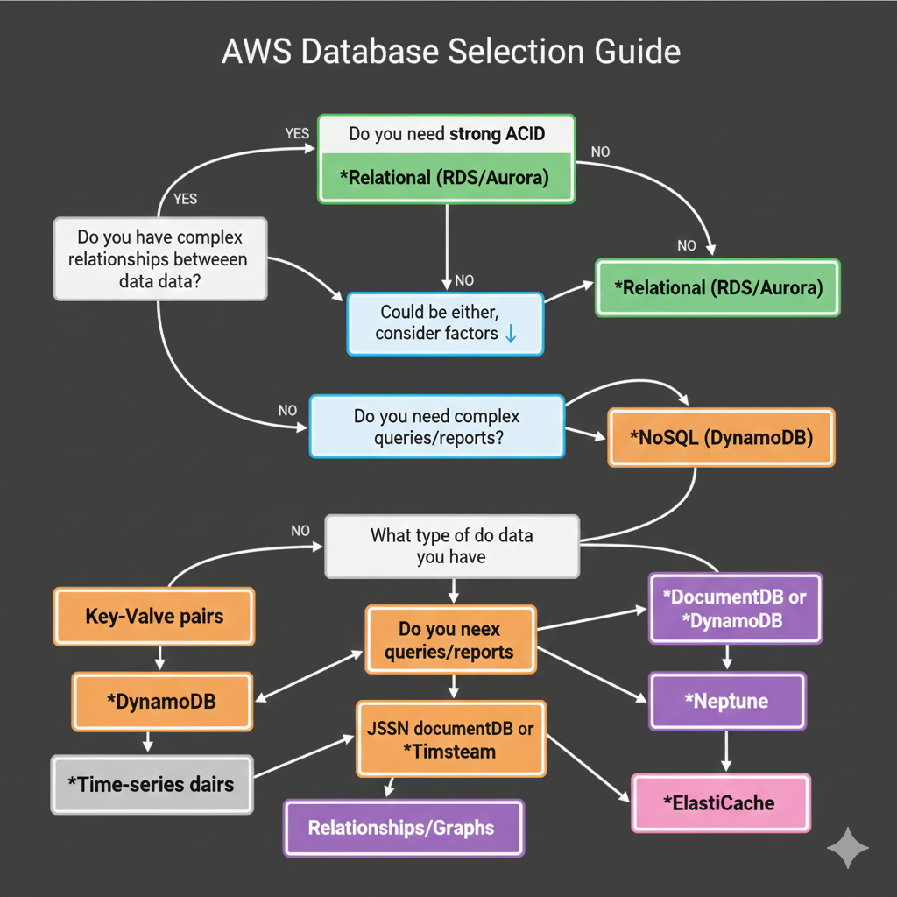

## Decision Framework

This guide provides a practical decision-making framework to help you choose the appropriate database for your specific use case.

## Start Here: Decision Tree


## Quick Reference Matrix

| Feature              | **RDS / Aurora**                    | **DynamoDB**                                | **ElastiCache**                            | **Neptune**                             | **Redshift**                             |
| :------------------- | :---------------------------------- | :------------------------------------------ | :----------------------------------------- | :-------------------------------------- | :--------------------------------------- |
| **Type**             | Relational (SQL)                    | NoSQL (Key-Value)                           | In-Memory                                  | Graph                                   | Data Warehouse                           |
| **Primary Use Case** | ERP, CRM, E-commerce, Financials    | Mobile backends, Gaming, IoT, Session store | Caching, Leaderboards, Real-time analytics | Social networks, Recommendation engines | BI, Reporting, Analytics                 |
| **Data Model**       | Tables, Rows, Foreign Keys          | Items, Attributes (Schema-less)             | Key-Value, Redis structures                | Nodes, Edges, Properties                | Columnar Storage                         |
| **Scaling**          | Vertical (Scale Up) / Read Replicas | Horizontal (Partitioning)                   | Horizontal (Sharding)                      | Read Replicas                           | Horizontal (Massive Parallel Processing) |
| **Performance**      | High (ms)                           | Extremely High (single-digit ms)            | Ultra High (micro-sec)                     | High for relationships                  | High for aggregations                    |
| **Consistency**      | Strong (ACID)                       | Eventual (Strong optional)                  | Eventual / Strong                          | Eventual / Strong                       | Eventual                                 |
| **Cost Model**       | Instance-based                      | Provisioned or Pay-per-request              | Instance-based                             | Instance-based                          | Instance-based                           |
|                      |                                     |                                             |                                            |                                         |                                          |

## Detailed Use Case Analysis

### 1. E-Commerce Application
**Scenario**: Building an online store with products, customers, orders, and inventory.

#### Components Breakdown:

**Use Relational (Aurora/RDS) for**:
- ✅ Order transactions (ACID required)
- ✅ Payment processing
- ✅ Inventory management (stock levels)
- ✅ Customer accounts
- ✅ Financial reporting

```sql
-- Strong consistency needed for inventory
BEGIN TRANSACTION;
  UPDATE inventory SET quantity = quantity - 1 WHERE product_id = 123;
  INSERT INTO orders (customer_id, product_id, quantity) VALUES (456, 123, 1);
COMMIT;
```

**Use NoSQL (DynamoDB) for**:
- ✅ Product catalog (products have different attributes)
- ✅ Shopping carts (temporary, high throughput)
- ✅ User reviews and ratings
- ✅ Browsing history
- ✅ Product recommendations

```json
{
  "productId": "laptop_001",
  "name": "Gaming Laptop",
  "category": "Electronics",
  "specs": {
    "cpu": "Intel i9",
    "ram": "32GB",
    "gpu": "RTX 4090"
  },
  "reviews": [...]
}
```

### 2. Social Media Platform
**Scenario**: Build a social networking site with profiles, posts, friendships, and messaging.
#### Recommended Architecture:
**Relational (RDS) - 20%**:
- User authentication and credentials
- Billing and subscriptions
- Admin dashboards

**NoSQL (DynamoDB) - 60%**:
- User profiles
- Posts and comments
- Activity feeds
- Notifications
- Direct messages

**Graph (Neptune) - 20%**:
- Friend connections
- Followers/following relationships
- Content recommendations
- Influence analysis

```
Why this split?
- Relational: Critical auth/billing needs ACID
- NoSQL: High-volume, flexible schema for user content
- Graph: Relationship queries (mutual friends, suggestions)
```

### 3. Banking Application

**Scenario**: Core banking system with accounts, transactions, and reporting.

**Recommendation**: **Relational Only (Aurora PostgreSQL)**

**Why**:
- ✅ ACID transactions are absolutely critical
- ✅ Money transfers must be atomic
- ✅ Audit trails required
- ✅ Complex financial reporting
- ✅ Regulatory compliance

```sql
-- Atomic money transfer
BEGIN TRANSACTION;
  UPDATE accounts SET balance = balance - 500 WHERE id = 'ACC001';
  UPDATE accounts SET balance = balance + 500 WHERE id = 'ACC002';
  INSERT INTO audit_log VALUES (NOW(), 'TRANSFER', 500, 'ACC001', 'ACC002');
COMMIT;
```

**Optional NoSQL Components**:
- ElastiCache for session management
- DynamoDB for mobile app push notifications
- But core banking = Relational

### 4. IoT Sensor Network

**Scenario**: Collecting data from thousands of sensors sending readings every second.

**Recommendation**: **NoSQL (DynamoDB or Timestream)**

**Why**:
- ✅ Millions of writes per second
- ✅ Time-series data
- ✅ Horizontal scaling required
- ✅ No complex relationships
- ✅ Flexible schema (different sensor types)

```json
{
  "sensorId": "temp_sensor_1001",
  "timestamp": "2024-01-15T10:30:45Z",
  "readings": {
    "temperature": 22.5,
    "humidity": 65,
    "pressure": 1013.25
  },
  "location": {"lat": 40.7128, "lon": -74.0060}
}
```

### 5. Content Management System

**Scenario**: Blog platform with articles, authors, comments, and media.

**Recommendation**: **Hybrid - DocumentDB (primary) + RDS (optional)**

**DocumentDB/DynamoDB for**:
- ✅ Article content (rich media, varying structure)
- ✅ User comments
- ✅ Tags and categories
- ✅ Media metadata

```json
{
  "articleId": "post_12345",
  "title": "Getting Started with AWS",
  "author": {"name": "Alice", "id": "author_456"},
  "content": "...",
  "tags": ["aws", "cloud", "tutorial"],
  "publishedAt": "2024-01-15",
  "media": [
    {"type": "image", "url": "...", "caption": "..."},
    {"type": "video", "url": "...", "duration": 120}
  ],
  "comments": [...]
}
```

**RDS for** (optional):
- User authentication
- Author management
- Analytics

## Key Decision Factors

### 1. Data Structure

**Highly Structured** → *Relational*
```
Example: Employee database
- Every employee has: ID, name, department, salary, hire_date
- Clear relationships: employee → department → manager
```

**Variable Structure** → *NoSQL*
```
Example: Product catalog
- Electronics: brand, model, specs, warranty
- Clothing: size, color, material, care_instructions
- Books: author, pages, publisher, ISBN
```

### 2. Consistency Requirements

**Strong Consistency Needed** → *Relational*
- Financial transactions
- Inventory management
- Booking systems (no double-booking)

**Eventual Consistency OK** → *NoSQL*
- Social media likes
- View counts
- Product recommendations

### 3. Query Patterns

**Complex Queries with JOINs** → *Relational*
```sql
-- Complex report across multiple tables
SELECT 
  d.name AS department,
  COUNT(e.id) AS employee_count,
  AVG(e.salary) AS avg_salary
FROM departments d
LEFT JOIN employees e ON d.id = e.department_id
WHERE e.hire_date > '2023-01-01'
GROUP BY d.name
HAVING COUNT(e.id) > 10
ORDER BY avg_salary DESC;
```

**Simple Key-Based Lookups** → *NoSQL*
```python
# Fast single-item retrieval
get_item(
  TableName='Users',
  Key={'userId': 'user_12345'}
)
```

### 4. Scale Requirements

**Moderate Scale** (< 10K requests/second) → *Either*

**High Scale** (> 100K requests/second) → *NoSQL*
- DynamoDB can handle millions of requests/second
- Automatic horizontal scaling

**Predictable Growth** → *Relational*

**Unpredictable Spikes** → *NoSQL*

### 5. Development Speed

**Need Rapid Prototyping** → *NoSQL*
- No schema migrations
- Flexible data model
- Quick iterations

**Stable Requirements** → *Relational*
- Well-defined schema
- Enforced constraints
- Gradual changes

## Common Anti-Patterns to Avoid

### ❌ Using NoSQL for Everything
**Don't**: Use DynamoDB for a simple CRUD app with clear relationships

**Problem**: Lose referential integrity, complex queries become application logic

**Better**: Use RDS for straightforward relational data

### ❌ Using Relational for High-Scale Key-Value
**Don't**: Use RDS to store millions of session records

**Problem**: Poor performance, scaling challenges, high cost

**Better**: Use ElastiCache or DynamoDB

### ❌ Ignoring Hybrid Approaches
**Don't**: Force one database type for all use cases

**Problem**: Suboptimal performance or costly workarounds

**Better**: Use the right tool for each job

### ❌ Premature Optimization
**Don't**: Choose NoSQL "because it scales" for a startup MVP

**Problem**: Added complexity without proven need

**Better**: Start with what you know (often RDS), scale when needed

## Decision Checklist

Answer these questions to guide your choice:

- [ ] **Do I need ACID transactions?** → YES = Relational
- [ ] **Is my schema fixed and stable?** → YES = Relational
- [ ] **Do I need complex JOINs and aggregations?** → YES = Relational
- [ ] **Will I have millions of requests/second?** → YES = NoSQL
- [ ] **Is my data structure flexible/varying?** → YES = NoSQL
- [ ] **Do I need to iterate quickly on schema?** → YES = NoSQL
- [ ] **Is my data primarily key-value lookups?** → YES = NoSQL
- [ ] **Do I need graph relationships?** → YES = Neptune
- [ ] **Is this primarily for caching?** → YES = ElastiCache

## Cost Considerations

### RDS/Aurora
**Pros**: Predictable pricing, reserved instances  
**Cons**: Pay for provisioned capacity even if unused

**Best for**: Steady, predictable workloads

### DynamoDB
**Pros**: Pay-per-request, true serverless, auto-scaling  
**Cons**: Can be expensive at very high volumes

**Best for**: Variable workloads, serverless applications

## Migration Path

### Starting Point

**New Project**:
<b>1. Start simple</b>
<details>
<summary>Show Answer</summary>
Answer: usually RDS
</details>

2. Add NoSQL as specific needs arise
3. Don't over-engineer

**Existing Application**:
1. Identify bottlenecks
2. Extract high-throughput components
3. Gradually migrate to NoSQL
4. Keep core transactional data in RDS

## Summary: Quick Guidelines
## Summary: Quick Guidelines

1.  **Default to RDS/Aurora** if your data fits in a spreadsheet (rows/columns) and you need transactions.
2.  **Choose DynamoDB** if you need unlimited scale, flexible schema, or simple key-value patterns.
3.  **Add ElastiCache** if you need sub-millisecond speed for frequently accessed data.
4.  **Use Redshift** only for analytics (OLAP), not for the live application (OLTP).
5.  **Use Neptune** only if relationships are more important than the data itself (graphs).

## Next Steps

Ready to implement? Choose your path:

- **Relational Path**: [RDS Introduction](../02-rds-basics/rds-introduction.md)
- **NoSQL Path**: [DynamoDB Introduction](../03-dynamodb-basics/dynamodb-introduction.md)
- **Need Both**: Start with RDS, add DynamoDB as needed

---

**Challenge**: Design the database architecture for these applications:

<b>1. Food delivery app</b>
<details>
<summary>Show Answer</summary>
Answer: restaurants, orders, delivery tracking
</details>

<b>2. Video streaming platform</b>
<details>
<summary>Show Answer</summary>
Answer: users, videos, watch history, recommendations
</details>

<b>3. Project management tool</b>
<details>
<summary>Show Answer</summary>
Answer: teams, tasks, timelines, comments
</details>


---

## Part 2: Advanced Real-World Scenarios

### Scenario 1: The "Viral" Mobile Game
**Situation:** A mobile game stores player scores and profiles in MySQL. It goes viral, reaching 1 million daily active users. The single database server hits 100% CPU due to millions of small updates (score changes, inventory pickups).
**Decision:** **Switch to NoSQL (DynamoDB/Redis)**
**Reasoning:**
- **Access Pattern:** High volume of small, fast writes. Key-based lookup (get player profile).
- **Scale:** Unpredictable viral growth demands horizontal scaling.
- **Consistency:** Eventual consistency is fine for leaderboards (if a score shows up 1 second late, nobody dies).

### Scenario 2: The Healthcare Patient Portal
**Situation:** A hospital needs a system to store patient medical history, billing, and insurance claims.
**Decision:** **Stick with Relational (Aurora PostgreSQL)**
**Reasoning:**
- **Data Integrity:** Life-critical data. ACID transactions are non-negotiable.
- **Complexity:** Complex relationships between Patients, Doctors, Appointments, Prescriptions, and Billing.
- **Compliance:** Regulatory requirements (HIPAA) often favor established relational audit trails.

### Scenario 3: The "Feed" Architecture
**Situation:** A news aggregation app needs to show a custom feed to each user based on who they follow and their interests.
**Decision:** **Hybrid (Graph + Key-Value)**
**Reasoning:**
- **Graph (Neptune):** Determine *what* to show (Who do I follow? What do they like?). Graph traversals are efficient here.
- **Key-Value (DynamoDB):** Store the actual content of the posts (or the pre-computed feed) for fast retrieval.

---

## Part 3: Interview Questions

### Basic Level
1.  **When would you choose a NoSQL database over a Relational one?**
    -   When I need massive horizontal scale, flexible schemas (rapid iteration), or have specific data models like graphs or documents that map poorly to tables.
2.  **What is the "N+1 Problem" in relational databases?**
    -   It happens when data is fetched in a loop. For example, fetching 100 users (1 query) and then running a separate query for each user's address (100 queries). This kills performance. NoSQL avoids this by embedding data (storing address *with* the user).
3.  **What is a "Read Replica"?**
    -   A copy of the primary database that can handle read-only traffic. It offloads work from the main database but might be slightly out of sync (eventual consistency).

### Intermediate Level
4.  **Explain "Polyglot Persistence".**
    -   Using different databases for different parts of an application typically based on the specific needs of each component (e.g., Redis for caching, PostgreSQL for payments, Mongo for catalog).
<b>5. </b>
<details>
<summary>Show Answer</summary>
Answer: C) Complex relationships & JOINs</b>
</details>


<details>
<b>2. If your application requires handling millions of requests per second with single-digit millisecond latency, choose:</b>
<details>
<summary>Show Answer</summary>
Answer: B) DynamoDB (NoSQL)</b>
</details>


<details>
<b>3. E-Commerce Order Processing (Payments) typically requires:</b>
<details>
<summary>Show Answer</summary>
Answer: B) Strong ACID Transactions</b>
</details>


<details>
<b>4. Which is a valid reason to choose NoSQL?</b>
<details>
<summary>Show Answer</summary>
Answer: B) Your data schema changes constantly</b>
</details>


<details>
<b>5. For a recommendation engine (e.g., "People who bought this also bought..."), the best specialized DB is:</b>
<details>
<summary>Show Answer</summary>
Answer: C) Graph (Neptune)</b>
</details>


<details>
<b>6. What is the primary use case for Amazon ElastiCache?</b>
<details>
<summary>Show Answer</summary>
Answer: B) In-memory caching to speed up read-heavy workloads</b>
</details>


<details>
<b>7. "Data Warehousing" (like Redshift) is optimized for:</b>
<details>
<summary>Show Answer</summary>
Answer: B) Analytical processing (OLAP) & massive aggregations</b>
</details>


<details>
<b>8. Which is an example of "structured" data?</b>
<details>
<summary>Show Answer</summary>
Answer: C) An employee record with fixed fields</b>
</details>


<details>
<b>9. If you need to search through petabytes of text logs, use:</b>
<details>
<summary>Show Answer</summary>
Answer: B) OpenSearch / Elasticsearch</b>
</details>


<details>
<b>10. A major cost factor for DynamoDB is:</b>
<details>
<summary>Show Answer</summary>
Answer: B) Read/Write Capacity Units (Throughput)</b>
</details>


<details>
<b>11. Relational Databases scale best:</b>
<details>
<summary>Show Answer</summary>
Answer: A) Vertically (Scale Up)</b>
</details>


<details>
<b>12. You need to store "Session State" for a web app. Best choice?</b>
<details>
<summary>Show Answer</summary>
Answer: B) Key-Value Store (Redis/DynamoDB)</b>
</details>


<details>
<b>13. Which scenario might force a migration from NoSQL back to SQL?</b>
<details>
<summary>Show Answer</summary>
Answer: B) Need for strict regulatory compliance, audit trails, and complex reporting</b>
</details>


<details>
<b>14. "Time Series" data (like sensor readings) is best stored in:</b>
<details>
<summary>Show Answer</summary>
Answer: A) A specialized Time Series DB (Timestream) or Column store</b>
</details>


<details>
<b>15. Why avoid "Premature Optimization"?</b>
<details>
<summary>Show Answer</summary>
Answer: B) You shouldn't pick a complex NoSQL system if a simple SQL setup works fine initially</b>
</details>


<details>
<b>16. Which ensures "Referential Integrity"?</b>
<details>
<summary>Show Answer</summary>
Answer: A) Foreign Keys (Relational)</b>
</details>


<details>
<b>17. ACID stands for:</b>
<details>
<summary>Show Answer</summary>
Answer: A) Atomicity, Consistency, Isolation, Durability</b>
</details>


<details>
<b>18. In the CAP theorem, which property do distributed NoSQL databases typically sacrifice?</b>
<details>
<summary>Show Answer</summary>
Answer: C) Strong Consistency (often)</b>
</details>


<details>
<b>19. Hybrid architectures involve:</b>
<details>
<summary>Show Answer</summary>
Answer: B) Using multiple specialized databases (Polyglot Persistence)</b>
</details>


<details>
<b>20. Which cost model allows "Pay per Request"?</b>
<details>
<summary>Show Answer</summary>
Answer: B) DynamoDB On-Demand</b>
</details>


<details>
<b>21. "Schema Migration" is a pain point primarily for:</b>
<details>
<summary>Show Answer</summary>
Answer: B) Relational Databases</b>
</details>


