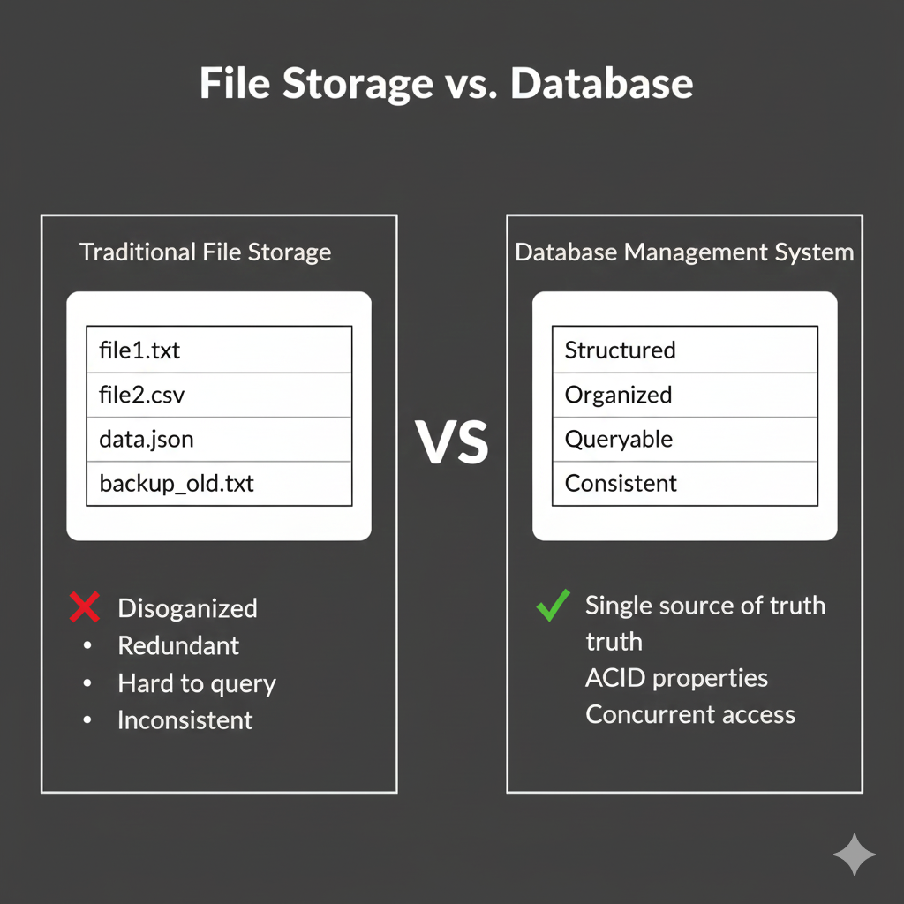
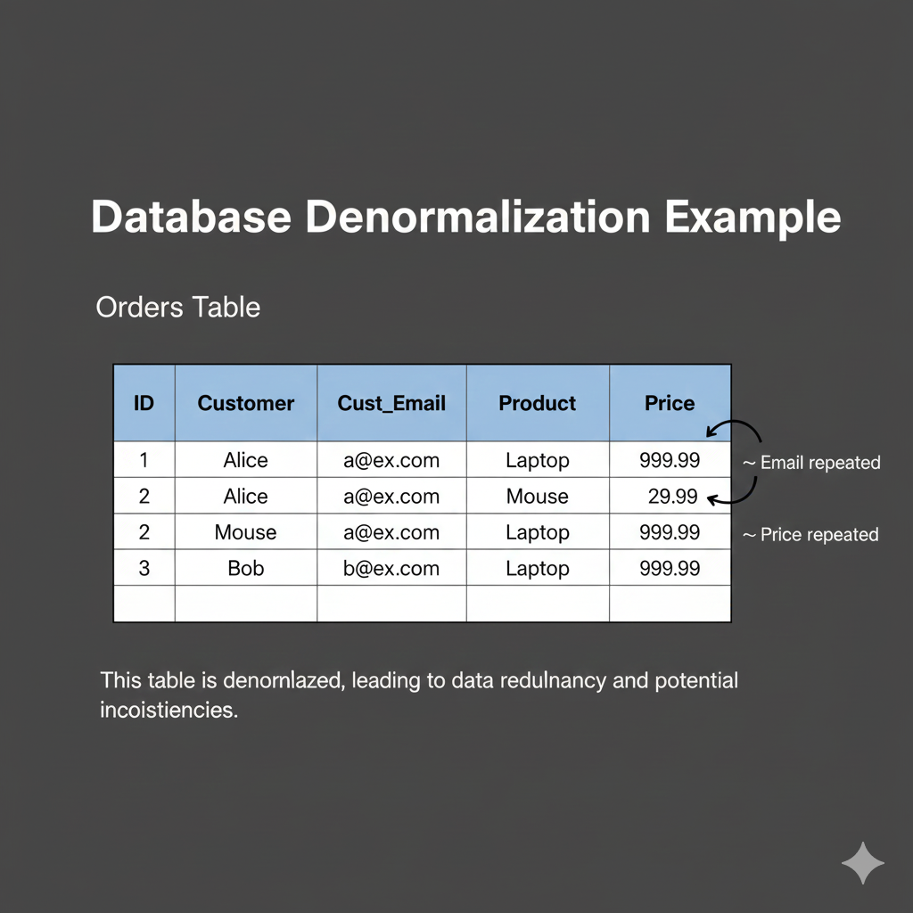
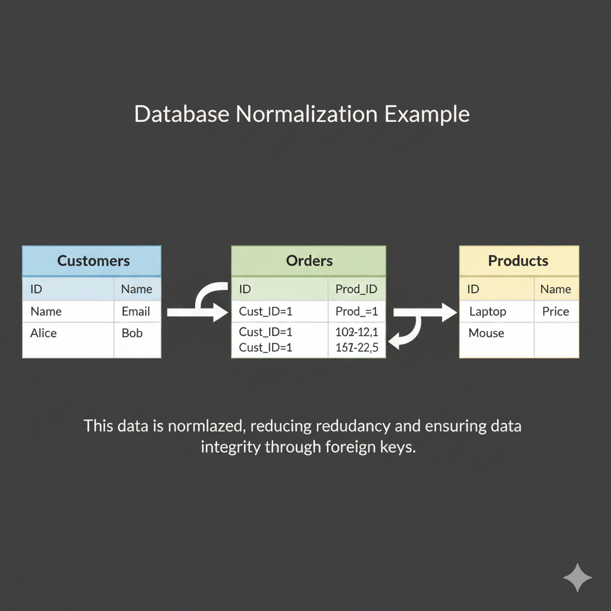

## What is a Database?
A database is an organized collection of structured data that is stored electronically and accessed through a computer system. Databases are managed by Database Management Systems (DBMS) which provide an interface for storing, retrieving, and manipulating data efficiently.

### Why Use Databases?


**Key Benefits:**
- **Data Integrity**: Ensures data accuracy and consistency
- **Data Security**: Controlled access and encryption
- **Concurrent Access**: Multiple users can access simultaneously
- **Backup and Recovery**: Automated data protection
- **Scalability**: Handle growing data volumes
- **Query Capability**: Efficiently search and retrieve data

## Database Types Overview

### 1. Relational Databases (SQL)
Organized in tables with rows and columns, using Structured Query Language (SQL).
```table
Users Table                    Orders Table
┌────┬──────────┬───────────┐  ┌────┬─────────┬────────┬────────┐
│ ID │ Name     │ Email     │  │ ID │ User_ID │ Amount │ Date   │
├────┼──────────┼───────────┤  ├────┼─────────┼────────┼────────┤
│ 1  │ Alice    │ a@ex.com  │  │ 1  │ 1       │ 99.99  │ 2024-01│
│ 2  │ Bob      │ b@ex.com  │  │ 2  │ 1       │ 149.99 │ 2024-02│
│ 3  │ Charlie  │ c@ex.com  │  │ 3  │ 2       │ 79.99  │ 2024-02│
└────┴──────────┴───────────┘  └────┴─────────┴────────┴────────┘
         ↑                               ↑
         └───────────────────────────────┘
              Foreign Key Relationship
```

**Examples**: MySQL, PostgreSQL, Oracle, SQL Server, MariaDB

**Best For**:
- Financial transactions
- Customer relationship management (CRM)
- Enterprise resource planning (ERP)
- Applications requiring complex queries and joins
### 2. NoSQL Databases
Flexible, non-tabular databases designed for large-scale data storage.
#### Key-Value Stores
```json
{
  "user:1001": {
    "name": "Alice",
    "email": "alice@example.com",
    "preferences": {"theme": "dark", "language": "en"}
  },
  "session:abcd1234": {
    "userId": 1001,
    "expires": "2024-12-31T23:59:59Z"
  }
}
```
**Examples**: DynamoDB, Redis  
**Best For**: Caching, session management, user preferences

#### Document Stores
```json
{
  "_id": "product123",
  "name": "Laptop",
  "price": 999.99,
  "specs": {
    "cpu": "Intel i7",
    "ram": "16GB",
    "storage": ["512GB SSD", "1TB HDD"]
  },
  "reviews": [
    {"user": "alice", "rating": 5, "comment": "Great!"},
    {"user": "bob", "rating": 4, "comment": "Good value"}
  ]
}
```
**Examples**: MongoDB, DocumentDB  
**Best For**: Content management, catalogs, user profiles
#### Column-Family Stores
```
Row Key    │ Column Family: Profile          │ Column Family: Activity
───────────┼─────────────────────────────────┼───────────────────────
user:1001  │ name:Alice, email:a@ex.com      │ lastLogin:2024-01-15
user:1002  │ name:Bob, email:b@ex.com        │ lastLogin:2024-01-14
```
**Examples**: Cassandra, HBase  
**Best For**: Time-series data, IoT applications
#### Graph Databases
```
    (Alice)───[FRIENDS_WITH]───(Bob)
       │                          │
   [LIKES]                    [BOUGHT]
       │                          │
       ↓                          ↓
   (Product A)←────[SOLD]────(Store X)
```
**Examples**: Neptune, Neo4j  
**Best For**: Social networks, recommendation engines, fraud detection

## ACID Properties
ACID is the standard set of strict guarantees that ensure database transactions are reliable, even in the event of errors, power failures, or other mishaps.

### 1. **A**tomicity ("All or Nothing")
Ensures that a transaction is treated as a single, indivisible unit of work. Either all operations in the transaction succeed, or none of them do.

**Scenario**: Bank Transfer ($100 from Alice to Bob)
1. Debit Alice $100
2. Credit Bob $100

**Failure**: If the system crashes after step 1 but before step 2:
- **Without Atomicity**: Alice loses money, Bob gets nothing. Money vanishes.
- **With Atomicity**: The system sees step 2 failed, so it **rolls back** step 1. Alice's balance is restored.

```sql
BEGIN TRANSACTION;
  UPDATE accounts SET balance = balance - 100 WHERE id = 1;
  -- System crash here? Database automatically undoes the line above.
  UPDATE accounts SET balance = balance + 100 WHERE id = 2;
COMMIT;
```

### 2. **C**onsistency ("Valid State")
Ensures that a transaction brings the database from one valid state to another, maintaining all predefined rules (constraints, cascades, triggers, data types).

**Key Rules**:
- **Data Integrity**: Columns must store the correct data type (e.g., no text in an integer column).
- **Referential Integrity**: Foreign keys must point to existing rows.
- **Business Logic**: balances cannot be negative (if defined by a constraint).

**Example**:
If a valid transaction attempts to Delete a Customer who still has active Orders (and a Foreign Key constraint prevents this), the database **rejects** the transaction to maintain Consistency.

### 3. **I**solation ("Independence")
Ensures that concurrent transactions (occurring at the same time) execute independently and leave the database in the same state as if they were executed sequentially.

**Concurrency Problems Solved**:
- **Dirty Reads**: Reading uncommitted data from another transaction.
- **Non-repeatable Reads**: Reading the same row twice and getting different data.
- **Phantom Reads**: New rows appearing in a query set during a transaction.

**Isolation Levels (Trade-off between Performance vs Strictness)**:
<b>1. Read Uncommitted</b>
<details>
<summary>Show Answer</summary>
Answer: Fastest, Dangerous
</details>

<b>2. Read Committed</b>
<details>
<summary>Show Answer</summary>
Answer: Default in many DBs
</details>

3. **Repeatable Read**
<b>4. Serializable</b>
<details>
<summary>Show Answer</summary>
Answer: Slowest, safest
</details>


### 4. **D**urability ("Permanence")
Guarantees that once a transaction has been committed, it will remain committed even in the case of a catastrophic system failure (e.g., power outage, crash, or disk failure).

**How it works**:
- Databases use a **Write-Ahead Log (WAL)** or Transaction Log.
- Changes are written to the log on disk *before* they are considered complete.
- If the system restarts, it replays the log to ensure data is restored.

## CAP Theorem
In distributed databases, you can only guarantee 2 out of 3:
```
        Consistency
            / \
           /   \
          /     \
         /       \
        /         \
Availability -- Partition Tolerance

Choose 2:
CP: Consistent + Partition tolerant (sacrifice availability)
AP: Available + Partition tolerant (sacrifice consistency)
CA: Consistent + Available (not viable in distributed systems)
```
### Trade-offs:
- **CP Systems**: Banking (must be consistent, can sacrifice availability)
- **AP Systems**: Social media feeds (prefer availability, eventual consistency OK)
- **AWS Examples**:
  - **RDS**: CP (strong consistency, may not be available during failures)
  - **DynamoDB**: AP by default (eventually consistent, highly available)

## Database Components

### Schema
The blueprint defining database structure:
```sql
CREATE TABLE users (
  id INT PRIMARY KEY,
  username VARCHAR(50) NOT NULL,
  email VARCHAR(100) UNIQUE,
  created_at TIMESTAMP DEFAULT CURRENT_TIMESTAMP,
  CONSTRAINT chk_email CHECK (email LIKE '%@%')
);
```

### Tables
Organized collections of related data:
- **Columns**: Attributes/fields
- **Rows**: Individual records
- **Primary Key**: Unique identifier for each row
- **Foreign Key**: References another table's primary key
### Indexes
Speed up data retrieval:
```sql
-- Without index: Scans entire table
SELECT * FROM users WHERE email = 'alice@example.com';

-- With index: Direct lookup
CREATE INDEX idx_email ON users(email);
SELECT * FROM users WHERE email = 'alice@example.com'; -- Much faster!
```

**Trade-off**: Faster reads, slower writes (index must be updated)

### Transactions
Groups of operations that execute as a single unit:
```sql
START TRANSACTION;
  INSERT INTO orders (user_id, total) VALUES (1, 99.99);
  UPDATE inventory SET quantity = quantity - 1 WHERE product_id = 100;
  INSERT INTO audit_log (action, timestamp) VALUES ('order_placed', NOW());
COMMIT; -- All or nothing
```

## Common Database Operations (CRUD)

### Create
```sql
INSERT INTO products (name, price, category)
VALUES ('Laptop', 999.99, 'Electronics');
```

### Read
```sql
-- Select all
SELECT * FROM products;

-- Select specific
SELECT name, price FROM products WHERE category = 'Electronics';

-- With joins
SELECT orders.id, users.name, orders.total
FROM orders
JOIN users ON orders.user_id = users.id;
```

### Update
```sql
UPDATE products
SET price = 899.99
WHERE name = 'Laptop';
```

### Delete
```sql
DELETE FROM products
WHERE id = 5;
```

## Database Design Best Practices

### 1. Normalization
Organize data to reduce redundancy:

**Before (Denormalized)**:


**After (Normalized)**:


### 2. Use Appropriate Data Types
```sql
-- Good
CREATE TABLE users (
  id INT,                    -- Integer for IDs
  email VARCHAR(255),        -- Variable length for emails
  age TINYINT,              -- Small integer for age
  created_at TIMESTAMP      -- Timestamp for dates
);

-- Bad
CREATE TABLE users (
  id VARCHAR(100),          -- ❌ Wastes space, slower
  email TEXT,               -- ❌ Overkill for emails
  age VARCHAR(10),          -- ❌ Should be numeric
  created_at VARCHAR(50)    -- ❌ Can't do date operations
);
```

### 3. Define Constraints
```sql
CREATE TABLE products (
  id INT PRIMARY KEY AUTO_INCREMENT,
  name VARCHAR(100) NOT NULL,           -- Required field
  price DECIMAL(10,2) CHECK (price > 0), -- Must be positive
  stock INT DEFAULT 0,                   -- Default value
  category_id INT,
  FOREIGN KEY (category_id) REFERENCES categories(id)
);
```

## When to Use Databases vs Files

### Use Databases When:
- ✅ Need complex queries and relationships
- ✅ Multiple users need concurrent access
- ✅ Data integrity is critical
- ✅ Need transactional guarantees
- ✅ Data size is large and growing

### Use Files When:
- ✅ Simple, sequential data access
- ✅ Storing binary data (images, videos)
- ✅ Configuration files
- ✅ Temporary data or caching
- ✅ Single-user applications

## AWS Database Services Overview

| Service         | Type              | Best For                                  |
| --------------- | ----------------- | ----------------------------------------- |
| **RDS**         | Relational        | Traditional applications, complex queries |
| **Aurora**      | Relational        | High-performance MySQL/PostgreSQL         |
| **DynamoDB**    | NoSQL (Key-Value) | Serverless, high-scale applications       |
| **DocumentDB**  | NoSQL (Document)  | MongoDB workloads                         |
| **ElastiCache** | In-Memory         | Caching, session store                    |
| **Redshift**    | Data Warehouse    | Analytics, BI                             |
| **Neptune**     | Graph             | Recommendation engines                    |
|                 |                   |                                           |

## Next Steps
Now that you understand database fundamentals, continue your learning:

1. **[Relational vs NoSQL](./relational-vs-nosql.md)** - Deep dive into choosing the right database type
2. **[Choosing Database Type](choosing%20the%20right%20database%20type.md)** - Decision framework for your use case
3. **[RDS Introduction](../02-rds-basics/rds-introduction.md)** - Start with AWS managed relational databases

## Key Takeaways

- 📊 Databases provide structured, reliable data storage
- 🔒 ACID properties ensure transaction reliability
- 🏗️ Choose relational for structured data with relationships
- 🚀 Choose NoSQL for flexible, scalable applications
- 🛠️ AWS offers managed services for all database types
- ⚖️ CAP theorem: understand trade-offs in distributed systems

---

**Practice Challenge**: Think about an application you use daily. What type of database would it use and why? Consider the data structure, access patterns, and consistency requirements.

---

## Part 2: Real-World Scenarios

### Scenario 1: The Integrity Crisis
**Situation:** A startup's e-commerce platform initially used a NoSQL database for everything to move fast. As they grew, customers began complaining that their account balances didn't match their order history.
**Analysis:** The NoSQL database was eventually consistent and lacked multi-document transactions (ACID). When a user placed an order, money was deducted, but if the order creation failed, the money wasn't automatically refunded in a single atomic unit.
**Solution:** They migrated the "Financial Ledger" and "Order Processing" components to a Relational Database (PostgreSQL) to leverage **ACID properties**, specifically Atomicity (all-or-nothing transactions) and Consistency (valid data states).

### Scenario 2: The Viral Slowdown
**Situation:** A news website stores article comments in a large SQL table. When a celebrity news story went viral, the entire site slowed down because millions of users were reading and writing comments simultaneously.
**Analysis:** SQL databases scale vertically (bigger server). The massive volume of writes and reads for unstructured comment data overwhelmed the single primary database instance.
**Solution:** They moved the Comments section to a **NoSQL Key-Value store (DynamoDB)**. This allowed them to scale horizontally, handling millions of requests per second by distributing data across many servers, as strict relational integrity wasn't needed for comments.

### Scenario 3: The Connected Data
**Situation:** A social networking app needs to suggest "Friends of Friends" to users. Doing this in their SQL database requires joining the "Users" table to itself five times, which takes 10 seconds to load.
**Analysis:** Relational databases struggle with deep relationship traversals (many-to-many joins).
**Solution:** They implemented a **Graph Database (Amazon Neptune)**. Traversing relationships in a graph is efficient (microseconds) because connections are stored as direct pointers, making "friend recommendation" queries instant.

---

## Part 3: Interview Questions

### Basic Level
1.  **Explain the difference between a Primary Key and a Foreign Key.**
    -   A **Primary Key** uniquely identifies a row in a table (e.g., `UserID`). A **Foreign Key** is a field that links to the Primary Key of another table (e.g., `Order.UserID` links to `User.UserID`), establishing a relationship.
2.  **What does "ACID" stand for?**
    -   Atomicity, Consistency, Isolation, Durability. It's a set of properties that guarantee valid database transactions.
3.  **What is an Index and why is it useful?**
    -   An index is a data structure (like a book's index) that improves the speed of data retrieval operations on a table at the cost of additional writes and storage space.

### Intermediate Level
4.  **Describe the CAP Theorem. Which two does a traditional SQL database usually choose?**
    -   CAP stands for Consistency, Availability, and Partition Tolerance. In a distributed system, you can only pick two. Traditional SQL databases (like MySQL) generally choose **CA** (Consistency and Availability) in a single node, or **CP** (Consistency and Partition Tolerance) in a cluster, sacrificing availability during a network partition to ensure data is correct.
<b>5. </b>
<details>
<summary>Show Answer</summary>
Answer: A) Atomicity</b>
</details>


<details>
<b>2. In a Relational Database, what represents a single record of data?</b>
<details>
<summary>Show Answer</summary>
Answer: C) Row</b>
</details>


<details>
<b>3. Which type of database is best suited for social networks with complex relationships?</b>
<details>
<summary>Show Answer</summary>
Answer: C) Graph</b>
</details>


<details>
<b>4. What allows a database to recover committed transactions after a power failure?</b>
<details>
<summary>Show Answer</summary>
Answer: C) Durability</b>
</details>


<details>
<b>5. "Eventual Consistency" is a common characteristic of which type of database?</b>
<details>
<summary>Show Answer</summary>
Answer: B) Many NoSQL systems (AP systems)</b>
</details>


<details>
<b>6. What SQL command is used to modify existing data?</b>
<details>
<summary>Show Answer</summary>
Answer: C) UPDATE</b>
</details>


<details>
<b>7. Which normalization goal focuses on eliminating redundant data?</b>
<details>
<summary>Show Answer</summary>
Answer: A) Data Redundancy</b>
</details>


<details>
<b>8. A "Foreign Key" constraint enforces:</b>
<details>
<summary>Show Answer</summary>
Answer: B) Referential Integrity</b>
</details>


<details>
<b>9. Which isolation level prevents "Dirty Reads"?</b>
<details>
<summary>Show Answer</summary>
Answer: B) Read Committed (and higher)</b>
</details>


<details>
<b>10. In CAP Theorem, if you choose Availability and Partition Tolerance (AP), what do you sacrifice?</b>
<details>
<summary>Show Answer</summary>
Answer: B) Consistency (Strong)</b>
</details>


<details>
<b>11. DynamoDB is an example of which NoSQL type?</b>
<details>
<summary>Show Answer</summary>
Answer: B) Key-Value / Document</b>
</details>


<details>
<b>12. Which SQL clause is used to filter records?</b>
<details>
<summary>Show Answer</summary>
Answer: C) WHERE</b>
</details>


<details>
<b>13. Vertical Scaling means:</b>
<details>
<summary>Show Answer</summary>
Answer: B) Adding more CPU/RAM to an existing server</b>
</details>


<details>
<b>14. Which is NOT a standard CRUD operation?</b>
<details>
<summary>Show Answer</summary>
Answer: C) Undo</b>
</details>


<details>
<b>15. Using an index typically makes ______ slower.</b>
<details>
<summary>Show Answer</summary>
Answer: B) Writes (because the index must also be updated)</b>
</details>


<details>
<b>16. What is a connection pool?</b>
<details>
<summary>Show Answer</summary>
Answer: B) A cache of database connections reused by clients</b>
</details>


<details>
<b>17. Which represents a Many-to-Many relationship in a relational DB?</b>
<details>
<summary>Show Answer</summary>
Answer: B) A Junction (Join) Table</b>
</details>


<details>
<b>18. "Sharding" is a method of:</b>
<details>
<summary>Show Answer</summary>
Answer: B) Horizontal Partitioning</b>
</details>


<details>
<b>19. In SQL, `DROP TABLE` will:</b>
<details>
<summary>Show Answer</summary>
Answer: B) Delete the table structure and data permanently</b>
</details>


<details>
<b>20. Which Amazon service is a managed relational database?</b>
<details>
<summary>Show Answer</summary>
Answer: B) RDS</b>
</details>


<details>
<b>21. A "NULL" value in a database represents:</b>
<details>
<summary>Show Answer</summary>
Answer: C) Missing or unknown data</b>
</details>


