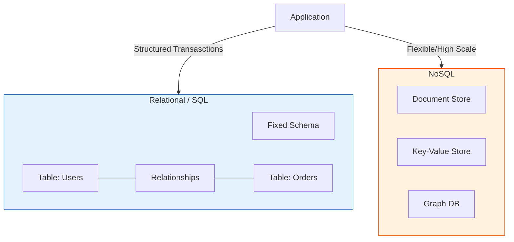

# Database Fundamentals

Welcome to the Database Fundamentals section! This directory contains foundational knowledge about databases in cloud computing, specifically focusing on AWS database services.

## Overview

Databases are essential components of modern applications, providing structured data storage, retrieval, and management capabilities. This section will guide you through the basics of database concepts and introduce you to AWS's managed database services.

## Core Concept: Cloud Database Architectures
**[REFERENCE: Cloud Database Architectures & Selection](./reference/cloud-database-architectures-ref.md)**

Navigating the strategic landscape of modern data storage:
- **SQL vs. NoSQL**: Understanding the tradeoff between rigid transactional consistency (ACID) and massive horizontal scalability.
- **The Selection Logic**: Utilizing specialized database types (Key-Value, Graph, Document) for specific application data patterns to maximize performance.
- **Distributed CAP Theorem**: Managing the balance between Consistency, Availability, and Partition Tolerance in global-scale operations.

## Enterprise Governance: Data Protection & Reliability
**[REFERENCE: Database Governance, Reliability & Security](./reference/database-governance-reliability-ref.md)**

Scaling database management with high-maturity reliability and security guardrails:
- **Resilient Multi-AZ Design**: Implementing synchronous failover and asynchronous read replicas to satisfy zero-downtime SLAs.
- **Zero-Trust Data Security**: Hardening the "Data Layer" through private networking, KMS encryption, and automated secret rotation.
- **Proof-of-Recovery**: Moving beyond basic backups to automated Point-in-Time Recovery (PITR) validation and strict audit logging for compliance (SOC2/HIPAA).

---
## Learning Path

### 1. Database Basics
Start here to understand fundamental database concepts:
- [Database Concepts](01-database-basics/database%20concepts%20and%20fundamentals.md) - Core database principles
- [Relational vs NoSQL](01-database-basics/relational-vs-nosql.md) - Understanding different database types
- [Choosing Database Type](01-database-basics/choosing%20the%20right%20database%20type.md) - Decision-making guide

### 2. RDS Basics
Learn about Amazon Relational Database Service:
- [RDS Introduction](02-rds-basics/rds-introduction.md) - What is RDS and why use it
- [RDS Getting Started](02-rds-basics/rds-getting-started.md) - Create your first RDS instance
- [RDS Backups & Snapshots](02-rds-basics/rds-backups-snapshots.md) - Data protection basics

### 3. DynamoDB Basics
Introduction to AWS's NoSQL database service:
- [DynamoDB Introduction](03-dynamodb-basics/dynamodb-introduction.md) - NoSQL with DynamoDB
- [DynamoDB Tables & Items](03-dynamodb-basics/dynamodb-tables-items.md) - Core concepts
- [DynamoDB Getting Started](03-dynamodb-basics/dynamodb-getting-started.md) - Hands-on guide

## Prerequisites

- Basic understanding of cloud computing concepts
- AWS account (free tier is sufficient)
- Familiarity with AWS Console
- Basic understanding of command line interface (optional)

## What You'll Learn

By completing this section, you will:
- ✅ Understand fundamental database concepts
- ✅ Know when to use relational vs NoSQL databases
- ✅ Be able to create and manage RDS instances
- ✅ Understand DynamoDB tables and items
- ✅ Perform basic database operations via AWS Console and CLI
- ✅ Implement basic backup and recovery strategies

## Next Steps

After mastering these fundamentals, progress to:
- **Intermediate Level**: [Database Services](../../../../readme.md) for advanced RDS features, DynamoDB design patterns, Aurora, and ElastiCache
- **Advanced Level**: [Database Enterprise](../../../../readme.md) for multi-region deployments, performance optimization, and enterprise security

## Additional Resources

- [AWS Database Services Overview](https://aws.amazon.com/products/databases/)
- [AWS Free Tier](https://aws.amazon.com/free/) - Practice without cost
- [AWS Documentation](https://docs.aws.amazon.com/)
- [AWS Well-Architected Framework - Database Pillar](https://aws.amazon.com/architecture/well-architected/)

---

**Ready to start?** Begin with [Database Concepts](01-database-basics/database%20concepts%20and%20fundamentals.md)!

## Database Architecture

## Real World Scenarios

### Scenario 1: E-Commerce Catalog Scaling
**Context:** An online retailer's product catalog has grown to millions of items with diverse attributes (some have sizes/colors, others have technical specs). The rigid SQL schema is hard to update.
**Solution:**
- **NoSQL (DynamoDB/MongoDB):** Migrate the product catalog to a Document store.
- **Flexible Schema:** New products can have arbitrary attributes without altering the table structure.
- **Read Performance:** High-speed reads for browsing products using key-value or secondary indexes.
**Benefit:** faster innovation cycles and ability to handle "Black Friday" traffic spikes due to NoSQL horizontal scaling.

### Scenario 2: Banking Transaction System
**Context:** A bank needs to record transfers between accounts. Absolute data integrity is required (money must not vanish).
**Solution:**
- **Relational (RDS/Aurora):** Use a SQL database with ACID compliance.
- **Transactions:** Wrap the "Debit Sender" and "Credit Receiver" operations in a single transaction. If one fails, both roll back.
- **Constraints:** Foreign keys ensure that transactions are only linked to valid accounts.
**Benefit:** Guarantees strong consistency and financial accuracy.

---

## Interview Questions

### Basic Level
1.  **What is the difference between SQL and NoSQL?**
    -   **SQL (Relational):** Structured data, predefined schema, valid relationships (tables, rows), scales vertically. Good for complex queries/transactions.
    -   **NoSQL (Non-Relational):** Flexible schema, various models (document, key-value), scales horizontally. Good for rapid changes, massive data, and simple query patterns.
2.  **What does ACID stand for?**
    -   **Atomicity:** All or nothing.
    -   **Consistency:** Database remains in a valid state.
    -   **Isolation:** Transactions don't interfere with each other.
    -   **Durability:** Saved data stays saved.
3.  **What is a Primary Key?**
    -   A unique identifier for a record (row) in a table. It cannot be null.

### Intermediate Level
4.  **Explain "Read Replicas" vs "Multi-AZ" in AWS RDS.**
    -   **Read Replicas:** Async copies of the DB to offload read traffic (performance).
    -   **Multi-AZ:** Sync copy in another zone for failover (High Availability). NOT for performance boosting.
5.  **What is "Sharding"?**
    -   Splitting a large dataset across multiple servers (shards) horizontally. Common in NoSQL to achieve unlimited scale. hard to do in SQL.
6.  **Comparison of DynamoDB vs RDS?**
    -   **DynamoDB:** Serverless NoSQL, single-digit ms latency, scales to zero or infinity, pays per request/capacity.
    -   **RDS:** Managed SQL (Postgres/MySQL), runs on servers (instances), pays per hour + storage.
7.  **What is a "Foreign Key"?**
    -   A field in one table that links to the Primary Key of another table, enforcing referential integrity.
8.  **Define "indexes" in a database.**
    -   Data structures (like a B-Tree) that improve the speed of data retrieval operations on a table at the cost of additional writes and storage space.

<b>9. </b>

Show Answer

Answer: B) Relational (SQL)</b>

<b>2. Scaling a database by adding more power (CPU/RAM) to a single server is called:</b>

Show Answer

Answer: B) Vertical Scaling</b>

<b>3. DynamoDB is an example of which type of database?</b>

Show Answer

Answer: B) Key-Value / Document (NoSQL)</b>

<b>4. In RDS Multi-AZ, the standby instance is primarily used for:</b>

Show Answer

Answer: B) High Availability (Failover)</b>

<b>5. Which property ensures that a transaction is "all or nothing"?</b>

Show Answer

Answer: A) Atomicity</b>

<b>6. Which service provides a managed Redis or Memcached environment?</b>

Show Answer

Answer: C) ElastiCache</b>

<b>7. "SQL" stands for:</b>

Show Answer

Answer: B) Structured Query Language</b>

<b>8. A "Join" operation is a key feature of:</b>

Show Answer

Answer: B) Relational Databases</b>

<b>9. Which AWS service is a data warehouse solution (OLAP)?</b>

Show Answer

Answer: C) Redshift</b>

<b>10. In the CAP theorem, "P" stands for:</b>

Show Answer

Answer: B) Partition Tolerance</b>

<b>11. What is the main benefit of "Read Replicas"?</b>

Show Answer

Answer: C) Improved Read Performance (Offloading)</b>

<b>12. MongoDB is a popular examples of a:</b>

Show Answer

Answer: B) Document Store</b>

<b>13. Amazon Aurora is compatible with which two database engines?</b>

Show Answer

Answer: B) MySQL and PostgreSQL</b>

<b>14. Which statement adds data to a SQL table?</b>

Show Answer

Answer: B) INSERT</b>

<b>15. Data "Durability" refers to:</b>

Show Answer

Answer: B) Data not disappearing over time</b>

<b>16. Which strategy is most effective for handling un-predictable, massive traffic spikes for a simple lookup app?</b>

Show Answer

Answer: C) DynamoDB On-Demand</b>

<b>17. "Columns" in a NoSQL Document store are typically referred to as:</b>

Show Answer

Answer: A) Attributes / Fields</b>

<b>18. Graph databases (like Amazon Neptune) are optimized for:</b>

Show Answer

Answer: B) Analyzing complex relationships (social networks, fraud detection)</b>

<b>19. Database Migration Service (DMS) helps you:</b>

Show Answer

Answer: A) Migrate databases to AWS with minimal downtime</b>

<b>20. Which command modifies the structure of an existing table (e.g., adding a column)?</b>

Show Answer

Answer: B) ALTER TABLE</b>

<b>21. "OLTP" stands for:</b>

Show Answer

Answer: B) Online Transaction Processing</b>

