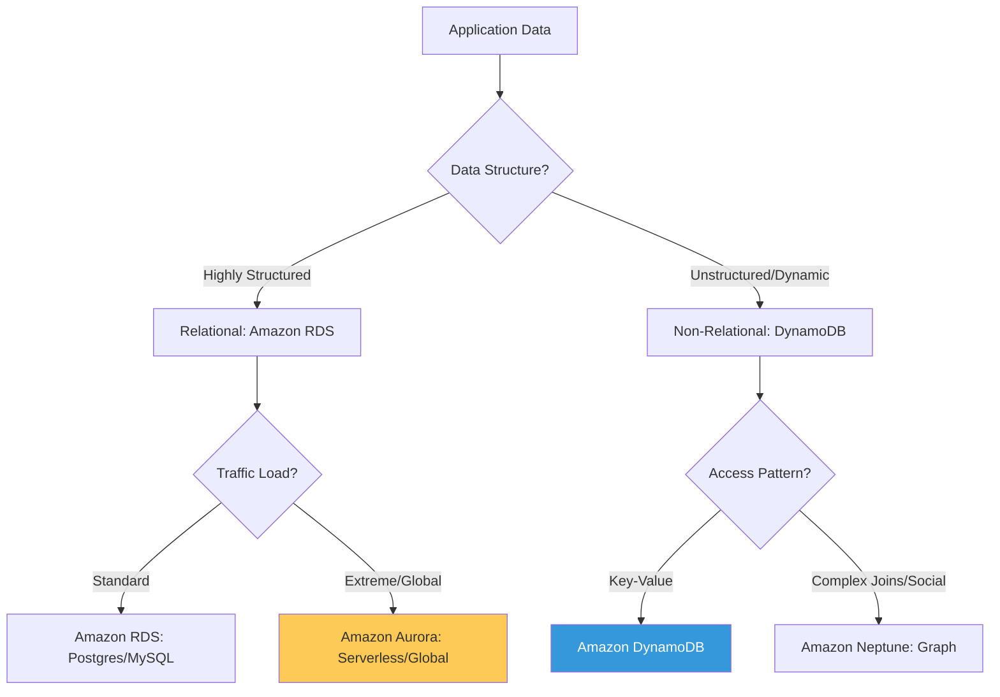

# Cloud Database Architectures & Selection Reference

**Doc Version:** 1.0.0
**Role:** Database Architect / Cloud Engineer
**Scope:** Relational vs NoSQL, CAP Theorem, and AWS Managed Database Portfolio

---

## 1. The Core Duality: SQL vs. NoSQL

Choosing the right database starts with understanding the nature of your data and the requirements of your application.

### A. Relational (SQL) - The Standard for Consistency
- **Schema**: Rigid, predefined tables with rows and columns.
- **Scaling**: Optimized for **Vertical Scaling** (bigger servers).
- **Core Benefit**: **ACID Compliance** (Atomicity, Consistency, Isolation, Durability).
- **Best For**: Financial systems, ERPs, and applications requiring complex joins.

### B. Non-Relational (NoSQL) - The Standard for Scale
- **Schema**: Flexible, document-based (JSON), key-value, or graph-based.
- **Scaling**: Optimized for **Horizontal Scaling** (adding more servers/shards).
- **Core Benefit**: High performance at massive scale and rapid development cycles.
- **Best For**: Content management, real-time analytics, and high-volume web apps.

---

## 2. Distributed Systems: The CAP Theorem

When scaling databases across a network, the CAP theorem states you can only guarantee two out of three properties:

1.  **Consistency (C)**: Every read receives the most recent write or an error.
2.  **Availability (A)**: Every request receives a (non-error) response.
3.  **Partition Tolerance (P)**: The system continues to operate despite network failures between nodes.

> **Enterprise Standard**: Most cloud databases are **CP** (Consitency + Partition Tolerance) or **AP** (Availability + Partition Tolerance). You must choose based on if your app values "The most correct data" (Banking) or "Always responding" (Social Media).

---

## 3. Visualizing Database Selection

---

## 4. AWS Database Portfolio Overview

| Service | Category | Common Use Case |
| :--- | :--- | :--- |
| **Amazon RDS** | Relational | Traditional apps, CRM, ERP. |
| **Amazon Aurora** | Relational (High-Perf) | High-scale SQL, global applications. |
| **Amazon DynamoDB** | NoSQL (Key-Value) | Gaming, ad-tech, serverless backends. |
| **Amazon DocumentDB** | NoSQL (Document) | Content management (MongoDB compatible). |
| **Amazon ElastiCache** | In-Memory | Session caching, real-time leaderboards (Redis). |

---

## 5. Enterprise Governance Standards

- **Infrastructure as Code (IaC)**: Databases should NEVER be created manually in the console. Use Terraform or CloudFormation to ensure consistent configurations (e.g., encryption, backup windows).
- **The "Right-Tool" Policy**: Avoid the "Database Anti-Pattern" of trying to store everything in one SQL DB. Use a **Polyglot Persistence** strategy where different services use the DB type best suited for their specific data.

> **Enterprise Pattern**: Implement **The Serverless-First Database strategy**. For new auxiliary services, utilize DynamoDB with On-Demand capacity. This eliminates the need to manage instance sizes and ensures that the database cost scales exactly with the application's actual usage.
