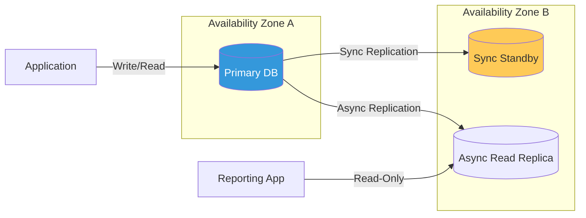

# Database Governance, Reliability & Security Reference

**Doc Version:** 1.0.0
**Role:** Database Administrator / DevOps Engineer
**Scope:** Data Protection, High Availability (HA), and Database Guardrails

---

## 1. High Availability (HA) and Disaster Recovery (DR)

Cloud databases provide built-in mechanisms to ensure that data remains available even during hardware or data center (Availability Zone) failures.

### A. RDS Multi-AZ (HA)
- **Mechanism**: A synchronous "Standby" instance is maintained in a second Availability Zone.
- **Failover**: Automatic and transparent. DNS records are updated by AWS to point to the standby.
- **Use Case**: Production environments where zero downtime is required.

### B. Read Replicas (Performance)
- **Mechanism**: Asynchronous copies of the database that can serve read-only traffic.
- **Benefit**: Offloads the primary engine from heavy reporting or read-intensive workloads.

---

## 2. Data Protection & Sovereignty

### A. Backup Strategies
- **Automated Backups**: RDS takes daily full snapshots and captures transaction logs, allowing for **Point-in-Time Recovery (PITR)**.
- **Manual Snapshots**: User-initiated snapshots that are kept until manually deleted (essential before major schema migrations).

### B. Encryption at Rest & Flight
- **Storage Encryption**: Using **KMS (Key Management Service)** to encrypt the underlying disk and snapshots.
- **TLS/SSL**: Mandatory for all client-to-database communication to prevent snooping of sensitive data.

---

## 3. Visualizing Data Resiliency

---

## 4. Database Security Guardrails

Securing a database requires a "Defense-in-Depth" approach:
1.  **Network**: Place DBs in **Private Subnets**. Never assign Public IPs.
2.  **Firewall (Security Groups)**: Strictly allow access ONLY from the specific Web/Application security group on the specific port (e.g., 5432 for Postgres).
3.  **Identity**: Use **IAM DB Authentication** or rotating secrets in **AWS Secrets Manager** instead of long-lived hardcoded passwords.

---

## 5. Enterprise Governance Standards

- **Metadata Labeling**: All database instances MUST include `Environment`, `DataClassification` (e.g., PII, Public), and `Ccenter` tags.
- **Audit Logging**: Enable **CloudWatch Logs** for slow queries and connection attempts to satisfy compliance requirements (SOC2/HIPAA).
- **The "No-Delete" Policy**: Enable **Deletion Protection** on all production instances to prevent accidental termination via the CLI or Console.

> **Enterprise Pattern**: Implement **The "Automated PITR Validation"**. Don't assume your backups work. Orchestrate a weekly automated job that restores the latest RDS snapshot to a temporary "Verification" instance and runs a simple query. If the restore fails or the data is corrupt, alert the SRE team immediately. This moves from "Hopeful Backups" to "Proven Recovery."
