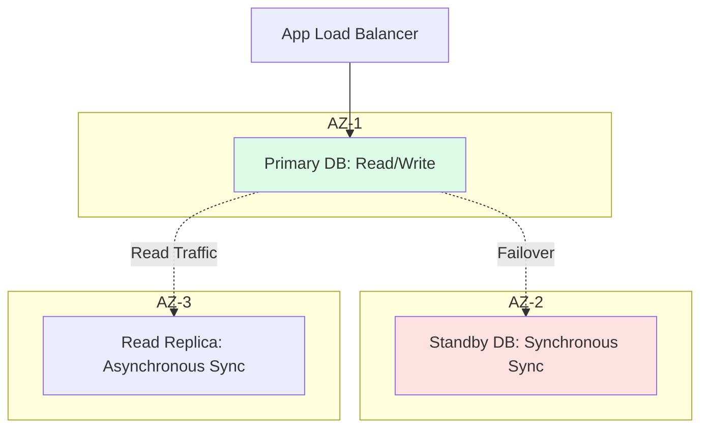

# 💾 Databases: The Enterprise Persistence Layer

> **"Listen carefully, Junior. Code can be redeployed, servers can be rebooted, but if you lose the database, the company is dead. In DevOps, we don't just 'use' databases; we defend the data like it's the crown jewels."**

---

## 🧠 The Mental Model: The Persistence Layer

**The Junior Struggle**: "I'll just run a SQL script and create a table. Why do I need to care about ACID, replication, or RPO/RTO?"

**The Senior Solution**: You realize that a database is like a **Bank Vault**:
- **ACID**: The security protocols that ensure every transaction is perfect (No missing money).
- **Multi-AZ**: Having a backup vault in a different city that opens automatically if the first one is robbed.
- **PITR**: The security cameras that allow you to rewind time and see exactly who did what at any second.
- **Read Replicas**: The multiple teller windows that prevent a long line (Performance).

---

## 🆚 Junior Way vs. Senior Way

| Feature | The Junior Way (Problematic) | The Senior Way (Architected) |
|:---|:---|:---|
| **Storage** | Manual local backups | **Automated Snapshots** with cross-region replication |
| **Availability** | Single-instance DB | **Multi-AZ** with automated failover |
| **Read Traffic** | Sending all queries to the master | **Read Replicas** for scaling read performance |
| **Security** | Database in a public subnet | **Private Subnets** with VPC Endpoints |
| **Recovery** | "I think the backup works" | **Tested PITR** (Point-in-Time Recovery) |

---

## 🏗️ Visual: High-Availability Database Architecture

---

## 🗺️ Curriculum Path

1. **[01-Database-Fundamentals](./01-database-fundamentals/readme.md)**: SQL vs NoSQL, ACID/BASE, and Managed vs Self-hosted.
2. **[02-PostgreSQL-DevOps](./02-postgresql-devops/readme.md)**: Advanced features and performance tuning.
3. **[03-MySQL-and-RDS](readme.md)**: Cloud implementation via Amazon RDS.
4. **[04-NoSQL-MongoDB-Redis](./04-nosql-mongodb-redis/readme.md)**: Document stores and high-performance caching.
5. **[05-Backup-and-Monitoring](./05-backup-and-monitoring/readme.md)**: Data durability and snapshots.

---

## 🏆 Real-World DevOps Story: The Backup That Wasn't

**The Scenario**: A Junior engineer set up a nightly backup script for a production database.
**The Crisis**: A year later, the database was corrupted. When they went to restore, they found the backups were all 0 bytes because the script had failed silently and never sent an alert.
**The Fix**: Implemented **Automated Backup Alerts** and a monthly "Restoration Drill" to verify data integrity.
**The Lesson**: **Junior, a backup you haven't tested for restoration is not a backup.** Always verify your safety net.

---

## 🎤 Interview Preparation (Database Ops)

1. **Q: Junior, what does 'ACID' stand for?**
   - *A: **Atomicity** (All or nothing), **Consistency** (Valid data), **Isolation** (No interference), **Durability** (Permanent once committed).*

2. **Q: What is the CAP Theorem?**
   - *A: You can only have two of the three: **Consistency**, **Availability**, and **Partition Tolerance**. Most distributed databases must sacrifice one (usually Consistency) to stay Available.*

3. **Q: Explain 'Read Replicas' vs 'Multi-AZ'.**
   - *A: **Multi-AZ** is for High Availability (Disaster Recovery). **Read Replicas** are for Scalability (Performance).*

4. **Q: What is 'Point-in-Time Recovery' (PITR)?**
   - *A: It uses a combination of full snapshots and transaction logs to restore a database to a specific second, allowing you to undo a 'DELETE' command that happened 5 minutes ago.*

5. **Q: Junior, what is the difference between SQL and NoSQL?**
   - *A: SQL (Relational) is best for structured data with complex relationships. NoSQL (Non-Relational) is best for unstructured, rapidly scaling data with flexible schemas.*

6. **Q: What is 'Eventual Consistency'?**
   - *A: A model (often in NoSQL) where changes are propagated across the network, and the system guarantees that 'eventually' all nodes will show the same data, but not necessarily instantly.*

7. **Q: What is a 'Database Migration' and why is it risky?**
   - *A: It's the process of moving data or changing its schema (Structure). It's risky because it can cause downtime, data loss, or performance degradation if not tested properly.*

8. **Q: Explain 'Database Sharding'.**
   - *A: A method of splitting a large database into smaller, faster, more easily managed parts called 'shards', typically distributed across multiple servers.*

9. **Q: What is the benefit of a Managed DB service (like Amazon RDS)?**
   - *A: It automates the 'Toil'—patching, backups, software updates, and scaling, allowing engineers to focus on the application logic.*

10. **Q: What is a 'Deadlock'?**
    - *A: A situation where two or more processes are waiting for each other to release a lock on a database row, causing the system to grind to a halt.*

---

## 📝 Knowledge Check

1. **Which letter in ACID ensures that a transaction is 'All or Nothing'?**
   - [x] Atomicity.

2. **Which replication type is used for a Multi-AZ standby for instant failover?**
   - [x] Synchronous.

3. **What does 'RPO' stand for in Disaster Recovery?**
   - [x] Recovery Point Objective (How much data lost).

4. **Which NoSQL type is best for storing user sessions and fast lookups?**
   - [x] Key-Value / In-Memory (Redis).

5. **Where should you place your production database for maximum security?**
   - [x] Private Subnet.

6. **True/False: A Read Replica can be promoted to a Primary Master.**
   - [x] **True**. (In most cloud providers).

7. **What is 'Data Drift'?**
   - [x] When the data in a secondary node differs from the master node.

8. **Which SQL command is used to add a new column to a table?**
   - [x] `ALTER TABLE`.

9. **What is the default port for PostgreSQL?**
   - [x] 5432.

10. **What happens to a transaction if one of its steps fails?**
    - [x] It is 'Rolled Back' (Undone).

---

## 🔗 Next Steps
Junior, the persistence layer is secure. Now let's learn how to monitor its health.
1. Proceed to: **[01-Database-Fundamentals](./01-database-fundamentals/readme.md)** →
2. Return to: **[Phase 1 Hub](../readme.md)** →

---
## 🧭 Additional Modules
- [00 Database Basics](00-database-basics/readme.md)
- [06 Interview Questions and Quizzes](06-interview-questions-and-quizzes/readme.md)
- [07 Real Life Scenarios](07-real-life-scenarios/readme.md)
- [MySql](mysql/readme.md)
