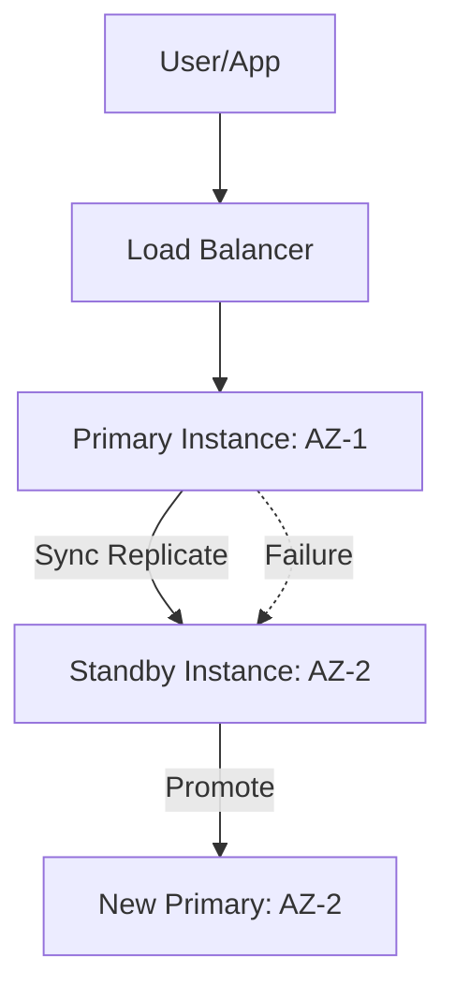

# Database Availability & Backup Reference

**Doc Version:** 1.0.0
**Role:** Database Reliability Engineer (DBRE)
**Scope:** High Availability, Replication, and Recovery

---

## 1. High Availability (HA) Patterns

### Master-Slave (Read Replicas)
- **Master**: Handles all Writes and Updates.
- **Slave**: Sycnronizes with Master and handles Read queries.
- **Why?**: Offloads traffic from the Master. If Master fails, a Slave is promoted.

### Multi-AZ (Multi-Availability Zone)
- **Synchronous Replication**: Data is written to the standby instance *before* the transaction is confirmed.
- **Failover**: Automated by the cloud provider (e.g., AWS RDS).
- **Goal**: Disaster Recovery (DR).

---

## 2. Backup Strategies

### A. Snapshots (Full Backups)
- **Point-in-Time**: A static copy of the storage at a specific moment.
- **Usage**: Nightly backups.

### B. Point-in-Time Recovery (PITR)
- **Mechanism**: Continuous backup of Transaction Logs (WAL in Postgres, Binlog in MySQL).
- **Recovery**: Restore the last snapshot AND replay the logs until a specific second.
- **Why**: Recovers from human error (e.g., `DROP TABLE` at 2:05 PM).

---

## 3. RPO vs RTO

- **RPO (Recovery Point Objective)**: How much *data* can we afford to lose? (e.g., 5 minutes of logs).
- **RTO (Recovery Time Objective)**: How much *time* can we afford to be down? (e.g., 1 hour to restore).

---

## 4. Visualizing Failover

---

## 5. The "Golden Rule" of DB Backups

**A backup is not a backup until you have successfully restored it.**

> **Enterprise Pattern**: Use **Automated Restore Testing**. Once a week, an automated job should spin up a fresh DB instance, restore the latest snapshot, and run a sanity-check query to ensure data integrity.
