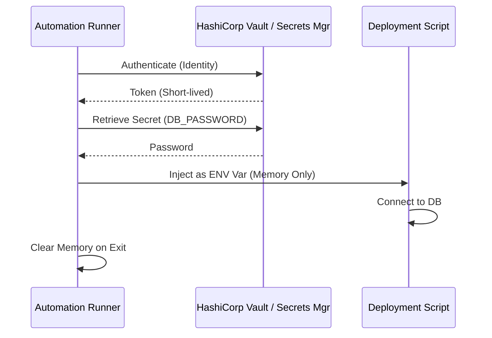

# Automation Security & Secrets Governance

**Doc Version:** 1.0.0
**Role:** DevSecOps Engineer
**Scope:** Secret Management, Principle of Least Privilege, and Audit

---

## 1. The "Zero Secrets in Code" Rule

Hardcoding credentials is the #1 cause of cloud breaches.

### Levels of Maturity
1.  **Level 0 (Fatal)**: Hardcoded API keys in Git.
2.  **Level 1 (Better)**: Environment variables (Local).
3.  **Level 2 (Professional)**: Local Secret Managers (e.g., `ansible-vault`, `.env` ignored in Git).
4.  **Level 3 (Enterprise)**: Centralized Secrets Management (HashiCorp Vault, AWS Secrets Manager, Azure Key Vault).

---

## 2. Best Practices for Automated Tools

### A. Principle of Least Privilege (PoLP)
Never run automation with "Admin" or "Root" credentials unless absolutely necessary.

- **Bad**: Cron job runs as root.
- **Good**: Cron job runs as `automation_user` with sudo access only to `systemctl restart myapp`.

### B. Narrow Scoping
- **API Keys**: Should be restricted by IP address and specific actions (Read-only vs Read/Write).
- **Service Accounts**: Should have IAM policies restricted to specific resources.

---

## 3. Tool-Specific Patterns

### Ansible Vault
Encrypt sensitive variables at rest.
```bash
ansible-vault encrypt secrets.yml
```

### GitHub Actions Secrets
Inject secrets at runtime via the environment.
```yaml
env:
  API_KEY: ${{ secrets.PROD_API_KEY }}
```

---

## 4. Auditing Automation

"Who ran what, and when?"

1.  **Syslog/Journald**: Log all execution starts, ends, and errors.
2.  **CloudTrail**: Audit every API call made by a Service Account.
3.  **Versioning**: Every automation script must be versioned. Avoid "latest" tags in production.

---

## 5. Visualizing Secure Secret Injection



> **Enterprise Pattern**: Use **Dynamic Secrets**. Tools like HashiCorp Vault can generate a unique, short-lived database credential for every single automation run. The credential expires after 1 hour, rendering it useless if stolen.
