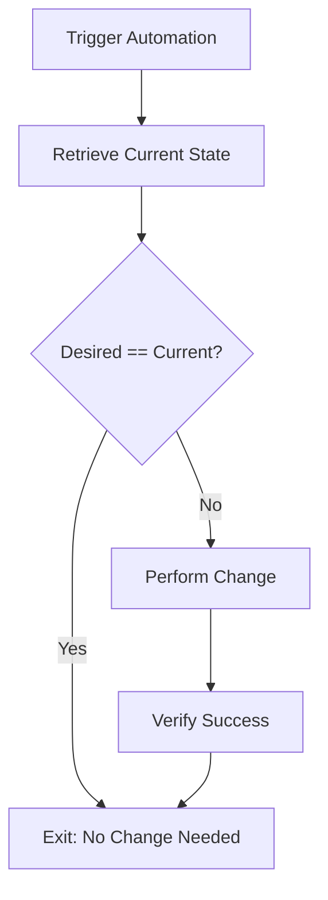

# Idempotency in Automation: Reference Architecture

**Doc Version:** 1.0.0
**Role:** Automation Engineer
**Scope:** Principles, Implementation, and Patterns

---

## 1. What is Idempotency?

In a DevOps context, **idempotency** means that applying an operation multiple times has the same result as applying it once.

### Why It Matters
- **Self-Healing**: Scripts can be safely re-run after a partial failure.
- **Consistency**: Prevents duplicate resources (e.g., creating 5 users because the script ran 5 times).
- **Predictability**: You can dry-run or re-apply configuration at any time.

---

## 2. Implementation Patterns

### A. The "State Check" Pattern
Before taking action, verify if the desired state already exists.

**Bash Example**:
```bash
# Bad: Always tries to create, fails if exists
mkdir /data/backup

# Good (Idempotent): Checks existence first
if [ ! -d "/data/backup" ]; then
    mkdir -p /data/backup
    echo "Directory created."
else
    echo "Directory already exists. Skipping."
fi
```

**Python Example (Boto3)**:
```python
import boto3

def create_s3_bucket(bucket_name):
    s3 = boto3.client('s3')
    try:
        s3.head_bucket(Bucket=bucket_name)
        print("Bucket already exists.")
    except Exception:
        s3.create_bucket(Bucket=bucket_name)
        print("Bucket created.")
```

### B. The "Difference" Pattern (Declarative)
Calculate the delta between current and desired state and apply only the changes.

**Tools that do this natively**:
- **Terraform**: `terraform plan` shows the delta.
- **Ansible**: Modules check state before changing.

---

## 3. The "Strict Mode" for Shell Automation

For professional automation, never use default Bash settings.

```bash
#!/bin/bash
set -euo pipefail
IFS=$'\n\t'
```

- `-e`: Exit immediately if a command exits with a non-zero status.
- `-u`: Treat unset variables as an error.
- `-o pipefail`: Return the exit code of the last command in the pipe that failed.
- `IFS`: Internal Field Separator (handles spaces in filenames correctly).

---

## 4. Visualizing the Idempotent Loop



---

## 5. Automation Anti-Patterns

1.  **Blind Execution**: Running `apt-get install` without checking if the package is already there (slow, potential side effects).
2.  **Hardcoded Secrets**: Putting API keys in scripts (Security failure).
3.  **No Error Handling**: Assuming every command succeeds (Reliability failure).
4.  **Global Side Effects**: Changing system-wide settings that affect other apps without isolation.

> **Enterprise Pattern**: Use **Atomic Transactions**. If your script performs 3 steps, ensure that if Step 3 fails, Steps 1 and 2 are rolled back or at least left in a valid state.
