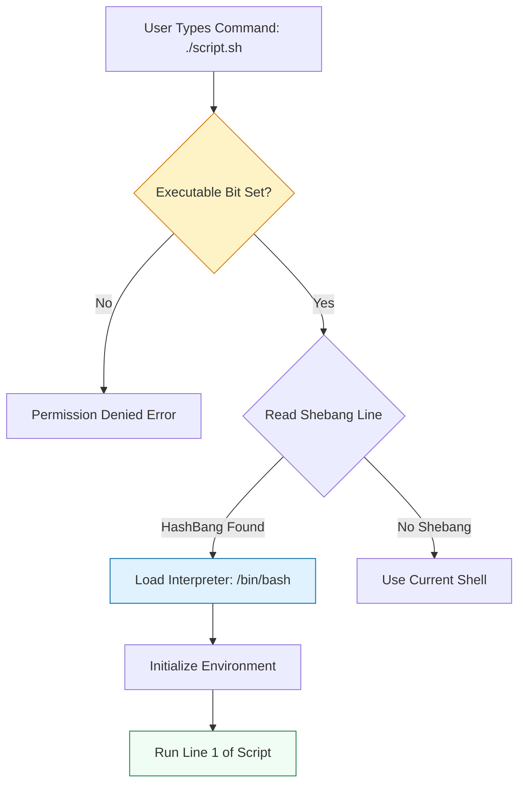

# 🐚 Shell Foundations: The Anatomy of Automation

> **"The shell is the glue that binds independent tools into a unified automation platform. If your glue is weak, your platform collapses."**

Welcome to the **Shell Foundations** module. Before we write complex logic, we must master the **Metadata** of a script: How it starts, who owns it, and how it executes. A production script is not just a text file with commands; it is a secure, executable binary in its own right.

**Why This Matters for Junior DevOps Engineers:**
- 🛡️ **Security**: Running a script as root when not needed is a CVE waiting to happen.
- ⚙️ **Reliability**: Using the wrong Shebang (`#!/bin/sh` vs `#!/bin/bash`) breaks scripts on different OS versions.
- 🎯 **Interview**: "Explain the difference between `source script.sh` and `./script.sh`" is a standard screening question.
- 🔧 **CI/CD**: Configuring executable permissions (`chmod +x`) is mandatory for pipeline steps.

---

## 📚 Table of Contents

1. [The Script Lifecycle](#-the-script-lifecycle)
2. [The Shebang: Choosing an Interpreter](#-the-shebang-choosing-an-interpreter)
3. [Permissions & Execution Modes](#-permissions--execution-modes)
4. [The Environment: Path & Variables](#-the-environment-path--variables)
5. [Real-World DevOps Scenarios](#-real-world-devops-scenarios)
6. [Security Best Practices](#-security-best-practices)
7. [Common Pitfalls & Solutions](#-common-pitfalls--solutions)
8. [Hands-On Exercises](#-hands-on-exercises)
9. [Interview Preparation](#-interview-preparation)
10. [Knowledge Check](#-knowledge-check)

---

## 🏗️ The Script Lifecycle

A script goes through three distinct phases before a single line of logic runs.



### 🔍 Lifecycle Breakdown

**Stage 1: Permission Check**
- **What**: Kernel checks if `x` bit is set for the user.
- **Command**: `chmod +x script.sh`.
- **Note**: Root can ignore read checks, but still needs execute bits in some contexts.

**Stage 2: Interpreter Loading (Shebang)**
- **What**: The kernel reads the first 2 bytes (`#!`).
- **Action**: It launches the program specified (e.g., `/bin/bash`).
- **Result**: Your script becomes an *argument* to that interpreter.

**Stage 3: Environment Initialization**
- **What**: The new process inherits environment variables (PATH, USER) from the parent.
- **Critical**: It does NOT inherit shell variables (local vars) unless exported.

---

## 🐍 The Shebang: Choosing an Interpreter

The first line determines your destiny.

### 1. The Portable Standard (Recommended)
```bash
#!/usr/bin/env bash
```
- **Why**: It searches the user's `$PATH` for the first instance of `bash`.
- **Benefit**: Works on macOS (bundled bash), Linux (system bash), and NixOS (custom paths).
- **Drawback**: Vulnerable if user has a malicious `bash` in their path (rare).

### 2. The Absolute Path (Legacy/Specific)
```bash
#!/bin/bash
```
- **Why**: Hardcodes the system binary.
- **Benefit**: Predictable security.
- **Drawback**: Breaks on systems where bash is in `/usr/local/bin` (BSD/Solaris).

### 3. The "Sh" Trap (Avoid)
```bash
#!/bin/sh
```
- **Why**: Uses the strict POSIX shell (Dash on Ubuntu, Bash on CentOS).
- **Risk**: Advanced features like Arrays (`arr[0]`) and Double Brackets (`[[ ]]`) will **CRASH**.
- **Rule**: Only use for ultra-portable, simple scripts.

---

## 🔐 Permissions & Execution Modes

### Three Ways to Run
1.  **Direct Execution** (Production Standard):
    ```bash
    chmod +x init.sh
    ./init.sh
    ```
    - **Effect**: Runs in a **Sub-shell**. Variables defined inside do NOT pollute your current terminal.

2.  **Interpreter Execution** (Debugging):
    ```bash
    bash -x init.sh
    ```
    - **Effect**: Ignores shebang, runs with specified shell. Good for debug mode (`-x`).

3.  **Sourcing** (Config Loading):
    ```bash
    source init.sh
    # OR
    . init.sh
    ```
    - **Effect**: Runs in **Current Shell**. Variables defined inside **stay** in your terminal.
    - **Danger**: `exit` in the script closes your terminal window!

---

## 🎭 Real-World DevOps Scenarios

### 🛡️ Scenario 1: The "Works on My Machine" Shebang

**The Incident:** A developer wrote a deployment script with `#!/bin/bash` on their Ubuntu laptop. They deployed to a minimal Alpine Linux container.
**The Failure:** Alpine Linux doesn't have Bash installed by default (it uses Ash). The container crashed with `exec format error`.
**The Fix:**
1. Install Bash in Dockerfile (`apk add bash`).
2. Use `#!/usr/bin/env bash` for portability.
3. Or rewrite in POSIX `sh` for Alpine native support.

### 🔥 Scenario 2: The "Source" Disaster

**The Incident:** A junior engineer wrote a setup script that ended with `exit 1` if a check failed. They instructed the team to run it via `source setup.sh`.
**The Failure:** The check failed. The `exit 1` command executed in the **Current Shell**.
**The Impact:** It instantly closed the SSH sessions of 5 senior engineers who ran it, killing their background jobs.
**The Fix:** Never use `exit` in a script meant to be sourced. Use `return`.
```bash
# ✅ Safe for sourcing
if [ "$USER" != "root" ]; then
    echo "Root required"
    return 1 2>/dev/null || exit 1 # Handles both source and execution
fi
```

---

## 🔒 Security Best Practices

### 1. The "Curl Pipe Bash" Risk
You often see: `curl -sL https://install.xyz | bash`.
**The Risk**: Network interruption can truncate the script. If the script normally deletes temp files `rm -rf /tmp/xyz`, a truncated version might run `rm -rf /`.
**Mitigation**: Download, inspect, then run.
```bash
curl -sL https://install.xyz > install.sh
sha256sum install.sh # Verify checksum
bash install.sh
```

### 2. SUID Bits (The Red Flag)
Never set the SUID bit (`chmod u+s`) on a shell script.
**Why**: It allows the script to run as the owner (Root) regardless of who runs it. Shell scripts are too easy to exploit (race conditions, injection). Modern kernels ignore SUID on scripts for this reason.

---

## ⚠️ Common Pitfalls & Solutions

### Pitfall 1: Windows Line Endings (CRLF)
**Symptom**: `bash: ./script.sh: /bin/bash^M: bad interpreter`
**Cause**: Editing script in Notepad/VSCode on Windows. It adds `\r\n`.
**Fix**: `dos2unix script.sh`.

### Pitfall 2: Logic in `.bashrc`
**Symptom**: SCP or SFTP fails to connect, but SSH works.
**Cause**: Putting `echo "Hello"` in your `.bashrc`. SCP expects a silent handshake.
**Fix**: Wrap output logic in a check.
```bash
# Only print if interactive
if [[ $- == *i* ]]; then
    echo "Welcome $USER"
fi
```

---

## 🎯 Hands-On Exercises

### Exercise 1: The "Hello Secure World"
**Objective**: Create a robust script template.
**Requirements**:
1. Use the portable shebang.
2. Set execute permissions.
3. Print the current user and path.
4. Run it directly (`./script.sh`).

**Starter Code**:
```bash
# TODO: Add Shebang

echo "User: TODO"
echo "Path: TODO"
```

### Exercise 2: The Source vs Exec Test
**Objective**: Demonstrate variable scoping.
**Requirements**:
1. Create `test_scope.sh` that sets `MY_VAR="Loaded"`.
2. Run `./test_scope.sh`. Echo `$MY_VAR` (Should be empty).
3. Run `source test_scope.sh`. Echo `$MY_VAR` (Should be "Loaded").

---

## 🎙️ Interview Preparation

### Foundation Questions

**1. "What is the difference between `chmod +x` and `chmod 755`?"**
- **Answer**: `chmod +x` adds execute permission to User, Group, and Others, preserving existing bits. `chmod 755` sets explicit permissions (rwxr-xr-x), potentially overwriting custom bits like SUID.

**2. "Explain the Shebang line."**
- **Answer**: The first line `#!` tells the kernel which interpreter to use. It allows a text file to behave like a binary executable.

### Advanced Scenario Questions

**3. "Why does my cron job fail but the script works manually?"**
- **Answer**: **Environment Differences**. Cron runs with a minimal shell (POSIX sh) and a limited `$PATH`. It usually lacks your `~/.bashrc` variables.
- **Fix**: Always use absolute paths (`/usr/bin/python` vs `python`) and define `PATH` explicitly in the script.

---

## 🧠 Knowledge Check

**1. Which command converts Windows line endings to Linux?**
- [ ] `unix2dos`
- [x] `dos2unix`
- [ ] `sed -i`

**2. What happens if you run a script without a shebang?**
- [ ] It crashes.
- [x] It runs in your current shell (default behavior).
- [ ] It runs as root.

**3. Which file is sourced for Non-Login shells (like opening a new terminal tab)?**
- [ ] `~/.bash_profile`
- [x] `~/.bashrc`
- [ ] `/etc/profile`

---

## 🎓 Self-Assessment Checklist

Before moving to the next module, ensure you can:
- [ ] Choose the correct Shebang for portability.
- [ ] Explain why `source` is different from `./`.
- [ ] Fix "Interpreter bad" errors (CRLF).
- [ ] Set executable permissions.
- [ ] Run a script in debug mode (`bash -x`).

**Score yourself**: 5+/5 = Ready to advance | <5 = Review exercises

[⬅️ Back to Mastery](readme.md) | [Next: Logic & Controls](../002-intermediate-logic/readme.md) ➡️
