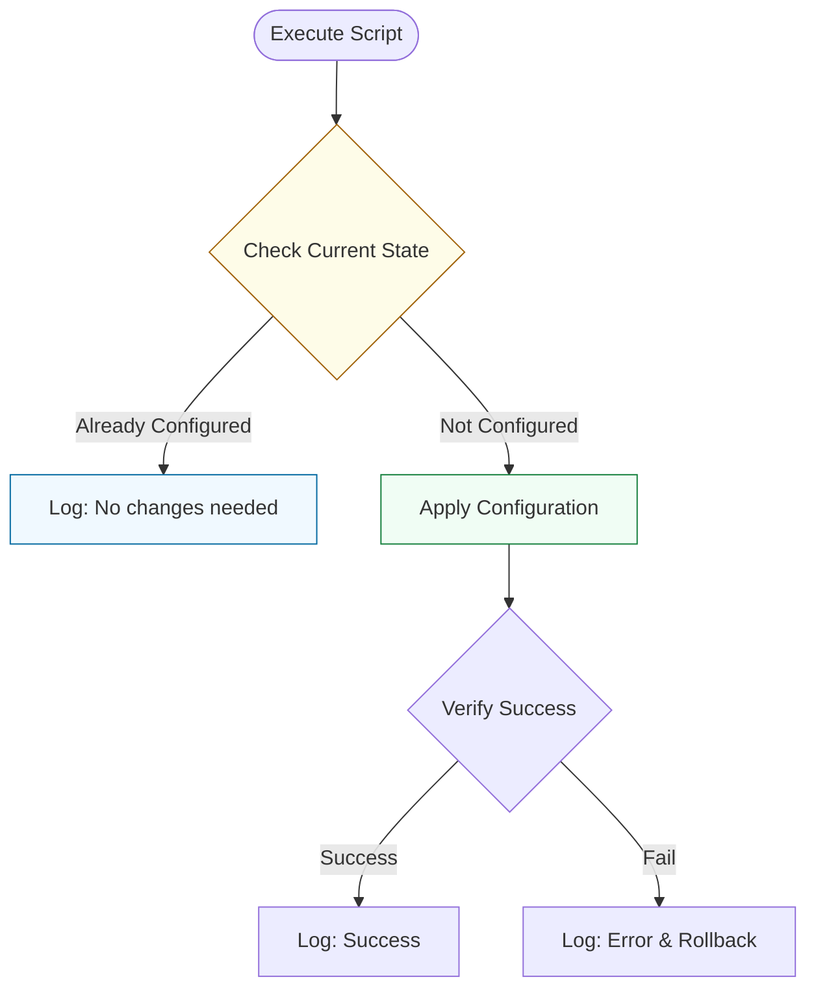

# 🧠 Shell Logic: Flow Control & Idempotency

> **"A good script does the job. A great script only does the job if it hasn't been done yet."**

Welcome to the **Shell Logic** module. Writing a list of commands is easy. Writing a script that can handle errors, missing files, and variable inputs requires Logic. This module covers the "Brains" of Bash: **Advanced Conditionals**, **Iterative Loops**, and the absolute cardinal rule of DevOps: **Idempotency**.

**Why This Matters for Junior DevOps Engineers:**
- 🛡️ **Safety**: Knowing the difference between `[ $a = $b ]` and `[[ $a == $b ]]` prevents 80% of bugs.
- ⚡ **Efficiency**: Using `case` statements vs nested `if/then/else` makes configurations readable.
- 🎯 **Interview**: "Write a loop to ping a list of servers" is a classic screening test.
- 🔧 **Automation**: Idempotency is what allows Terraform and Ansible to work. You need to understand it to write effective wrappers.

---

## 📚 Table of Contents

1. [The Idempotency Lifecycle](#-the-idempotency-workflow)
2. [Advanced Conditionals: `[[ ]]` vs `[ ]`](#-advanced-conditionals--vs--)
3. [Loops: For, While, Until](#-loops-for-while-until)
4. [Control Structures: Case & Select](#-control-structures-case--select)
5. [Real-World DevOps Scenarios](#-real-world-devops-scenarios)
6. [Security Best Practices](#-security-best-practices)
7. [Common Pitfalls & Solutions](#-common-pitfalls--solutions)
8. [Hands-On Exercises](#-hands-on-exercises)
9. [Interview Preparation](#-interview-preparation)
10. [Knowledge Check](#-knowledge-check)

---

## 🏛️ The Idempotency Workflow

Idempotency means: **Current State + Desired State = Action (only if needed)**.
A script run 100 times should have the same effect as a script run 1 time.



### 🔍 Lifecycle Breakdown

**Stage 1: State Check**
- **What**: Query the system (`grep`, `ls`, `curl`).
- **Logic**: "Does user 'jenkins' exist?"

**Stage 2: Decision Gap**
- **What**: Compare Actual vs Desired.
- **Logic**: If exists, `exit 0`. If not, proceed.

**Stage 3: Reconciliation**
- **What**: The actual change (`useradd`).
- **Goal**: Bring the system to Desired State.

---

## 🧪 Advanced Conditionals: `[[ ]]` vs `[ ]`

### The Old Way (`[ ]`)
Legacy POSIX test.
- ❌ Vulnerable to word splitting if variables are unquoted.
- ❌ Logic operators need to be escaped (`-a`, `-o`).
- ❌ No Regex support.

### The Modern Way (`[[ ]]`)
Bash built-in keyword.
- ✅ Handles spaces/empty vars safely.
- ✅ Supports Regex (`=~`).
- ✅ Supports pattern matching (`== value*`).

```bash
# Regex Matching: Check if IP is valid format (simplified)
ip="192.168.1.5"
if [[ "$ip" =~ ^[0-9]+\.[0-9]+\.[0-9]+\.[0-9]+$ ]]; then
    echo "Valid IP format"
fi
```

### File Tests Quick Reference
| Flag | Meaning |
|:---|:---|
| `-e` | Exists |
| `-d` | Is Directory |
| `-f` | Is File |
| `-s` | Is not empty |
| `-x` | Is Executable |
| `-w` | Is Writable |

---

## 🔁 Loops: For, While, Until

### 1. For Loop (Iterating Lists)
Best for: Known sets of items (Files, Server Lists).

```bash
# Loop through all logs
for log in /var/log/*.log; do
    echo "Compressing $log..."
    gzip "$log"
done
```

### 2. While Loop (Reading Input)
Best for: Reading files line-by-line or waiting for a condition.

```bash
# Read a file line by line safely
while IFS= read -r line; do
    echo "Processing: $line"
done < settings.conf
```

### 3. Until Loop (Waiting)
Best for: Retry logic (e.g., waiting for database).

```bash
# Wait for port 5432 (Postgres)
until nc -z localhost 5432; do
    echo "Waiting for DB..."
    sleep 2
done
```

---

## 🔀 Control Structures: Case & Select

### The Case Statement
Best for: Handling flags or multiple string choices. replaces messy `if/elif/else`.

```bash
case "$1" in
    start)
        echo "Starting server..."
        systemctl start nginx
        ;;
    stop)
        echo "Stopping server..."
        systemctl stop nginx
        ;;
    *)
        echo "Usage: $0 {start|stop}"
        exit 1
        ;;
esac
```

---

## 🎭 Real-World DevOps Scenarios

### 🛡️ Scenario 1: The "Clobbering" Config

**The Incident:** A deployment script ran `echo "config=true" > app.conf`.
**The Failure:** It overwrote the existing configuration file every time, deleting custom settings put there by other tools.
**The Fix:** **Idempotent Appending**.

```bash
# ✅ Check first!
if grep -q "config=true" app.conf; then
    echo "Config already present."
else
    echo "config=true" >> app.conf
fi
```

### 🔥 Scenario 2: The Infinite Loop of Doom

**The Incident:** A log rotation script used:
```bash
for log in *.log; do
    mv "$log" "$log.old"
done
```
**The Failure:** `mv` created a new file ending in `.log.old`. But if the glob expanded weirdly or was re-run, it started renaming files to `.log.old.old.old` recursively, filling the inode table.
**The Fix:** Explicit extension checking using **Parameter Expansion**.

```bash
for log in *.log; do
    # Skip if already renamed
    if [[ "$log" == *.old ]]; then continue; fi
    
    mv "$log" "${log%.log}.old"
done
```

---

## 🔒 Security Best Practices

### 1. IFS and Read
Always use `while IFS= read -r line` when reading files.
- `IFS=`: Prevents stripping leading/trailing whitespace.
- `-r`: Prevents backslashes (`\`) from being interpreted as escape characters.

### 2. Regex Boundaries
When validating inputs, anchor your regex.
- Bad: `[[ $user =~ admin ]]` (Matches "administrator", "bad-admin")
- Good: `[[ $user =~ ^admin$ ]]` (Matches Exactly "admin")

---

## ⚠️ Common Pitfalls & Solutions

### Pitfall 1: Iterating Output of `ls`
**Bad**: `for f in $(ls *.txt)`
- Fails if filenames have spaces ("My File.txt").
**Good**: `for f in *.txt`
- Bash expands globs safely.

### Pitfall 2: Missing Quotes in Test
**Bad**: `if [ $name = "John" ]`
- If name is empty, bash sees: `if [ = "John" ]` -> Error.
**Good**: `if [[ "$name" == "John" ]]`

---

## 🎯 Hands-On Exercises

### Exercise 1: The Server Provisioner
**Objective**: Write an idempotent user creation script.
**Requirements**:
1. Check if user "deploy" exists.
2. If yes, print "User exists".
3. If no, create user.
4. Verify afterwards.

**Starter Code**:
```bash
#!/usr/bin/env bash
USER="deploy"

# TODO: id -u check
# TODO: useradd logic
```

### Exercise 2: The Log Rotator
**Objective**: Rename all `.txt` files to `.bak` safely.
**Requirements**:
1. Loop through files.
2. Ensure file exists (`-f`).
3. Use `${var%.txt}` to strip extension.
4. Print "Renaming X to Y".

---

## 🎙️ Interview Preparation

### Foundation Questions

**1. "Difference between `$@` and `$*`?"**
- **Answer**: 
    - `"$@"` treats each argument as a separate quoted string ("arg1" "arg2"). Perfect for loops.
    - `"$*"` treats all arguments as a single string ("arg1 arg2"). 

**2. "How do you loop numbers 1 to 10?"**
- **Answer**: `for i in {1..10}; do ... done`.

### Advanced Scenario Questions

**3. "Write a script that waits for a website to return 200 OK."**
- **Answer**:
```bash
while true; do
    code=$(curl -s -o /dev/null -w "%{http_code}" http://site.com)
    if [[ "$code" == "200" ]]; then
        break
    fi
    sleep 1
done
```

---

## 🧠 Knowledge Check

**1. Which test checks if a directory exists?**
- [ ] `-f`
- [x] `-d`
- [ ] `-e`

**2. Which loop is best for reading a file?**
- [ ] `for`
- [x] `while`
- [ ] `until`

**3. Which syntax allows Regex matching?**
- [ ] `[ ]`
- [x] `[[ ]]`
- [ ] `( )`

---

## 🎓 Self-Assessment Checklist

Before moving to the next module, ensure you can:
- [ ] Write an `if/else` block using `[[ ]]`.
- [ ] Iterate over files with `for f in *`.
- [ ] Read a config file line-by-line.
- [ ] Use `case` for handling script actions (start/stop).
- [ ] Write an idempotent check (Check-then-Act).

**Score yourself**: 5+/5 = Ready to advance | <5 = Review exercises

[⬅️ Back to Intro](../01-introduction/readme.md) | [Next: Data Processing](readme.md) ➡️
