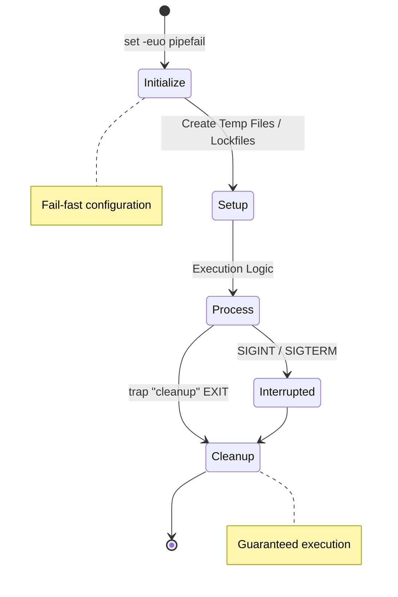

# 🛡️ Robust Execution & Signal Management Module

**Defensive programming** is the difference between a script that fails silently and one that saves your infrastructure. This module covers `set -euo pipefail`, signal trapping, lockfiles, and advanced error handling.

## 📚 Module Structure
- **[Boilerplates](readme.md)**: Production-ready templates (`robust_template.sh`).
- **[CHALLENGES](./challenges.md)**: Hands-on exercises to test your resilience.

---

## 🚀 The Resilient Script Lifecycle

A robust script follows a strict lifecycle: **Initialize -> Setup -> Process -> Cleanup**.



---

## 🛠️ 1. Strict Mode Configuration

Fail-fast behavior is essential.

```bash
#!/bin/bash
set -euo pipefail
IFS=$'\n\t'
```

| Flag | Name | Impact |
| :--- | :--- | :--- |
| `-e` | `errexit` | Immediately stops the script if any command returns non-zero. |
| `-u` | `nounset` | Treats unset variables as critical errors. |
| `-o pipefail` | `pipefail` | Ensures a pipeline fails if *any* command in the pipe fails. |

---

## 🪤 2. Signal Management (Traps)

The `trap` command ensures cleanup happens regardless of success, failure, or Ctrl+C.

```bash
cleanup() {
    echo "🧹 Cleaning up temp files..."
    rm -f "$TEMP_FILE"
}
trap cleanup EXIT
```

### Signal Types
- **EXIT**: Runs when the script ends (for any reason).
- **SIGINT (2)**: Triggered by Ctrl+C.
- **SIGTERM (15)**: Triggered by `kill` command (default).
- **ERR**: Triggered when a command fails (use with caution).

---

## 🔒 3. Concurrency Control (Lockfiles)

Prevent race conditions using `flock` (Linux) or `mkdir` (POSIX).

### The `flock` Method (Preferred)
Uses a file descriptor lock given by the Kernel. Safe against crashes.

```bash
exec 200>/var/lock/.myscript.excl
flock -n 200 || { echo "Already running."; exit 1; }
```

---

## 📖 Real-World Stories

### The Zombie Process Problem
**Context**: A monitoring script ran every minute.
**What Happened**: It didn't track its background PIDs. When the script timed out, the background processes kept running.
**Result**: After 24 hours, thousands of orphan processes crashed the server.
**Solution**: Use a `trap` that kills background jobs: `kill $(jobs -p)`.

### The Disk Space Disaster
**Context**: Log processing script using `/tmp`.
**What Happened**: Script crashed due to OOM. `/tmp` was never cleaned.
**Result**: 100GB of temp data filled the root partition.
**Solution**: Always use `trap "rm -f $TEMP" EXIT`.

---

## ❓ Interview Questions

1. **What is the difference between `trap "cmd" EXIT` and `trap "cmd" ERR`?**
   - *Answer*: `EXIT` triggers whenever the script finishes (success or failure). `ERR` only triggers when a command fails.
2. **How do you handle a command that is EXPECTED to fail occasionally within `set -e`?**
   - *Answer*: Append `|| true` or use `command || return 0`.
3. **What is `flock` and why is it better than `mkdir` for locking?**
   - *Answer*: `flock` handles "stale locks" automatically. If the process crashes, the kernel releases the lock.
4. **How do you safely handle secrets in Bash?**
   - *Answer*: Use environment variables (`$SECRET`), unset them after use, and avoid passing them as CLI arguments (which show up in `ps`).

---

[⬅️ Back to Advanced Bash](readme.md)