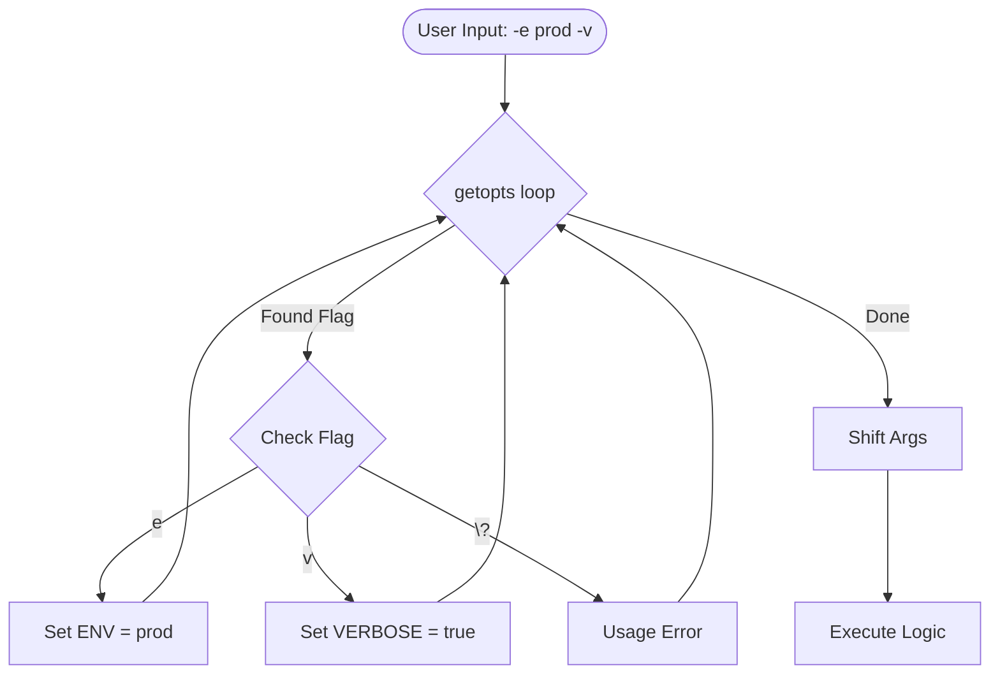

# Advanced Argument Parsing (getopts)

For complex scripts, positional parameters (`$1`, `$2`) are fragile and hard to document. `getopts` allows you to create professional, flag-based command-line interfaces (CLI).

## 🛠️ The `getopts` Built-in

`getopts` is a shell built-in that parses short options (e.g., `-v`, `-f filename`).

```bash
while getopts "e:v" opt; do
  case $opt in
    e) ENV="$OPTARG" ;;       # : means this flag requires a value
    v) VERBOSE=true ;;        # No : means it is a boolean flag
    *) usage ;;               # Handle unknown flags
  esac
done
```

## 📊 Logic Flow with `getopts`



### Option String Explained
- `"ev"`: Only `-e` and `-v` are allowed. Neither takes a value.
- `"e:v"`: `-e` requires a value (stored in `$OPTARG`), `-v` does not.
- `":e:v"`: Start with `:` to enable "silent error reporting," allowing you to handle errors manually in your `case` statement.

---

## 📖 Professional Patterns

### The `usage` Function
Every professional tool should provide a helpful help message.

```bash
usage() {
    echo "Usage: $(basename "$0") [-v] -e ENVIRONMENT"
    exit 1
}
```

### Parsing Long Options (`--verbose`)
Bash's `getopts` does NOT support long options natively. To handle them, you must use a manual loop or the external `getopt` (no 's'). See `Boilerplates/cli_skeleton.sh` for a manual loop example that handles BOTH short and long options.

---

## 📖 Real-World Story: The "Confused" Script

**Scenario**: A script took 3 arguments: `source`, `destination`, and `force`.
**Problem**: A developer forgot the order and ran `./deploy.sh true /src /dst`.
**Outcome**: The script interpreted `true` as the source directory. Deployment failed.
**Solution**: Refactored to `./deploy.sh -s /src -d /dst -f`. The flags make the command self-documenting and order-independent.

---

## ❓ Interview Questions

1. **What is the purpose of `shift $((OPTIND - 1))`?**
   - *Answer*: It removes the processed flags from the argument list, leaving only the "positional" arguments (like filenames) for the rest of the script to handle.
2. **Difference between `getopts` and `getopt`?**
   - *Answer*: `getopts` is a POSIX shell built-in (safe, portable, short flags only). `getopt` is an external binary (supports long flags but varies between GNU/Mac versions).
3. **How do you handle optional values for flags?**
   - *Answer*: `getopts` doesn't support optional values (a flag either takes an argument or it doesn't). You must use a manual parsing loop for that.

---

[⬅️ Back to Advanced Bash](readme.md)
