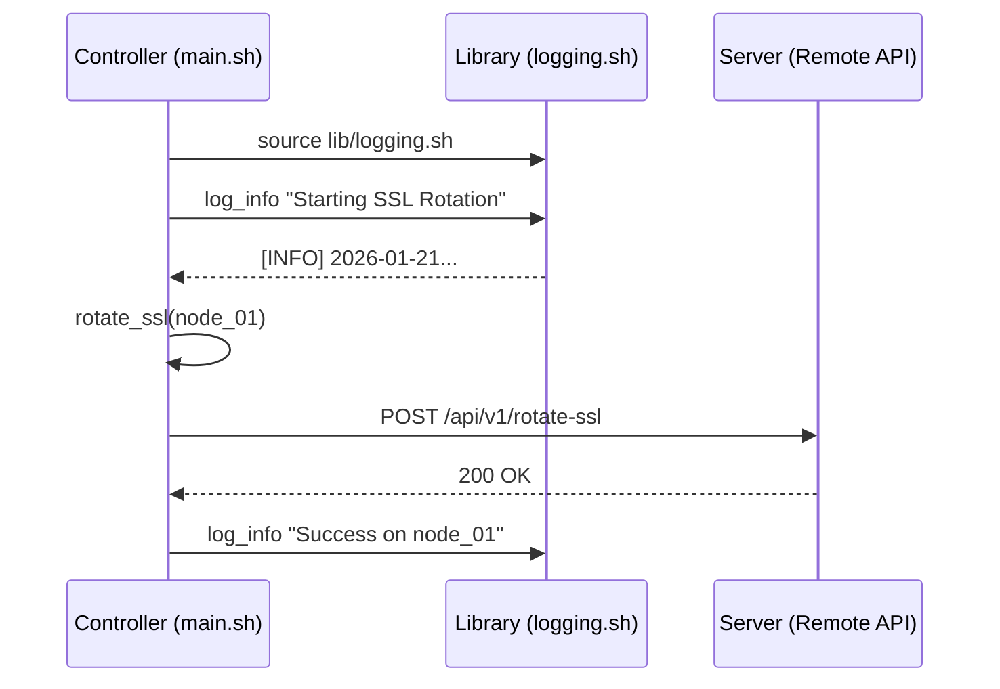

# 🏗️ Advanced Functions & Modularization

> **"A script is a monologue. A modular system is a conversation."**

---

## 🏛️ Architecture: The Library Pattern

In professional DevOps, we never write 1000-line monolithic scripts. Instead, we build **function libraries** that are sourced by multiple lightweight "controller" scripts. This ensures consistency across your automation fleet.

### The Modular Workflow

---

## 🌟 Overview

This module covers the transition from basic functions to complex modular architectures. We explore how to manage variable scope, return structured data, and share code across independent automation pipelines.

### Key Intermediate Topics:
1. **Source Pattern**: Using the `source` (or `.`) command effectively.
2. **Variable Localism**: Strict enforcement of the `local` keyword to prevent memory leaks and "ghost" values.
3. **Structured Returns**: Moving beyond exit codes to capture function output into arrays or objects.
4. **Library Hierarchy**: Organizing code into `/lib` and `/bin` directories for scalability.

---

## 🛠️ Real-World Scenario: Day in the Life

### SSL Certificate Rotation across a Load Balancer Fleet

**The Challenge**: Every 90 days, 50 different load balancers need their Let's Encrypt certificates renewed and reloaded. Manually logging into each is impossible.
**The Solution**: A modular shell script that:
1.  **Sources a Networking Library** to handle API authentication.
2.  **Iterates through a JSON list** of LB endpoints using `jq`.
3.  **Encapsulates the rotation logic** in a function that verifies the fingerprint of the new certificate before applying it — ensuring zero downtime.

---

## ❓ Interview Preparation (Functions & Scope)

1.  **Q: Why should you use the `local` keyword inside every function?**
    *A: By default, all variables in Bash are global. If a function modifies `INDEX`, it will ruin every loop in the main script that uses the same name. `local` restricts the variable to that function's stack.*

2.  **Q: What happens when you `source` a file in a script?**
    *A: The shell reads and executes the content of the sourced file in the **current** shell environment. This is why functions and variables from the lib become available.*

3.  **Q: How do you return a value from a function in Bash?**
    *A: Bash functions only return an exit code (0-255). To "return" data (like a string), you use `echo` inside the function and capture it in the caller using command substitution: `RESULT=$(my_func)`.*

---

## 📝 Knowledge Check

1.  **Which command is used to include an external file's functions?**
    - [x] a) `source`
    - [ ] b) `import`
    - [ ] c) `include`

2.  **True or False: Variables defined in a sourced library are visible to the parent script.**
    - [x] True
    - [ ] False

3.  **What is the best way to handle library paths relative to the script's location?**
    - [ ] a) `source /etc/lib/script.sh`
    - [x] b) `SCRIPT_DIR=$(dirname "${BASH_SOURCE[0]}")`
    - [ ] c) `cd .. && source lib.sh`

---

## 🔗 Next Steps
Proceed to: **[Advanced I/O & Logging](../04-advanced-io-and-logging/readme.md)** →
