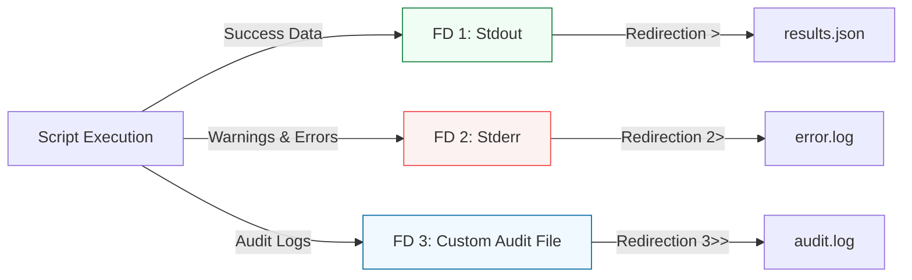

# 🔀 04: Advanced I/O & Logging

> **"A script that doesn't log is a script that doesn't exist when it fails."**

---

## 🏛️ Architecture: The Logging Pipeline

In professional scripting, we don't just "echo" things. we use systematic redirection to ensure that **Data** (success) goes to one channel and **Telemetry/Errors** (warnings) goes to another.

### System Stream Logic

---

## 🌟 Overview

This module masterclass on data plumbing. Intermediate shell scripting is 50% logic and 50% redirection. You will learn how to handle multi-stage pipelines and create professional-grade logging frameworks.

### Key Intermediate Concepts:
1. **Descriptor Management**: Using `exec` to permanently open or close file descriptors for the script's duration.
2. **Stderr Precision**: Mastering `>&2` to ensure your error messages are never mistaken for data.
3. **Descriptor Duplication**: Learning the difference between `2>&1` and `&>`.
4. **Fd 3-9 Utilization**: Using custom streams for internal script communication or multi-file writing.

---

## 🛠️ Real-World Scenario: Day in the Life

### Automated Backup Audit & Reporting

**The Challenge**: A backup script generates a JSON list of successfully backed-up files, but it also generates thousands of minor "permission denied" warnings that clutter the output.
**The Solution**: An intermediate script that uses **Advanced I/O**:
1.  **Redirects Stderr (2)** to `/tmp/warnings.txt` to keep the JSON output clean.
2.  **Opens FD 3** specifically for an "Audit Log" that records the size of every file processed.
3.  **Uses `exec 1> results.json`** to ensure the entire script's success output is automatically captured without needing `>` on every line.

---

## ❓ Interview Preparation (I/O & Logging)

1.  **Q: How do you send a specific message to Stderr inside a script?**
    *A: Use `echo "Error message" >&2`. This redirects the output of the echo command to the file descriptor 2 (Stderr).*

2.  **Q: What is the benefit of using `exec 3> log.txt`?**
    *A: It keeps the file descriptor 3 open for the entire script. You can then write to it using `echo "data" >&3` multiple times without the overhead of opening and closing the file on every call.*

3.  **Q: Explain how to capture both Stdout and Stderr into separate variables at once.**
    *A: This is complex in Bash. Typically, you redirect one to a temporary file: `COMMAND 2> /tmp/err` and capture the other `OUT=$(COMMAND)`. Advanced users use process substitution and named pipes.*

---

## 📝 Knowledge Check

1.  **Which file descriptor represents the Error stream?**
    - [ ] a) 0
    - [ ] b) 1
    - [x] c) 2

2.  **How do you merge the error stream into the success stream?**
    - [ ] a) `1>&2`
    - [x] b) `2>&1`
    - [ ] c) `&>`

3.  **True or False: Using `exec` can close a file descriptor?**
    - [x] True (`exec 3>&-` closes FD 3)
    - [ ] False

---

## 🔗 Next Steps
Proceed to: **[Signal Handling & Traps](readme.md)** →
