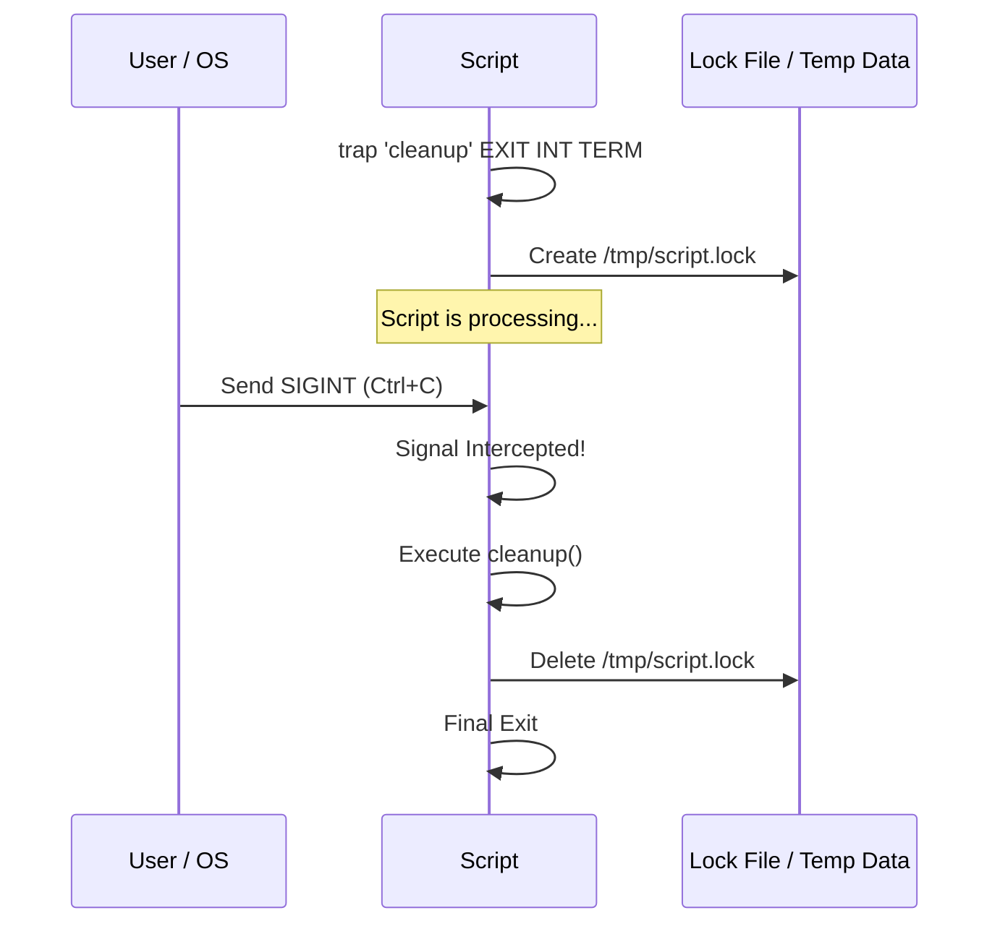

# 🛡️ 05: Signal Handling & Traps

> **"A script should not just run; it should know how to die gracefully."**

---

## 🏛️ Architecture: The Signal Lifecycle

Unix signals are interrupts sent to a process to notify it of an event. In DevOps, the most common signals are `SIGINT` (Ctrl+C) and `SIGTERM` (Stop request from Orchestrator). 

### The Trap Mechanism

---

## 🌟 Overview

This module covers **Resilient Scripting**. You will learn how to protect your system from "orphan" files, locked databases, and half-finished transactions by mastering the `trap` command.

### Key Intermediate Concepts:
1. **The Signal Spectrum**: Understanding `SIGINT` (2), `SIGTERM` (15), and `SIGHUP` (1).
2. **The Trap Command**: Mapping specific signals to cleanup functions.
3. **Pseudo-Signals**: Mastery of the `EXIT` pseudo-signal for guaranteed cleanup.
4. **Signal Propagation**: Ensuring child processes are also terminated when the parent dies.

---

## 🛠️ Real-World Scenario: Day in the Life

### Automated DB Migration with Safe Rollback

**The Challenge**: A script is running a critical database schema migration. If the engineer accidentally kills the script mid-process, the database could be left in a corrupted or locked state.
**The Solution**: An intermediate script that uses **Traps**:
1.  **Sets a Trap on EXIT**: `trap 'rollback_on_failure' EXIT`.
2.  **Detects Success**: If the migration finishes, it unsets the trap: `trap - EXIT`.
3.  **Automatic Cleanup**: If terminated early, the `rollback_on_failure` function automatically executes a SQL transaction to undo the changes, ensuring the DB remains consistent.

---

## ❓ Interview Preparation (Signals & Resilience)

1.  **Q: What is the difference between `trap "echo exit" EXIT` and `trap "echo interrupt" INT`?**
    *A: `INT` only triggers if the script receives a `SIGINT` (like Ctrl+C). `EXIT` is a pseudo-signal that triggers whenever the script finishes for **any** reason (success, error, or signal), making it the safest choice for generic cleanup.*

2.  **Q: Why can't you trap `SIGKILL` (9)?**
    *A: `SIGKILL` is handled by the kernel, not the process. The kernel immediately terminates the process without giving it any time to run a cleanup function. This is why you should always try `SIGTERM` first.*

3.  **Q: How do you ignore a specific signal during a critical block of code?**
    *A: Use `trap '' SIGNAL`. For example, `trap '' HUP` will allow a script to keep running if the SSH connection is lost.*

---

## 📝 Knowledge Check

1.  **Which command is used to catch a signal in Bash?**
    - [ ] a) `catch`
    - [x] b) `trap`
    - [ ] c) `signal`

2.  **What is the signal number for 'Interrupt' (Ctrl+C)?**
    - [ ] a) 1
    - [x] b) 2
    - [ ] c) 9
    - [ ] d) 15

3.  **True or False: A script can handle more than one signal with a single trap.**
    - [x] True (`trap 'cleanup' INT TERM EXIT`)
    - [ ] False

---

## 🔗 Next Steps
Proceed to: **[Regex & Data Parsing](readme.md)** →
